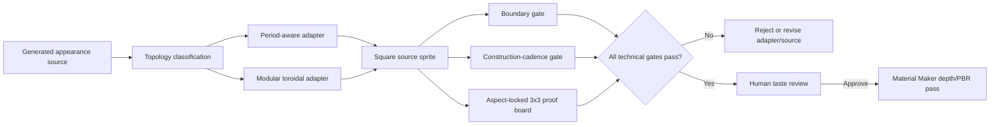

# Autonomous Seam Machinery

## Purpose

This machinery makes generated material sprites technically repeatable without asking a human to
repair seams by hand. Image generation remains responsible for visual character. Deterministic
code is responsible for repeat topology. Material Maker remains a later depth/PBR pass and may
only receive a source sprite after this machinery admits it.

The core idea is commercially reusable:

> Generative appearance and deterministic topology are separate jobs. Let the image model author
> the material language; let a measurable compositor guarantee the repeat.

The current Genesis fixture proves two adapters:

- **Period-aware construction:** plank-and-batten.
- **Modular toroidal assembly:** slate.

Those adapters are production-capable for their proven shapes. The current script is still a
Genesis proof executable with hard-coded fixture paths; it is not yet a general-purpose packaged
CLI.

## Binding production contract

1. A material begins as one or more source sprites.
2. The material is classified by topology before repair or assembly.
3. Structural axes are never closed with a generic blur that can erase joints, courses, battens,
   crevices, stitches, or unit cadence.
4. A topology adapter produces a square final source sprite.
5. Automated gates produce a machine-readable receipt.
6. A correctly proportioned final-tile plus 3x3-repeat board is mandatory human evidence.
7. The board must mark the exact tile joins.
8. A technical pass does not imply a taste pass.
9. MM receives only a technically passed and taste-approved source sprite.
10. MM may add structural depth; it may not repaint or replace the sprite's albedo identity.

## Architecture



## Why prompting alone is insufficient

An image model can understand “seamless” aesthetically without producing opposite edges that
close structurally. It may:

- render a small roof plane rather than an infinite pattern;
- introduce a special first or last course;
- paint perspective, cast shadows, or relief into albedo;
- create plausible individual edges that do not share the same phase;
- satisfy pixel continuity while deleting a construction joint;
- produce components that repeat only after a period larger than the requested tile.

Prompting should still demand a flat infinite pattern, but a prompt is not topology proof.

## Adapter A — period-aware construction

Use for a surface with a dominant construction axis whose joints must retain cadence:

- plank-and-batten;
- vertical or horizontal boards;
- regular rails, ribs, seams, or stitched strips;
- any field where losing one joint at the tile boundary is visibly wrong.

### Proven plank algorithm

1. Convert the source image to a column luminance profile.
2. Treat the darkest 20% of columns as possible construction crevices.
3. Search for two dark crevices approximately one tile apart.
4. Score each pair using:
   - the RGB jump from the last column before the right boundary to the first column at the left
     boundary;
   - a smaller neighborhood-phase penalty around both crevices.
5. Crop a square from the selected left crevice up to, but not including, the corresponding right
   crevice.
6. Preserve that structural axis unchanged.
7. Repair only the non-structural top/bottom edge with a cosine-weighted opposing-edge blend.
8. Resize with nearest-neighbor sampling to retain sprite structure.

Current scoring:

```text
pair_score = boundary_jump_rms + 0.05 * construction_phase_rms
```

The crucial rule is **crevice-to-crevice, never board-middle-to-board-middle followed by a generic
edge blend**. The latter created the rejected proof in which every tile boundary lost a crevice.

### Period-aware acceptance

- Boundary jump passes the ordinary-transition test.
- Both crop boundaries are detected construction crevices.
- Circular crevice cadence passes.
- The copper-marked joins in the 3x3 board retain the same joint rhythm as internal areas.

## Adapter B — modular toroidal assembly

Use when a surface is constructed from discrete repeated units:

- slate;
- clay tiles;
- timber shingles;
- thatch bundles;
- sod blocks;
- hide/canvas panels;
- bricks, cobbles, ashlar blocks, and similar families.

### Proven slate algorithm

1. Generate isolated flat component sprites on a removable chroma background.
2. Remove the background and validate alpha.
3. Extract the components without stretching them.
4. Choose a square canvas and grid steps that close exactly:

```text
canvas_width  % x_step == 0
canvas_height % y_step == 0
```

5. Build a seeded variant grid whose dimensions exactly match the toroidal tile grid.
6. Balance component usage and reject identical horizontal or vertical neighbours, including
   neighbours across the wrapped boundaries.
7. Keep every authored component upright: never rotate or flip a directional construction unit.
8. Render a 3x3 uninterrupted field using the physical course draw order. For slate, lower
   courses are laid first and upper courses overlap them so every rounded exposed edge remains
   visibly downward.
9. Crop the central period, then resize it to the declared delivery dimensions with
   nearest-neighbour sampling.

The “render a larger uninterrupted field, then crop the center” rule is essential for overlapping
units. Drawing wrapped units directly onto one tile can reorder the first and last courses. That
created the rejected horizontal slate band exposed by the corrected proof board.

### Proven slate fixture values

| Parameter | Value |
|---|---:|
| Canvas | 576 x 576 |
| Horizontal step | 96 |
| Vertical step | 72 |
| Columns | 6 |
| Rows | 8 |
| Stagger | 48 |
| Component library | 16 upright pieces (4 x 4 source sheet) |
| Variant-grid period | 6 columns x 8 rows |
| Variant seed | 73129 |
| Working size | 576 x 576 |
| Delivery size | 512 x 512 |

The full 6 x 8 variant grid is the repeat period. Its deterministic seeded assignment is balanced
to within two uses per component and rejects identical orthogonal neighbours on the torus. This
produces natural-looking variation without sacrificing exact repeat closure.

The generalized executable `build-modular-course-proof.py` applies the same contract to other
directional roof units. Each material declares its own component sheet, substrate color, course
steps, and seed. Timber shingles prove a 12-column x 8-row fixture at 48px horizontal and 72px
vertical steps; this tighter pitch prevents implausible under-roof gaps while retaining the same
orientation, balance, repeat, delivery-size, and proof-board gates.

### Modular acceptance

- Both grid dimensions divide the canvas exactly.
- Variant periods close on both axes.
- Directional components remain upright with their exposed edge facing the declared direction.
- Variant distribution is balanced and has no identical orthogonal neighbours.
- Global layer order is identical across tile boundaries.
- Final output dimensions equal the receipt's declared delivery dimensions.
- Boundary jumps are ordinary relative to internal transitions.
- Copper-marked joins show no special row, column, gap, overlap, or value band.

## Automated gates

### 1. Boundary transition gate

The old fixed test—first-column RGB equals last-column RGB within an arbitrary RMS threshold—was
retired as the primary gate. Two repeated tiles place neighboring samples together; those samples
do not have to be duplicates.

The current test compares the boundary jump with ordinary adjacent-pixel jumps inside the tile:

```text
x passes when x_boundary_rms <= 1.10 * p95(internal_x_neighbor_rms)
y passes when y_boundary_rms <= 1.10 * p95(internal_y_neighbor_rms)
```

This catches an unusually strong join while allowing legitimate local material variation. The 10%
allowance is reserved for the one-pixel phase shift that nearest-neighbor delivery-size resampling
can cause; it is not a waiver for visibly broken joins.

### 2. Construction-cadence gate

For plank-like materials:

1. Detect dark crevice groups from the column luminance profile.
2. Merge a crevice split across the circular boundary.
3. Record circular gap variation for diagnosis.
4. Require a dark crevice feature at both sides of the circular join.

Current rule:

```text
min(left_edge_feature_band)  <= p20(column_luminance)
min(right_edge_feature_band) <= p20(column_luminance)
```

The corrected proof measures:

```text
detected crevices: 11
median circular gap: 68 px
largest circular gap: 70 px (diagnostic only; board widths may vary)
dark crevice feature present on both circular boundary sides
```

### 3. Modular topology gate

Every grid dimension and variant period must close mathematically. The builder records each
boolean proof in the receipt and rejects any false value.

### 4. Proof-board integrity gate

- Final tile preview: square.
- 3x3 repeat source: square.
- Displayed previews: aspect-locked 1:1.
- Any attempted distortion raises an error and fails the build.
- Copper ticks outside the image mark the one-third and two-third join coordinates without
  covering the material.

The original proof board compressed a square repeat into a 3:1 rectangle. That board and every
conclusion based on it were invalid. Aspect locking is now executable policy.

### 5. Delivery-dimension integrity gate

The topology workspace and delivery sprite may have different sizes. Every adapter must apply the
declared nearest-neighbour delivery resize before writing its final tile. The builder and receipt
must agree with the actual pixel dimensions of every emitted final tile. A technically seamless
576px working canvas may not be reported or promoted as a 512px delivery asset.

### 6. Process exit

`build-autonomous-seam-proof.py` exits non-zero when a proven adapter misses any required
technical gate. A receipt containing the word `PASS` is not sufficient if the process itself did
not complete successfully.

## Current executable

From the worktree root:

```bash
python3 dev/material-lane/build-autonomous-seam-proof.py
```

The same executable is parameterized for an admitted production run. For example, the Batch 1 P1
run uses a six-piece (3 x 2) slate sheet while preserving a 6-column x 8-row toroidal field and
exports the required 512px source sprites:

```bash
python3 dev/material-lane/build-autonomous-seam-proof.py \
  --plank-source <plank.png> \
  --slate-components <slate-components-alpha.png> \
  --slate-columns 3 --slate-rows 2 \
  --work-size 576 --export-size 512 \
  --output-dir <proof-directory> --prefix <material-batch-version>
```

The default arguments reproduce the original two-adapter proof fixture.

Dependencies:

- Python 3;
- Pillow;
- NumPy.

Input fixtures:

- `source-sprites/b01-timber-roof-v001/roof-plank-batten-source-v003.png`
- `proofs/autonomous-seam-v001/slate-components-alpha-v001.png`

Outputs:

- final square source sprites;
- native square 3x3 repeats;
- aspect-locked proof board with join ticks;
- JSON verification receipt.

The builder regenerates its derived outputs deterministically from the same source inputs. Image
generation and chroma removal happen before the deterministic builder.

## Receipt contract

Every admitted source sprite must record:

- adapter and version;
- source path and source hash;
- crop or grid parameters;
- output dimensions;
- topology booleans;
- boundary metrics;
- construction-cadence metrics when applicable;
- paths to final tile, native 3x3 repeat, and proof board;
- final `PASS` or `FAIL`;
- generator mode and exact source prompt in the parent manifest.

Do not promote an asset whose receipt omits an applicable field.

## Adding a material family

For each new family:

1. Decide whether its visible identity is continuous, period-aware, or modular.
2. Identify every structural axis.
3. Choose an existing proven adapter only if its assumptions match.
4. Otherwise add a new adapter and a failure fixture before production use.
5. State which dimensions or feature cycles must close.
6. Add material-specific metrics when a generic boundary metric cannot detect a missing feature.
7. Generate the final tile and native 3x3 repeat.
8. Inspect the aspect-locked, join-marked board.
9. Preserve the rejected fixture that motivated any new gate.
10. Record the adapter version in the source receipt.

### Batch 1 routing

| Material | Initial adapter |
|---|---|
| Structural timber grain | Continuous-field adapter; not yet proven by this fixture |
| Timber shingle | Modular toroidal |
| Plank-and-batten | Period-aware construction, proven |
| Slate | Modular toroidal, proven |
| Clay tile | Modular toroidal |
| Thatch | Modular bundle/course adapter; may require a new cadence gate |
| Turf/sod | Modular sod blocks or a separately proven continuous-field adapter |
| Hide/canvas tarp | Modular toroidal with stitch/rope cadence checks |

“Initial adapter” is a routing decision, not automatic approval. Only plank-and-batten and slate
have adapters proven by the current executable.

## Human review boundary

Automation owns:

- topology;
- boundary continuity;
- cadence integrity;
- aspect-safe evidence;
- receipts and rejection.

The art director owns:

- whether the sprite has enough or too much authored character;
- repetition that is technically legal but aesthetically obvious;
- palette, material identity, scale, and play-distance readability;
- whether the source deserves an MM pass.

For example, the corrected slate proof is seamless but its four-component palette is visibly
repetitive. That is a taste limitation, not a topology failure.

## Failure registry

These failures are now regression doctrine:

| Failure | Cause | Permanent prevention |
|---|---|---|
| Flat source looks plausible but does not repeat | Prompt treated “seamless” aesthetically | Deterministic topology adapter |
| Slate appears stretched | Proof board resized square repeat to 3:1 | Aspect assertion |
| Slate has a horizontal band at tile joins | Wrapped rows composited in inconsistent layer order | Render uninterrupted 3x3 field, crop center |
| Plank misses every tile-boundary crevice | Generic edge blend erased structural feature | Crevice-to-crevice crop and cadence gate |
| Numerical pass hides visual defect | Metric did not represent construction semantics | Material-specific gate plus marked 3x3 evidence |

## Packaging this as a product

The reusable product boundary should exclude Genesis-specific art direction and assets. A
commercial extraction would need:

1. A configuration-driven CLI rather than hard-coded paths.
2. Adapter plugins such as `period-aware`, `modular-toroidal`, and future `continuous-field`.
3. A documented JSON input/output schema.
4. Generic component extraction, alpha validation, and source hashing.
5. Golden failure fixtures and automated regression tests.
6. HTML and PNG proof-board renderers with aspect assertions.
7. Batch operation, attempt limits, and stable exit codes.
8. Optional image-generation backends separated from the deterministic core.
9. Dependency notices, an SBOM, and a license review for bundled code and example assets.
10. Product documentation that requires customers to provide assets they are entitled to use.

Suggested future CLI shape—**design target, not implemented syntax**:

```text
seamforge build material.json
seamforge verify output/tile.png --adapter period-aware
seamforge board receipt.json
```

The strongest defensible product claim is not “AI makes seamless textures.” It is:

> Authored or generated texture character enters a deterministic topology-and-evidence pipeline
> that rejects broken repeats before downstream material work.

## Terra production handoff

Terra may continue Batch 1 when it follows this order:

1. Read this machinery spec.
2. Read `MATERIAL-SPRITE-PRODUCTION-SHEET-B01.md`.
3. Re-run the proof builder and confirm a zero exit status.
4. Use the proven plank/slate adapters as reference implementations.
5. Add or adapt one material family at a time.
6. Do not send any candidate to MM before its technical receipt and join-marked board pass.
7. Stop and report if a family needs an unproven adapter; do not improvise a visual-only waiver.

## Direct-sprite fast lane — 2026-07-24 amendment

The earlier “initial adapter” table is now a rescue-routing reference, not the default production
order. For new material families, use this bounded autonomous sequence:

1. Generate one complete full-field source sprite with explicit toroidal edge/phase language.
2. Run the numerical boundary gate and truthful locked-aspect 3x3 board on untouched output.
3. If it passes, keep the raw sprite.
4. If the failure is construction phase or prompt-addressable composition, run one targeted prompt
   retry and remeasure.
5. If a continuous, non-periodic field is visually strong and misses mildly, use a declared narrow
   toroidal edge lock and retain both the raw source and repair receipt.
6. Use period-aware or modular component reconstruction only when the direct field remains
   genuinely unusable. Do not spend component-assembly time merely because a heavier adapter
   exists.
7. After source technical acceptance, preserve that sprite as MM albedo. Derive
   construction-aware height: broad low-frequency relief for continuous organic fields, explicit
   course relief for layered construction, and feature-isolated guides when albedo colors must not
   become physical elevation.

The reference implementation is:

- `triage-fast-lane-sources.py` — batch boundary metrics and aspect-safe 3x3 evidence;
- `repair-fast-lane-timber.py` — continuous-field-only edge lock;
- `prepare-b01-fast-lane-mm.py` — subject-aware height guides and sprite-preserving MM graphs;
- `compile-b01-fast-lane-mm-v001.mjs` — two-run MM determinism proof;
- `verify-b01-fast-lane-mm-v001.py` — albedo identity, inherited seam, depth, ORM, and
  determinism gates.

Batch B01 demonstrated the intended cost profile: two untouched ImageGen passes, one successful
prompt retry, one narrow continuous-field repair, and zero component reconstructions across four
materials. The selected source receipt is
`proofs/b01-fast-lane-v001/b01-fast-lane-selected-candidates-v002.json`.

## Batch B02 reusable batch tooling — 2026-07-24

Batch B02 extends the fast lane from one-off scripts to versioned multi-material helpers:

- `compile-versioned-mm-batch.mjs` compiles an explicitly versioned graph directory twice,
  requires the declared material count and four output channels, refuses overwrite, and emits a
  byte-determinism receipt.
- `verify-versioned-mm-batch.py` resolves a batch manifest and its source-gate receipt, then checks
  albedo identity, inherited seams, non-flat depth, valid Godot ORM packing, and run equality.
- `triage-b02-deck-edge-sources.py` renders five culture candidates on a truthful square 3x3 board
  and records boundary/internal ratios rather than relying on visual seam claims.
- `repair-b02-rubble-seams.py` is a declared narrow continuous-field edge lock; it is not valid for
  directional courses, discrete components, or geometry-owned silhouettes.

B02 also records a useful negative result: component reconstruction can pass topology and still
fail the art gate. The fitted-rubble component rescue created oversized mortar gaps and a
display-rack cadence, so the richer direct sprite plus a 32px continuous-field lock was retained.
Do not promote a heavier rescue merely because it is deterministic. The cheapest candidate that
passes both topology and visual character remains the preferred source.
