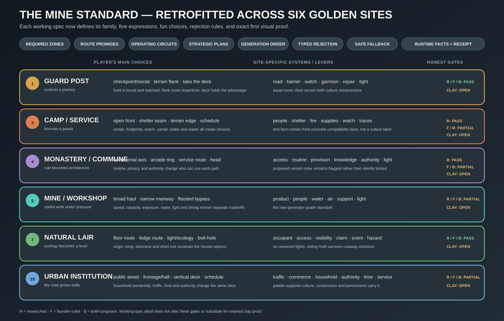
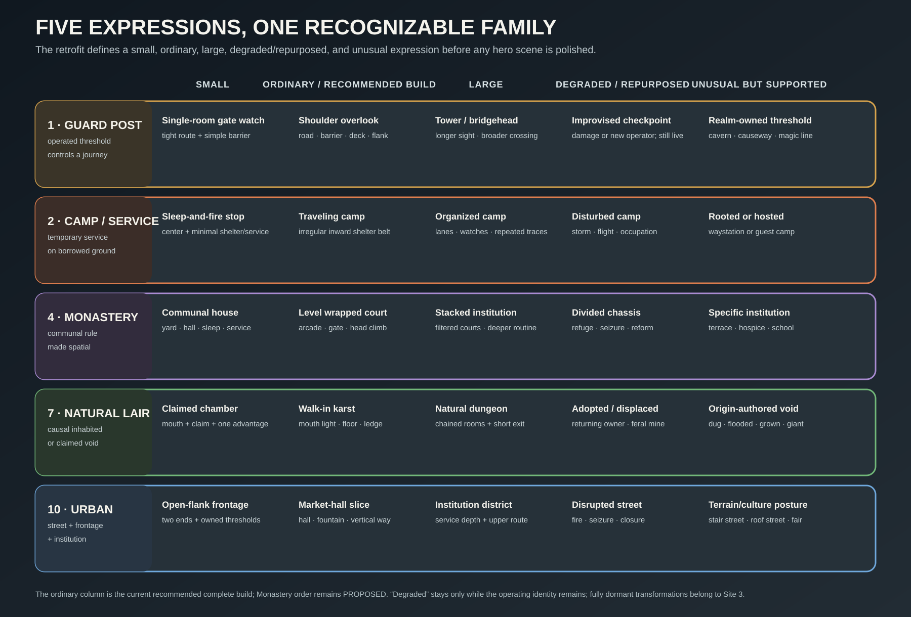

# Golden Sites — structure/material catalog and the Guard Post brief

Wave 2 accepted **twelve golden sites** as the eventual representative acceptance portfolio
(CLAY-PROOF-LADDER "Vocabulary"). They are accumulated, not built as a first batch. This file is
where a golden site's *structure kit*, *material kit*, and *relational composition brief* live, so
that no site invents a parallel authority for geometry, materials, trim, composition, or clay gates.

**Golden site 1 is the Guard Post.** Founder direction (wave-11 §19.6.6): the next big production
waves are a geometry pass and a texture pass, targeting "golden site 1 (the guard's post) looking
decent across procedural configurations" — with "we will clayroom for a while" first.

Generator-grade consolidation: `SITE-1-GUARD-POST-SPEC.md`.

## Entry gate — this file may not start

Guard Post 1 may not begin its real composition pass until the
[Clayroom Reset Ladder](CLAYROOM-RESET-LADDER.md) CL-R0…CL-R6 gate passes. The reason is a scope
protection, not ceremony: the Guard Post must prove **site composition** — road, terrain, defended
threshold, observation, negative space, cultural construction — and must not be spent rediscovering
whether a wall corner closes, a trim band maps, a sprite keeps its colour, or a light profile can be
tuned. **CL-R0 is BUILT (2026-07-23); CL-R1…CL-R6 are not.**

## Precedence and reconciliation notes

Reconciled against current canon on fold-in. **No conflict was found between the Desktop packet and
any current canonical ruling.** Three places where the packet needed *routing* rather than adoption:

1. **Trim.** The packet's `genesis-architecture-core-h6-v1` six-band layout is a concrete realization
   of the contract [TRIM-SHEET-PIPELINE.md](TRIM-SHEET-PIPELINE.md) §14 already accepted (Option B
   across T10.1-T10.5). It is recorded there as a proposed v1 layout, not re-owned here.
2. **Material authoring.** Material Maker 1.3 seed graphs, the custom-node library, mutation lineage,
   and export/receipt contracts belong to [MATERIAL-LANE.md](MATERIAL-LANE.md), which already owns
   the lane and carries Adam's stopping-point checklist. The Guard Post's *parent-seed roster* is
   listed below as a consumer, with authoring authority left where it is.
3. **Composition.** Region/route/reservation/provenance/surface-frame contracts belong to
   [BATTLEMAP-TOWNTRAY-COMPOSITION.md](BATTLEMAP-TOWNTRAY-COMPOSITION.md) (the C1H owner). The FFT
   relational grammar below supplies *taste rules and anti-rules* over that compiler; it does not
   create a second geometry or reservation authority.
4. **Rolled world context.** Portal/support aprons, context cards, reusable background
   images, far fields, atmosphere, and context receipts belong to
   [GOLDEN-SITE-WORLD-CONTEXT-PROJECTION.md](GOLDEN-SITE-WORLD-CONTEXT-PROJECTION.md).
   A site brief declares its context obligations; it does not invent a second backdrop
   renderer or turn background art into mechanics.
5. **Ontology and engine marriage.** Walk families, persistent site identity, host
   programs, operating models, cross-host transforms, materialization windows, semantic
   plans, projections, and ordinary venue fixtures are separated by
   [GOLDEN-SITE-ONTOLOGY-ENGINE-MARRIAGE.md](GOLDEN-SITE-ONTOLOGY-ENGINE-MARRIAGE.md).
   This catalog owns the twelve-case coverage portfolio; it does not turn the twelve
   names into a runtime enum.

## THE FFT BOUNDARY (binding)

The FFT work is a **relational shape-grammar study** — comparative map morphology and grammar
induction. It is **not** authorization to copy authored FFT maps.

> observed spatial relationship → Genesis table prose → typed grammar obligation → bounded
> deterministic solver → procedural structure/material realization → replay and visual QA

It must **never** mean one-to-one layout conversion, mesh reconstruction for shipping, or copying
FFT's authored maps. Genesis learns *why* the maps compose well, then generates new sites from its
own canonical facts.

Production boundary, restated from the study's own front matter: public screenshots and community
documentation are **reference evidence only**; open-source inspection tools remain under their own
licenses; **no FFT mesh, texture, map, or other copyrighted game asset may become a Genesis
production asset**; no unauthorized ISO or raw game-data redistribution. If raw map inspection ever
becomes necessary, Adam supplies his own lawful disc dump privately, and it is never committed or
redistributed.

## Import audit — what was NOT vendored, and why

The Desktop study directory was ~349 MB. Per the repository's LFS posture, the attribution law
([ATTRIBUTION.md](ATTRIBUTION.md)), and actual runtime need, **none of that binary archive is
tracked in the current Golden Site reference packet.** The verified tracked
`Reference/FFT-Guard-Post-Study/` directory is the lean written packet only (16 files,
about 308 KB at the 2026-07-25 audit).

The full evidence archive may exist locally at
`Reference/FFT-Guard-Post-Study/study-archive/`; it is intentionally untracked and is not
part of this isolated worktree or the source-controlled packet. The historical “moved”
note therefore records local evidence storage, not a repository import. The per-asset
dispositions below describe tracked repository truth; the license obligations still
govern any later use of the omitted evidence.

| Desktop asset | Disposition | Reason |
|---|---|---|
| `maps/five-angle/` (121-map, five-view corpus), `maps/existing-screenshots/` | **NOT imported** | Copyrighted game screenshots. Reference evidence only; no production or runtime need. Never a Genesis asset. |
| `downloads/` (original public archives) | **NOT imported** | Same provenance; retained on Desktop as the study's own audit trail. |
| `tools/GaneshaDx`, `tools/heretic`, `tools/libfft` | **NOT imported** | Third-party open-source tools under their own licenses; inspection-time only, zero runtime need. Vendoring would create an unowned license surface. |
| `material-maker-1.3/source/` (read-only clone of MM tag `1.3`, commit `1a86d739…`) | **NOT imported** | An entire third-party application source tree. MATERIAL-LANE already proves MM 1.3 headless export by shelling out to the installed app; the pin is recorded as a *version + commit* fact, not a vendored tree. |
| `historical-reference/**` images (lanes A/B/C, technical plans, contact sheets) | **NOT imported** | Mixed CC BY / CC BY-SA / public-domain, each with per-image attribution obligations. They inform internal visual direction only; importing them would put attribution obligations into the shipping repo for no runtime benefit. Their **source ledger is summarized below** so provenance survives without the bytes. |
| `analysis/contact-sheets/`, `analysis/FFT-GUARD-POST-COHORT-OVERVIEW.png` | **NOT imported** | Derived from the copyrighted corpus. |
| The twelve written specification documents | **FOLDED** (this file + the routing above) | Genesis-authored prose; the actual deliverable. |

**Historical-reference provenance, retained without the bytes.** Three culturally coherent lanes were
gathered: **Lane A**, a Roman-British border fortlet family (Milecastle 48 / Poltross Burn plan and
photographs; Vindolanda reconstructions) — Wikimedia, CC BY 3.0 and CC BY-SA 2.0/3.0/4.0. **Lane B**,
an Iberian medieval *atalaya* (Navapalos, Soria) — Wikimedia, CC BY-SA 3.0 ES / 4.0. **Lane C**, a
Central European Alpine route-control gate (Altfinstermünz, a territorial toll and border fortress
from about 1470) — Wikimedia, CC BY-SA 3.0 / 3.0 AT, plus one public-domain Merian-tradition view.
**Technical plans**: gatehouse plans from A. Hamilton Thompson, *Military Architecture in England
During the Middle Ages* (1912), via Project Gutenberg (public-domain source, Gutenberg terms), and a
CC BY-SA 4.0 Wetheral gatehouse plan. Full per-image ledger:
`~/Desktop/Genesis FFT Guard Post Study/historical-reference/SOURCE-LEDGER.md`.

**Before any of those images is copied, modified, distributed, embedded, used as a texture, or used
in promotional material, its exact license and attribution requirements must be reviewed for that
use.** The safe Genesis production path remains original procedural geometry and original materials.

Lane warnings worth keeping: an *atalaya* is a seeing/signalling object — excellent evidence for
lookout posture, heavy masonry, sparse openings, and distance readability, but **not** evidence that
a road passes through or beside an occupied checkpoint, so it is not a valid Guard Post 1 topology.
And maintained-overgrowth presentation must not copy the failed roofs, unsafe edges, blocked access,
or wholesale collapse visible in surviving monuments: reference damage teaches chronological layers;
the operating Guard Post shows clearing, drainage, weatherproofing, and concentrated recent repair.

## The three-way boundary (table / engine / renderer)

Restated from [CLAYROOM-RESET-LADDER.md](CLAYROOM-RESET-LADDER.md), because every catalog entry below
must declare which column it lands in.

| Table/catalog data | Deterministic engine roller | Renderer/tool |
|---|---|---|
| structure family, corner/end profile, connector type, material family, surface role, light semantic, renderer recipe id, fixture class, culture construction choice, condition/history fact | coordinates, splines/runs, tier membership, connectors, sockets, transforms, cluster members, bounded candidates, run segmentation, join resolution, UV phase, socket matching, light placement from mounts, seed variation, validation/scoring, candidate count, rejection, fallback selection, the selected plan | mesh tessellation, profile extrusion, UV projection, material sampling, deterministic condition masks, LOD, cutaway projection, visual microvariation hashed from stable ids, diagnostics, preview, measurement, capture |

**Meaning is rolled first; geometry cannot invent it.** The renderer projects committed plans and
performs no independent world-shaping roll — no independent culture roll, no independent overgrowth
roll.

## Strategic-gameplay law (binding)

The main goal of every built level is fun strategic gameplay. Architecture, historical
truth, culture, simulation, lighting, and beauty serve that goal and never excuse a
strategically flat scene.

Every accepted site must let the player read the situation, form a plan, choose among
meaningfully different approaches, manipulate site-specific levers, and understand the
consequences. This may happen through exploration, social play, stealth, rescue,
sabotage, defense, escape, or combat. It does not require every site to be an arena.

A candidate fails when one approach obviously dominates, alternate routes are cosmetic,
site machinery cannot affect play, position and timing do not matter, retreat is
meaningless, or the dressed view hides the choices. Changed seeds must preserve
strategic quality without preserving one identical solution.

## Seed and reproducibility law (binding)

Every Guard Post — and every golden site — must satisfy all of:

1. **Reproducible under a seed.** The same seed plus pinned recipe versions replays a
   byte-equivalent canonical plan.
2. **Supports changed landscape/road/post layouts.** Different seeds yield *different legal
   compositions*, varying only licensed fields; retained rejected seeds stay rejected for named
   causes.
3. **Rejects or falls back from broken candidates.** Failure yields a **typed rejection/fallback
   receipt**, never broken geometry, and follows a declared simplification ladder.
4. **No seed-specific branch, hand-placed coordinate, or special-case geometry patch** — including
   for the retained golden seed, an accepted capture, or a culture id.
5. Generation is deterministic, versioned, bounded, replayable, and persistent after commitment;
   ids and receipts are committed with the capsule.

## FFT-derived relational grammar (first taste constitution — LOCKED)

Ten recurring rules induced from a ten-map cohort with five matched views per map. These are the
**first Genesis taste constitution**, promoted by Adam on 2026-07-24. They are hard
defaults for candidate generation and review, with named site-family exceptions when a
site's own capsule requires a different relationship. The camp's route-edge inversion
is the first such exception.

1. **One primary spatial sentence.** Every site recipe exposes a one-sentence primary spatial
   relation before detail generation. A scene is not "a collection of medieval things."
2. **Broad masses before cells.** Construct two to four meaningful ground/elevation masses, then
   tessellate and dress. Reject elevation that reads as independent cell noise. (Range is a
   hypothesis to calibrate in clay, not a universal law.)
3. **Architecture occupies a transition.** A Guard Post anchor must control a committed transition or
   observation relation. Reject a post that merely occupies available flat space.
4. **Elevation has hierarchy.** Prefer one dominant elevation mass plus one supporting mass; penalize
   equal-area/equal-height terraces that erase hierarchy unless a table-authored archetype calls for
   symmetry.
5. **Roads are regions, not centerlines.** Generate the primary route as a corridor region with width
   and apron states, not a single-cell path painted after terrain.
6. **Rocks are relational clusters.** Every major cluster declares a relation: `tier-edge`,
   `outside-bend`, `boundary-cap`, `route-frame`, `cover-anchor`, or `landmark`. Decorative
   micro-rocks may follow material breakup but cannot replace cluster grammar.
7. **Quiet ground is active composition.** Reserve quiet-ground regions before incidental dressing;
   penalize dressing that destroys the silhouette or competes with the primary spatial sentence.
8. **Composed edges imply a larger world.** Derive the visible envelope from meaningful masses and
   ingress/egress continuations, then compose clipped corners and undercut sides. No arbitrary noisy
   perimeter erosion.
9. **Sparse object count, rich surface hierarchy.** Solve beauty with massing, profile, surface, and
   light before increasing prop density.
10. **Camera visibility is grammatical.** Candidate acceptance includes production-camera route,
    threshold, lookout, and standee visibility. **Cutaway is a deterministic projection of committed
    occluders, never a geometry reroll.**

Relational vocabulary (conceptual, not final schema names) — ground/elevation masses: `LOW_APPROACH`,
`ROAD_CORRIDOR`, `WORKING_TERRACE`, `UPHILL_SHOULDER`, `LOOKOUT_CROWN`, `ROCK_CLIFF_EDGE`,
`QUIET_GRASS`, `DITCH_WATER_VOID`, `NEGATIVE_SPACE_BOUNDARY`. Route events: `ENTRY_CONTINUATION`,
`BEND`, `GRADE_CHANGE`, `NARROWING`, `APRON_WIDENING`, `CONTROLLED_THRESHOLD`, `STAIR_RAMP_CLIMB`,
`EXIT_CONTINUATION`, `SECONDARY_FLANK`. Structure/terrain relations: `POST_ABUTS_SHOULDER`,
`POST_EMBEDS_IN_RETAINING_EDGE`, `POST_OVERLOOKS_ROUTE_LEG`, `GATE_STRADDLES_ROUTE`,
`WALL_TERMINATES_IN_ROCK`, `THRESHOLD_OPENS_TO_APRON`, `STAIR_BINDS_TERRACES`, `ROCK_CAPS_RISER`,
`REPAIR_BRIDGES_OLD_MASONRY`. Composition roles: `DOMINANT_MASS`, `SUPPORTING_MASS`,
`VERTICAL_PUNCTUATION`, `QUIET_FIELD`, `FOREGROUND_CUTAWAY`, `COMPOSED_EDGE`.

## `GP-SHAPE-01 — Shoulder Overlook Through-Road`

The first composition archetype. Its table-readable spatial sentence (provisional prose for testing,
**not** a new canonical table row):

> An old stone Guard Post occupies the uphill shoulder above a pass-through road. The road narrows
> where maintained retaining masonry meets a rock cut, then continues beyond the post.

**Hard obligations.** The road enters and exits through distinct legal continuations and stays
connected and traversable · a working approach/apron connects road to post threshold · the post sits
on or embeds into an uphill shoulder relation · at least one observation face has a legal sight
relation to the approach · every height delta has a typed connector or blocked-riser truth · required
workstation, container, supply, and circulation spaces remain legal · maintained overgrowth does not
block the road, door, observation station, or working clearances · retreat remains honest.

**Arrangeable.** Road straight/bent/gently climbing/switchbacked/rock-cut as the selected table row
licenses · shoulder may fall to either side · post on the inside bend, outside shoulder, or near the
narrowing so long as it still controls the route · a secondary uphill footpath/flank only when
envelope and table license it · rock clusters, short stairs, retaining walls, parapets are derived
support.

**Anti-rules.** No flat rectangular pad with a building centred on it · no per-cell independent
terrain noise · no uniformly scattered rocks or grass tufts · no road painted after terrain with no
cut, grade, edge, apron, or retaining relation · no decorative stair disconnected from the route
graph · no equal-height/equal-area terraces without a licensed symmetric archetype · no overgrowth
across operating circulation · no foreground wall that permanently hides the threshold or standees ·
**no special geometry for the retained golden seed.**

**Proposed deterministic construction sequence.** Roll meaning → resolve envelope and composed edges
→ resolve road endpoints → generate road-corridor candidates → generate broad elevation candidates
relative to the road → score post anchors → derive support (retaining, stairs/ramps, foundation
transitions, wall endpoints, rock-boundary slots) → reserve gameplay (footing, circulation,
deployment, objective, flank, cover, retreat) → assemble surfaces (frames, roles, masks, sockets, UV
scale, chronology) → project maintained overgrowth → validate the production view and derive cutaway
→ select, receipt, version, commit, persist one legal candidate. *Technically consistent with current
Genesis authority and the FFT study; Adam has not explicitly locked it as the build specification.*

## Guard Post construction — the low-poly translation

> The Guard Post is not a miniature realistic building made from hundreds of little modelled parts.
> It is a legible tactical diorama made from a few broad terrain masses, a road that is real
> geometry, continuous architectural runs, deep readable openings, and a handful of large silhouette
> pieces; the material system supplies construction rhythm and age without pretending to be geometry.

**The three-layer visual law:**

| Layer | Must carry | Must not carry |
|---|---|---|
| Low-poly geometry | silhouette, elevation, road width and grade, wall thickness, apertures, cover, route connectors, support, roof mass, collision, cutaway | modelled masonry units, roof tiles, grass blades, small cracks, surface grime |
| Material and trim | stone-unit rhythm, joints, grain, broad geological strata, restrained wear, roughness, moisture/growth affinity, declared physical scale | doors/openings, mechanical steps, fake parapets, fake collision, invented damage or repair |
| Narrative furnishing facts | work, storage, rest, readiness, supply, records, culture, history not yet needed for architectural proof | invisible blockers, invisible cover, invisible line-of-sight obstruction, invisible interaction reach |

**The scene must remain architecturally intelligible and tactically interesting in neutral clay.
Materials may strengthen the read; furnishings may not rescue it.**

**FFT-economy construction laws.** Broad masses first · every visible plane has a job · the road is a
ribbon, not paint · walls are continuous runs, not piles of blocks (masonry units live in the
material; only dressed silhouette pieces — caps, sills, thresholds, drain mouths, load-bearing
corners — become separate simple geometry) · openings have depth (a hole/reveal with wall thickness,
never a dark rectangle on a wall texture) · tactical elevation is geometric and emitted from the same
typed connector mechanics use · rocks are landmarks or supports in causal clusters, never even
scatter · grass is a quiet field supplied by the ground material · roofs are planes, not tile
collections · **the production camera is the judge** (a detail unreadable at gameplay scale is
deleted, enlarged into a proper construction feature, or moved into the material) · cutaway is a
deterministic derivative that may hide/ghost licensed occluders and cap the sections but may not
redesign the building · **no seed-specific art patch.**

**Preferred primitives.** Extruded boundary polygon · planar ribbon between two typed edge chains ·
straight or gently segmented run with a small cross-section profile · rectangular prism for beams,
posts, lintels, barrier members · wedge for a shoulder cut, buttress, or roof · two- or four-plane
roof mass · six- or eight-sided cylinder only where a round member materially matters · one- or
two-ring irregular polyhedron for rock · shared stepped mesh for tactical stairs · shallow U/V
profile for drainage · one-segment bevel only on silhouette- or contact-critical edges.

**Avoid.** A cube per tactical cell · a mesh per stone/brick/shingle/plank/grass tuft · multi-segment
bevel stacks · smooth subdivision · cylinders with more sides than the production view can
distinguish · texture-displacement silhouettes · random vertex noise on architectural runs ·
micro-triangulation or cracked-glass faceting.

**Atomic bill of materials (families, `GP-LP-*`).** Terrain and approach: composed stage, elevation
mass, shoulder cut/wedge, road ribbon. Architecture and control: post foundation, continuous wall
run, opening/aperture with reveal, threshold/barrier, lookout/observation assembly, roof mass,
retaining run, typed stair/ramp connectors, rock-cluster assembly, support member, repair member,
cutaway cap. Each family declares its low-poly emission, required parameters, and surface/material
sockets. Exact dimensions and triangle bands remain **clay-calibrated**, not locked by taste
discussion — measure in clay and changed-seed sheets.

## Cultural mutation — MVP and Ideal

> **MVP proves that culture can make the same legal Guard Post read as a different coherent
> construction tradition without changing its gameplay topology. Ideal allows culture to reshape the
> site's spatial solution and therefore requires the engine to solve and validate it again.**

**The first cultural pair (founder-confirmed 2026-07-23): Institutional Frontier Works** and
**Upland Vernacular Station**. These name original fantasy construction logics informed by
historical evidence — they are not literal Roman and Alpine cultures.

**Same-thing invariant capsule** (held constant across the paired variants): small, operating,
externally supplied checkpoint · maintained overgrown old stone, not abandonment · hill-shoulder site
with a real road narrowing · pass-through road with the same entry/exit continuations · barrier/gate
controlling the same threshold · one occupied guardroom beside the threshold · one licensed
observation position · the same workstation, storage, readiness, access, and circulation roles · the
same approach, threshold, lookout, flank, retreat, and camera obligations · the same canonical repair
event · the same weather, time, lighting, envelope, composition seed, and tactical reservations.
Working repair fixture: **recent slope-pressure and drainage repair** — the event is invariant, each
culture expresses how its builders perform it.

**MVP is not a palette swap.** Each culture differs through a correlated construction profile with at
least one shape/silhouette channel and one material/assembly channel visible at gameplay scale —
planning posture, wall system, weather/lookout silhouette, observation family, threshold assembly,
repair grammar, material-role distribution, and narrative-furnishing vocabulary. Culture A reads
**low, rectilinear, standardized, dressed-corner, measured-replacement**; Culture B reads **compact,
fitted-into-the-hill, irregular rubble with dressed stone reserved for load/wear-critical roles,
deep eave, packed-stone buttress and timber cribbing.**

A culture profile is a stable table/config row binding a coherent family — `cultureProfileId`,
`displayName`, `planningLogic`, `wallAssemblyProfile`, `roofWeatherProfile`, `openingFamily`,
`thresholdAssembly`, `lookoutAssembly`, `repairGrammar`, `materialRoleBindings`,
`furnishingRoleBindings`, `compatibilityTags`, `namedFallbackOrder`, `profileVersion`. **The row
selects compatible families; it does not contain authored coordinates.**

**Invariant in MVP:** road and mechanics route graph · entry/exit continuations and threshold
location · room and furnishing semantic roles · barrier function and usable clearances ·
reachability and observation mechanics · repair event, age, and operating condition ·
maintained-overgrowth state and physical growth rules · tactical reservations, collision promises,
cover, sight, and reach obligations. The paired fixtures use **byte-equivalent committed
`TacticalCompositionPlan` and mechanics plans**; culture-owned geometry stays inside prelicensed
support envelopes so it can never close a road, move a route, or change tactical advantage.

**Explicitly outside MVP** (deferred, not rejected): culture-specific road layouts or route graphs ·
culture changing room count/purpose · culture-specific staffing/faction/law/canonical nouns · a
courtyard, second building, tower compound, bridge complex, or full gatehouse · multiple roof or
repair families per culture · culture × realm, culture × season/weather matrices · symbolic dressing
as the primary differentiator · large prop catalogs or authored cultural set-pieces · all twelve
sites expressing both cultures.

**MVP evidence bundle:** one paired hero seed rendered as neutral clay, materialed structure,
architectural cutaway, and gameplay view with ordinary narrative furnishings hidden · six paired
changed seeds · two paired adversarial envelopes stressing slope direction, threshold orientation,
and camera occlusion · deterministic replay receipts for every fixture · one fallback capture per
culture demonstrating truthful degradation. **Eighteen generated site realizations — nine shared
inputs each expressed by both cultures — not eighteen authored maps.**

**MVP acceptance gate.** Both variants are unmistakably the same operating Guard Post; both are
culturally distinguishable at gameplay scale **without names, flags, signage, hue shifts, or a unique
decorative prop**; the distinction survives a neutral clay silhouette-and-construction view; material
projection *strengthens an already visible construction difference*; route graph, collision, tactical
reservations, interaction roles, and operating clearances remain equivalent; overgrowth obeys the same
exposure/drainage/traffic/repair logic on both systems; each culture's identity survives all changed
seeds; neither profile wins by collapsing every seed toward one layout; the renderer performs no
independent culture roll; no seed, fixture, culture id, or accepted capture receives a special-case
geometry patch; both cultures remain legible with narrative furnishings hidden, and **no invisible
furnishing changes collision, cover, sight, support, light position, or interaction reach.**

**Ideal tier** (after MVP proves the profile contract): spatial mutation — footprint proportions and
handedness, post position relative to the road edge, room adjacency and interior circulation, lookout
placement and vertical access, terrace/yard/retaining/gate composition, orthogonality versus
terrain-following construction, one-building versus small-compound realizations. **These require the
engine to generate new candidates, rerun all constraints, score, and commit a new composition plan.
They are not renderer swaps.** Also deeper material economy and craft, deeper operation and interior
expression, and cross-system expression (one culture profile across several site types, controlled
culture × realm interactions, related cultures and hybrid border construction with explicit
provenance rather than arbitrary mixing).

**Promotion law.** An Ideal feature enters the reusable culture system only after it is visible and
meaningful at gameplay scale, has an explicit canonical owner, has a comprehensible table/profile
representation, has deterministic geometry and material effects, has compatibility rules, budgets,
and a named fallback, survives changed seeds without destroying site identity, and works on a second
golden-site type without becoming a copied Guard Post motif.

## Furnishing boundary (binding — see ART-DIRECTION-CANON for the verbatim ruling)

Most furnishings remain **narrative** until architectural soundness and tactical quality are proven.
Furnishing facts may be DM-visible and world-persistent without physical models. **If a furnishing
changes collision, cover, sight, support, practical-light position, or exact interaction reach, it
must receive the smallest truthful physical proxy — invisible tactical furniture is not permitted.**
The paired cultures must therefore be legible through construction, silhouette, threshold, opening,
roof/lookout, repair, and material-role distribution **with all ordinary furnishings hidden**.
Furnishing *assembly* semantics remain C1J's (CLAY-PROOF-LADDER); a physical furnishing catalog must
not block the architectural/tactical proof.

## Material kit — Guard Post parent seeds (consumer view)

Authoring authority: [MATERIAL-LANE.md](MATERIAL-LANE.md). Material Maker **1.3**, versioned reusable
seed graphs with explicit mutation lineage (see ART-DIRECTION-CANON, 2026-07-23). The Guard Post
consumes twelve parent families:

`GP-MM-M01` old operational stone, coursed · `M02` old operational stone, local rubble · `M03`
dressed operational stone · `M04` packed road and working apron · `M05` quiet grass/soil ground ·
`M06` geological outcrop rock (visibly distinct from masonry) · `M07` structural timber · `M08`
forged iron · `M09` roof/weather family (pending the roof choice) · `M10` interior reveal and
cut-section · `M11` maintained-overgrowth response toolkit (damp, moss/lichen, crevice growth,
cleared use, repair suppression) · `M12` trim-role source strips.

Locked material headline: **maintained overgrown old/reclaimed stone** — operational paths,
threshold, observation, drainage, and clearances remain maintained; **overgrowth is condition/history,
not automatically Lost World, abandonment, culture, or realm.**

CL-R4 proves the seed **parents** and the channel routing in the Clayroom. The Guard Post proves the
selected maintained-overgrown-stone combination, road/ground relation, chronological repair story, and
cultural selection.

## Trim (consumer view)

Contract authority: [TRIM-SHEET-PIPELINE.md](TRIM-SHEET-PIPELINE.md). The Guard Post consumes the
stable six-band `genesis-architecture-core-h6-v1` layout — plain, base-course, cornice-belt,
coping-cap, stair-nosing, curb-retaining — full-width horizontal bands, independently authored source
strips, deterministic manifest-owned packing, clamped sampling, geometry-owned profiles/corners/
endpoints/occlusion, and truthful fallbacks. **Diagnostic sheet before beauty art** (CL-R5, then C1I).
First visual variants: `gp-trim-stone-institutional-v1`, `gp-trim-stone-upland-v1`, and the diagnostic
`gp-trim-debug-h6-v1`.

## Lock audit — what is founder-locked vs. working

`LOCKED` — site identity (small operating, externally supplied Guard Post) · golden form (roadside
post built into a hill shoulder) · pass-through road relationship · maintained overgrown stone, never
an abandoned ruin · procedural generation with mathematical reproducibility and legal seed variation ·
the table/engine boundary · the renderer boundary (projects committed plans, no independent
world-shaping roll) · golden-seed law (retained ordinary seed; no hand-authored map or seed-specific
branch) · separate structure/material catalogs and authorities · the FFT-like composed-diorama target
· the FFT very-low-poly construction translation · Material Maker 1.3 with saved reusable versioned
seed graphs and explicit mutation lineage · the primary spatial sentence (guardroom on the hill
shoulder beside a genuine road narrowing, gate/barrier controlling the pass-through threshold) ·
mutation phasing (construction-level MVP before spatial mutation) · the first cultural pair · the
historical-reference comparison method · the furnishing boundary.

Additional `LOCKED` rulings from the 2026-07-24 founder pass — open-top rectangular
guard room as the first component proof · Genesis-procedural-first with Kenney as
semantic scaffold/donor/fallback · shuttered observation window · flat walkable deck in
both first cultures · equal cover-class promise at the defensive edge even when its
construction differs.

`WORKING` (current defaults, not locked) — ground/road/rock/grass composition detail ·
post-placement scoring · mass hierarchy · exact camera/cutaway profile inside the fixed
production-camera law · golden build order (clay relations → structure → materials →
architectural cutaway/gameplay frame → culture A/B) · secondary route/flank weighting.

`OPEN` (card or proof work, not an unresolved founder packet) — exact recent-repair story ·
overgrowth intensity band · lighting/weather/time condition · palette/value script after
gameplay-scale material cards · exact Upland defensive-edge pattern subject to the
locked cover equality.

`DEFER` (do not lock by taste discussion; measure in clay and changed-seed sheets) — every numerical
parameter: dimensions, grade bands, tier ranges, wall thickness/batter, road cross-section, candidate
budgets, scoring weights, triangle bands, camera framing dimensions.

## Golden Site status gates (binding reporting law, 2026-07-25 audit)

“Studied,” “ruled,” “written,” and “proved” are different claims. A site may advance
through these gates only in order, and no later gate may be implied by an earlier one:

1. **RESEARCHED** — the required reference lanes, source ledger, declared gaps, and
   synthesis exist and have been re-gated.
2. **FOUNDER-RULED** — every load-bearing choice needed by the current build horizon is
   either ruled or explicitly classified as a nonblocking proposal.
3. **BRIEF-CONGRUENT** — all ten sections required below are present, internally
   consistent, and separated into Proof, MVP, and Ideal horizons.
4. **CLAY-PROVED** — a real deterministic roll has passed the fixed-camera visual,
   tactical, lighting, changed-seed, and adversarial-envelope gates. A drawing or prose
   recommendation can never earn this status.

Gate values are `PASS`, `PARTIAL`, or `OPEN`. “Served” is retired because it blurred
the four gates.

| site | role | researched | founder-ruled | brief-congruent | clay-proved | current reason |
|---|---|---|---|---|---|---|
| 1 Guard Post | host | PASS | PASS | PASS | OPEN | recent-repair card and final material/culture taste ride the proof; no rendered fixture has passed |
| 2 Camp / Service | host | PASS | PARTIAL | PARTIAL | OPEN | hosted-camp mechanism and build orders remain proposed; exit keys off persistent address/property/service facts, not one population/duration threshold |
| 3 Dormant / Abandoned | transform | PARTIAL | OPEN | PARTIAL | OPEN | stable occupants are legal while the original host circuit remains stopped; aperture-first is a profile; Funerary/Mortuary is an ordinary host; no rendered fixture |
| 4 Monastery / Commune | host | PASS | PARTIAL | PARTIAL | OPEN | evidence supports multiple chassis (wrapped court, processional campus, cliff/terrace, distributed house); build order remains founder-facing; no rendered fixture |
| 5 Mine / Workshop | host | PARTIAL | PARTIAL | PARTIAL | OPEN | 2026-07-28 adversarial review rejected the proposed research promotion; Site 5 ends where extraction-linked haul/waste/water/power ends and freestanding shops route to `BF-SHOP-WORKSHOP` |
| 6 Prison / Custody | host | PARTIAL | PARTIAL | PARTIAL | OPEN | Yamen remains a doctrine candidate; Ward-and-Surety is an external disposition provider and care/asylum a distinct host unless prevented exit activates custody; clay proof open |
| 7 Natural Lair | host | PASS | PASS | PASS | OPEN | congruent brief and current diagram now agree; no rendered proof exists |
| 8 Layered Control | transform | PARTIAL | PARTIAL | PARTIAL | OPEN | claimant ingredients are common but same-host eligibility is unmeasured; route costs are actor-relative deltas; grain/envelope/boundary are profiles; culture and clay open |
| 9 Contested Fortress | scale | PARTIAL | OPEN | PARTIAL | OPEN | Defense host + Layered Control + persistent windows; 14.62% measures fortification-interior host demand, not Site-9 activation; interior evidence and clay open |
| 10 Urban Institution | host | PARTIAL | PARTIAL | PARTIAL | OPEN | market-hall construction evidence improved; proposed eighth `BF-MARKET-EXCHANGE` taste sampler returned with Market Hall/Exchange rolls and upper-program composition cards; founder ruling/clay open |
| 11 Mixed Scale / Dragon Domain | scale | PARTIAL | OPEN | PARTIAL | OPEN | `ScaleContract` uses consequential affordance, not a 3:1 threshold; 18.55% is broad object supply, not activation; shared `GranularMass`, culture and clay open |
| 12 Anomalous / Living / Mobile | substrate | PARTIAL | OPEN | PARTIAL | OPEN | `SubstratePlan` axes are orthogonal; tenure/clock/path/perimeter conditional; 13.48% is a broad pressure-tag rate, not activation; measured drawings/culture/clay open |

The 2026-07-27 campaign has been adversarially redlined as of 2026-07-28. Gate values above
are the integrated reading; founder and clay gates remain explicit.

The detailed work queue and countable capture contract live in
`GOLDEN-SITES-PROOF-QUEUE.md`.
The default working method for the next site lives in
`GOLDEN-SITE-CONCEPTING-GUIDELINES.md`.

### Recommendation classes

Every recommendation in a site brief must use one of these labels:

- **REQUIRED** — a capsule or gameplay invariant; violation rejects the candidate.
- **DEFAULT** — the weighted normal case; ruled exceptions remain legal.
- **LICENSED** — legal only when named rolled facts, occupancy, culture, origin, or
  environment support it.
- **VARIANT** — an alternate composition in the roller, with build order and ladder
  links recorded.
- **PROPOSED** — not founder-ruled and never implementation authority.

Words such as `always`, `never`, and `exactly one` are reserved for `REQUIRED` rules
with a named validator. Historical recurrence by itself creates a `DEFAULT`, not a
universal law.

## The twelve golden sites

### Portfolio roles, not twelve runtime kinds

The portfolio deliberately mixes several proof roles:

- **host/program families:** Sites 1, 2, 4, 5, 6, 7, and 10;
- **cross-host transforms:** Site 3 dormant/abandoned and Site 8 layered control;
- **scale/relationship stress cases:** Sites 9 and 11; and
- **substrate/terminal-transformation stress case:** Site 12; tenure is an optional
  `SubstratePlan` axis.

Seven of the twelve numbers are host programs. Five are transforms or stress proofs. Sites
9, 11, and 12 compose ordinary hosts with shared control/window, scale, and substrate
contracts; they are not hidden runtime generators.

Site 8 therefore applies to a tavern, prison, mine, monastery, fortress, camp, or other
host when persistent competing claims satisfy its semantic predicate; it does not own
a unique map grammar. Map size affects the materialized expression, not whether the
conflict remains canon.

Common places such as taverns, shops, shrines, homes, and clinics are ordinary venue
programs rather than missing Golden numbers. High-frequency venues may receive retained
**Golden Venue fixtures** through the shared compiler. The first is
`VENUE-TAVERN-01`, routed by
[TAVERN-VENUE-ROUTING-BRIEF.md](TAVERN-VENUE-ROUTING-BRIEF.md). It exercises Site 2
route service, Site 10 urban frontage, and Site 8 layered control without becoming
Golden Site 13.

Guard Post supplied the first full brief and the original comparison bar. Camp, Natural
Lair, Monastery/Commune, Mine/Workshop, Prison/Custody, and Urban Institution now also
have dedicated working specs at the Mine standard; their honest gate values remain in
the table above.
The unserved sites gain **thin briefs** as they are reached, followed by working specs
before implementation; **the portfolio is accumulated, never a first batch**
(CLAY-PROOF-LADDER delivery law 4). No further Guard Post choice is required merely to
sketch another site — the current constitution is sufficient for cross-site comparison.
A thin brief carries: functional capsule · structural
coverage dimensions banked (BATTLEMAP-TOWNTRAY-COMPOSITION §10.3) · inherit/invent piece
split · material demand · occupancy variants · the site's "deck" (elevation-as-objective,
per the guard-post roof ruling's generalization) · **stretch analysis** (how far the
site's resources reach by reskin + recombination — added by the stakes ruling below) ·
**growth ladder** (the post-research build pattern — the directive below).
Site 2's thin brief is RULED (below).

**THE STAKES (Adam 2026-07-24, verbatim intent):** these twelve sites define the entire
game's MVP — "this is the visual identity of the game, not some checkbox-per-hour
checklist." Months-scale, exhaustive by design: for every site, think hard about how far
its resources stretch — usability across realms, cultures, occupancies, and hosts, and
reach through pure reskinning of the structures built. The lair's dungeon-skin ruling
(site 7) is the model stretch result.

**The growth-ladder directive (Adam 2026-07-24):** once a site's research pass lands,
author its build pattern as a growth ladder — easy scaling upward, expanding the shape
and level language at each scale, the way the guard post starts simple and expands into
more advanced checkpoints (rungs A→D; the camp's permanence ladder is the second model).
Ladders map to the L1–10 level bands (TIER-SCOPE): bigger, harder expressions of a site
arrive with higher-tier rolls.

**THE GENERATOR PRINCIPLE (Adam 2026-07-24, ruling on the monastery packet — binding
across all sites):** "we are building a monastery generator, not just one key scene…
across the board it's like we want all the options, but we need to determine which to
build first, which helps us learn enough to solve the next problem easier, and how do
these fit together, replace each other through degradation and promotion." Founder
either/or questions therefore default to BOTH-ROLLED; what gets recorded per question
is (a) the BUILD ORDER — which variant is built first, (b) the LEARNING rationale —
which variant teaches the most toward the next problem, and (c) the LADDER LINKS — how
the variants degrade into and promote out of each other. The congruence template's
growth-ladder section orders VARIANTS this way, not just size rungs. Presentation
consequence: founder questions arrive as proposed build orders, not as A-or-B choices.

**THE CONGRUENCE LAW (Adam 2026-07-24: "make sure these sites are congruent in detail
and build order, MVP and ideal expansion"):** all twelve briefs converge on ONE
template — capsule · growth ladder (the build order) · MVP slice · ideal expansion ·
deck · §10.3 coverage · inherit/invent · material demand · occupancy + hooks · stretch
analysis. Ladders and MVP/ideal tiers map onto MODULE-PHASING's proof → MVP → ideal
horizons (the game-wide three-horizon law). The 2026-07-25 audit found site 1 at the
template bar and sites 2, 4, 7, and 10 still structurally incomplete. Their explicit
Proof/MVP/Ideal sections below are the correction pass; a site remains
`BRIEF-CONGRUENT: PARTIAL` wherever an evidence gap or founder proposal still carries
load. No site settles without all ten sections at guard-post grade.

**THE WORKING-SPEC STANDARD (Adam 2026-07-25):** the Site 5 Mine/Workshop working spec is
the generator-grade standard for every Golden Site approaching implementation. The
ten-section brief remains the portfolio summary. A dedicated working spec adds required
zones, provisional grid/standee hypotheses, route promises, operating circuits,
factorized state, strategic plans/levers, generator inputs and semantic blueprint,
ordered generation, typed rejection, deterministic fallback, culture/organization/
ecology cards, runtime facts, stable ids, and proof receipt. This added detail never
promotes an unresolved proposal or substitutes for a clay fixture. Each retrofit also
states the family boundary, identity/culture/circumstance split, five expressions,
learning-first build, and exact first visual demonstration. Current retrofits:
`SITE-1-GUARD-POST-SPEC.md` · `SITE-2-CAMP-SERVICE-SPEC.md` ·
`SITE-4-MONASTERY-COMMUNE-SPEC.md` · `SITE-5-MINE-WORKSHOP-CONCEPT.md` ·
`SITE-6-PRISON-CUSTODY-SPEC.md` · `SITE-7-NATURAL-LAIR-SPEC.md` ·
`SITE-10-URBAN-INSTITUTION-SPEC.md`.

**THE SITE PIPELINE (Adam 2026-07-24 — the rigid scaffold every next site walks, in
order, no step skipped):**

1. **RESEARCH** — the depth law's studies: the breadth sweep ("what else could this
   site be"), real-image reference lanes with per-image license ledgers, the FFT
   cohort comparison, and a culture study where the site's life demands one (the
   urban pair is the model). Every study is re-gated before it is believed.
2. **DETERMINATION** — founder rulings on capsule, deck, and signature buys, arriving
   as proposed build orders (the generator principle), never A-or-B picks.
3. **LISTING** — the shopping list: the inherit/invent piece split; material demand in
   §8 roster form; dressing sorted into the three bins (material / decal-paint / prop).
4. **OPTIONS** — every viable variant enters the roller; per variant, record the build
   order, the learning rationale (which variant teaches most toward the next problem),
   and the ladder links (degradation down, promotion up).
5. **STRETCH** — alternative use cases for the geometry and materials: what each piece
   serves beyond this site, what a pure reskin buys, guest/host relationships,
   cross-site rhymes.
6. **SCENE PROMOTION ORDER** — the scene's own ladder: the most basic legal scene →
   the golden seed → the most developed expression, mapped to proof → MVP → ideal and
   the L1–10 level bands.
7. **CONGRUENT BRIEF** — the ten-section template; the site settles only when all ten
   sections stand at guard-post grade.

Retroactive application (Adam's directive, same day): the pipeline applies to every
site already shopping-listed. The variant build-order annotations added 2026-07-24 to
sites 2, 7, and 10 are useful drafts, not proof that steps 4–7 passed. The status table
above is the reporting authority.

**THE DEPTH LAW (Adam 2026-07-24, pace correction — binding):** conversational rulings
BANK as they land, but no site's brief is SETTLED until it has had guard-post-grade
depth: the breadth sweep ("what else could this site be"), real-world reference lanes
with actual images, and the FFT-equivalent comparison. The guard post is the bar — it was
researched with historical image lanes compared against FFT map equivalents before its
lock audit existed. Sites 2, 4, and 7 have completed research packets. Site 10 has
completed body and culture packets with declared load-bearing gaps. Those facts earn
only the `RESEARCHED` gate values recorded above; later gates remain separate.

## Site 2 — Camp / Service — thin brief

**Status:** `RESEARCHED: PASS` · `FOUNDER-RULED: PARTIAL` ·
`BRIEF-CONGRUENT: PARTIAL` · `CLAY-PROVED: OPEN`.

The first thin brief of the eleven. Numbers stay clay-deferred; this brief is comparison-
and briefing-grade, not a composition-archetype spec.

Generator-grade implementation contract: `SITE-2-CAMP-SERVICE-SPEC.md`.

### Functional capsule (LOCKED)

**Surface-anchored, no foundations — the anti-guard-post.** Nothing is built into the
ground; everything rests on it: stakes, laid stones, a fire ring, lashed poles. Where the
guard post commands a transition, the camp borrows a pause — it controls nothing and offers
something (fire, shelter, water, trade). A deliberate, named inversion of FFT relational
rule 3 (architecture occupies a transition): the camp's transition-relation is "beside the
route," never "astride it." Camps leave **traces, not ruins** — fire scar, stake holes,
trampled ground — banking condition evidence toward site 3 (dormant). A military
ditch-and-bank earthwork arrives later as a rolled GROUND piece, not a foundation; the
capsule survives it.

Working primary spatial sentence (clay-testable, not a canonical table row): *a camp
borrows a clearing beside the route — fire at the center, shelters ringed around it, stores
by the wagon, and the high ground unclaimed at the clearing's edge.*

### The permanence ladder (THE RULING) — two rollers, one technology

One family, one kit, three rungs — the camp's growth ladder, parallel to the guard post's:

1. **Rung 0 — bare campsite.** The pure capsule: zero standing pieces; inward ring
   topology in a borrowed clearing.
2. **Rung 1 — customary ground.** The road's memory: blackened fire stones, cleared tent
   pads, perhaps a cache. Used by many, built by none.
3. **Rung 2 — waystation.** The family takes root: standing shed (the site-1 inheritance
   doing its job), corral run, trough, woodpile; **outward frontage topology** addressing
   the road; an **apron-without-gate** — threshold grammar inherited WITHOUT the control
   relation (it offers, never commands). The first posts in the ground arrive here: the
   capsule's boundary, crossed knowingly at the top rung only, with inherited pieces
   rather than new construction tech.

Degeneration-chain property holds: every rung is a reviewed legal configuration, and an
abandoned waystation degrades honestly down the ladder (→ site 3 evidence). The structural
distinction the ladder preserves (why occupancy alone could not carry the split): **what
persists when everyone leaves** — a camp leaves traces, a waystation leaves structures —
and **which way it faces** (inward ring vs road frontage).

**Two rollers, one technology (Adam).** Camp and waystation are SEPARATE roller entry
points — distinct site nouns the walk can roll — even though they share the kit, the
builder technology, and the ladder as their design relation. The camp roller owns rungs
0–1 (ring archetype); the waystation roller owns rung 2 (frontage archetype). One never
escalates into the other inside a single roll.

**The module test (Adam rider — a tracked check, NOT a decision).** Whether the waystation
(or any later composite) needs its OWN procedural module is deferred until the twelve
golden sites are done; then review what assembles from parts vs what genuinely needs a
module. Prediction on record: site 10's street-frontage grammar should make the waystation
assemblable from parts (camp kit + frontage archetype + apron piece). If it still won't
compose, it earns its module then. (The Wave-2 roster names one family — "camp / service" —
and no other site in the twelve owns roadside service, so nothing else pre-claims it.)

### The guest-family property — camps roll inside hosts (RULED, Adam 2026-07-24)

**Camp sites can be found inside other sites.** Ruled in two extensions the same day:
**dungeon interiors** ("rare, but it could happen… the same thing generally, just
population and development capped") and **urban spaces** — refugee encampments,
impoverished neighborhoods. Same kit, same capsule, same occupancy/social machinery.

Why it's legal: the surface-anchored capsule makes the kit **host-portable** — nothing in
the camp kit modifies the host's structure, so a hosted camp borrows someone else's floor
(or square, or chamber) exactly as the exterior camp borrows ground. The no-foundations
law is what buys this. The camp is the roster's one **guest family**.

Working specifics (PROPOSED — Fable's mechanism, awaiting redline):

- **Caps are host-governed.** Dungeon host: development cap = rung ≤1 (bare or customary
  ground — "many fires have burned here," a storytelling beat for free) and population
  capped hard by the host room. Urban host: the population cap loosens (a refugee camp
  can sprawl) and the rooted rung is reachable as the **impoverished/shanty quarter** —
  the waystation's urban sibling: the same family-takes-root event, expressed by the host
  (route → waystation · city → shanty quarter). Natural-interior host: consumed by site
  7's bandit-hideout occupancy.
- **Piece subset per host:** fire ring · bedroll/small-tent props · crate stack · crude
  barricade travel everywhere; palisade/wagon/platform only where the host physically
  admits them (never in a dungeon room; an urban lot may take a lean-to run against a
  host wall — borrowed-wall construction is still surface-anchored). The host owns
  elevation everywhere: a hosted camp's deck is whatever the host offers.
- **Mechanism: summoned, not walked.** Hosted camps are NOT new rollers/site nouns. Host
  sites summon the camp family's assembly grammar through their room/district program
  lane (C1J and kin) with host caps applied. Walk-level camp rolls remain the two
  rollers; arrival hooks ride the HOST site's arrival (no new hook law needed).
- **Coverage dividend:** dungeon-hosted camps bank toward site 8 (infiltrated/layered);
  urban-hosted camps bank toward site 10 (district vocabulary); the lair's hideout
  occupancy consumes the natural-interior case.

### Tents (LOCKED)

Tent MASSES are geometry — silhouette, cover, and collision truth. ALL decoration —
stripes, patches, lacing — is paint. STRUCTURE-KIT-CATALOG §5 applied straight: no modeled
poles/guy-lines/flaps (low-poly economy), no billboard tents (cover truth).

**Tent forms can express construction tradition, but culture does not directly select
a silhouette.** The mass tier is a visible channel, never one blob of extruded
triangles. Selection is weighted from concrete rolled facts: climate, available
materials, mobility, duration of stay, transport animals, institutional standardization,
household structure, status, and current repair capacity. A culture may influence those
facts; it does not collapse into a tent costume. Cone, dome-lattice, low-tension, ridge,
bell, and pavilion forms remain in the typology, and their silhouette must survive at
gameplay scale without depending on signage or hue shifts. Decoration stays paint.

### The deck (RULED): terrain owns the high ground

The camp builds no elevation. The site's deck is the **unclaimed knoll at the clearing's
edge** — terrain, not architecture, is the objective — plus the **wagon top** as the one
always-available climbable structure (`climb-cost` access, catch points on the frame;
occupancy-expressive: trade wagon / war-cart / locally built sledge).

**Occupancy-licensed exception (Adam):** militaristic occupancies (military, bandit) may
roll **lashed timber watch platforms (guard towers)** — count occupancy-scaled: a military
encampment may raise more than one (Adam 2026-07-24). Deck at 4h (10 ft); access is the lashed frame
itself as `climb-cost` (SRD double movement, no roll — no ladder mechanics required);
lashed rail grants cover at the deck edge (cover class set at card time); catch points
declared on the frame. This is the catalog's first occupancy-LICENSED piece — see
STRUCTURE-KIT-CATALOG §15.

### Structural coverage banked (§10.3)

**Forest pocket and clearing** — the first dimension where terrain, not architecture, is
the composition. (The waystation's frontage topology foreshadows the rooftop/frontage-slice
dimension, which banks properly at site 10.)

### Inherit / invent split

Inherits (site-1 kit): shed roof plane + lean-to bay · pillar/post · terrain slab · terrace
retaining face where the clearing wants it · rock access cluster · crate stack.
Invents (signature): palisade run · fire ring · tent props (mass-tier status variants:
troop tent · officer tent · lean-to/shanty) · wagon (climbable deck) · lashed watch
platform (occupancy-licensed, count-scalable) · rung-2 service set (corral run, trough,
woodpile, apron-without-gate).

### Material demand

Mostly already authored in STRUCTURE-KIT-CATALOG §8: hide/canvas, roundwood/log,
rope-lashing trim band, mud/trampled ground, scorch condition. One delta for the Codex
material brief #2: **tent canvas promotes to a first-class skin slot** (weathered / dyed /
patched families), not makeshift-only.

**The host-coverage condition (Adam 2026-07-24 — binding):** camp materials and structures
are considered for EVERY environment a camp can roll in — open clearing, dungeon interior,
urban lot. Same demand slots, host-and-occupancy-selected expressions: a military
encampment reads ordered rows of uniform troop canvas, a few officer tents, and multiple
guard towers; a shanty quarter reads scavenged plank patchwork, tarps, and borrowed walls
(the §8 makeshift set expresses constrained materials and accumulated repair, not a
culture or species); a dungeon camp reads bedrolls and firelight.

### The tent kit + camp composition (RULED — Adam 2026-07-24, from the camp study's founder packet)

- **First forms in:** the skirted cone (bell — one efficient standardized-unit read) · the low open
  span (desert/black tent — the one genuinely new mass; cover + concealment + a room you
  can shoot into) · the dome/bender (expedient, locally framed, or repair-constrained;
  earns again at lair and shanty) · **plus the Roman troop tent as the fourth** (10 Roman ft square
  ≈ exactly 2×2 combat cells at 2h — ordered rows at zero fractional geometry).
- **Form compatibility weights, not culture bindings.** The study's historical pairs
  seed a compatibility table: standardized units may prefer bell/wedge; long pastoral
  households may prefer low spans; long-stay mobile households may prefer drums;
  high-status command functions may license pavilions or marquees; constrained local
  framing may prefer domes. These are evidence-backed starting weights. Any rolled
  culture may reach any form when its climate, materials, mobility, status, and history
  support it, and the provenance record explains why.
- **One adjustable cone:** the tall and squat cones ship as one parameterized mesh with
  deliberate profile/crown divergence — not two near-twins.
- **The drum/ger is a longer-stay form:** licensed by duration, household life, and
  transport capacity; never a one-night bare-campsite roll. This resolves the
  permanence-ladder conflict without assigning the form to a catch-all culture label.
- **Guy lines: no rope geometry** — short stake stubs + a radiating ground decal.
  **ROPE-GEOMETRY FLAG (Adam, parked): "that might be a thing one day"** — revisit when
  rope visuals earn geometry (the grapple-minted routes of STRUCTURE-KIT-CATALOG §6a
  will eventually want a visual answer).
- **The earthwork is ADMITTED now:** ditch-and-bank as a two-piece GROUND assembly (1h
  ditch + 1h bank from one excavation; never a foundation) — and it is a WORLD piece,
  not camp-only ("a ditch and bank could be used in other parts of the world" — Adam).
- **Entrance discipline is rolled per camp (Adam: "depends on the camp"):** guarded
  camps roll one controlled entrance; loose camps roll the three-priced-routes model
  (talk at the front · a risk through the screen · a sneak that buys surprise).
- **No enterable camp volumes in v1 (Adam):** tents, pavilions, and wagons stay masses;
  an NPC the player needs is SUMMONED to the entrance of their tent. Interiors stay
  narrative per the furnishing boundary.
- **THE CENTER-CLAIM LAW (REQUIRED):** reserve a readable central void and give it one
  **dominant claimant** (rung 0's fire becomes rung 2's well or fountain). Subordinate
  parts of that claimant—stones around a fire, a well crane, buckets, seating, ritual
  markers—are legal. Validation fails only when two unrelated landmarks compete at
  equal visual and functional weight, not when one coherent center assembly contains
  several pieces.
- Study refinement folded as the working default: **"ring" means inward-facing with a
  claimed center, not literally circular** — lanes and pockets are legal; everything
  faces the fire.

Study evidence: `Reference/Camp-Study/` (five lanes + synthesis + 38-image source
ledger; FFT corpus confirmed camp-free — the clearing grammar is its lesson).

**Variant build order + scene ladder (the generator principle, PROPOSED 2026-07-24):**
tents — bell cone first (the cheapest ordered-military read: one mesh, arrayed) →
Roman troop tent (teaches grid-exact rows at zero fractional cost) → the low span (the
one genuinely new mass; teaches tension silhouettes and the open shootable front) →
the dome (makeshift; earns again at the lair and the shanty quarter). Scene ladder:
most basic legal scene = rung 0, one tent + the fire ring in a clearing · golden seed
= the ruled ring camp (tents, fire, wagon, knoll, route tangent) · most developed =
rung 2's waystation service yard, or the military encampment with ordered rows,
ditch-and-bank, and multiple towers.

### Proof → MVP → Ideal

**Proof:** one deterministic exterior camp roll at the fixed production camera: a real
route tangent, readable borrowed clearing, one dominant center claimant, human witness
standee, noncolliding tent footprints, wagon and terrain high-ground options, legal
deployment/retreat space, and a night capture whose fire is motivated and whose dark
forms remain readable. Capture the same facts in clay, tactical-overlay, and dressed
views; then change the seed twice.

**MVP:** rungs 0–1; fire/center assembly; wagon; knoll; bell/wedge, low-span, and
dome/bender geometry families; military, traveling-household, bandit, and empty
occupancies; exterior host only. Form choice records the concrete facts that selected
it. No enterable tent interiors.

**Ideal:** waystation frontage; hosted dungeon and urban expressions; drum/ger,
pavilion, marquee, and tall/squat cone profiles; ditch-and-bank; occupancy-licensed
platforms; full condition traces; culture/history weighting; adversarial dense and
sparse envelopes. Hosted expressions cannot promote until their host site has passed
its own proof.

### Occupancy variants + arrival hooks

Military bivouac · bandit toll-camp · caravan waystation (service) · hunters/pilgrims ·
community or nonhuman camp (a second makeshift/scavenged proof case after the bullywug
checkpoint, when its material facts license it) · nobody/abandoned. Occupancy rolls ACROSS every rung — bandits squatting a
waystation banks toward site 8; an empty waystation toward site 3. Social front door per
the guard-post pattern: faction state + player relationship selects battle / hello / trade
/ tribute. Occupancy also selects a **composition profile** — military: ordered rows, tent
hierarchy, multiple towers; refugee/shanty: dense irregular, borrowed walls; bandit:
screened from the route. Arrival hooks band-appropriate per the arrival hook law (Grounded: "the dogs
start barking before you're seen"; Textured: "the fires burn low, and nobody tends them") —
rides the same owed arrival-hook validator (teeth law).

### Diagrams

`diagrams/camp-anchor-sketch.svg` (golden-form sketch: clearing, ring, route tangent,
wagon, knoll) · `diagrams/camp-vs-waystation-topology.svg` (ring vs frontage + the
permanence ladder) · `diagrams/camp-deck-elevation.svg` (the Q4 deck ruling: quantum
ladder, knoll, wagon top, licensed platform).

## Site 7 — Natural Lair — thin brief

**Status:** `RESEARCHED: PASS` · `FOUNDER-RULED: PASS` ·
`BRIEF-CONGRUENT: PASS` · `CLAY-PROVED: OPEN`.

Taken out of roster order deliberately: the lair is a vernacular donor (natural). The
full depth-law cycle ran same-day: opening rulings → breadth sweep → the Opus 5 study
(`Reference/Lair-Study/`, re-gated) → twenty founder answers folded, including the
evidence's corrections to the banked rulings. It is the most-evidenced site after the
guard post, but it has not yet produced a rendered Golden Site fixture.

Generator-grade implementation contract: `SITE-7-NATURAL-LAIR-SPEC.md`.

### Functional capsule (RULED, extended by Adam)

**A found OR dug interior.** No builder culture: geology supplies the structure, or the
occupant itself excavates it — **dragon lairs and big burrowers are in-scope for this
site** (Adam). "Architecture" appears only as occupant adaptation — nest, hoard, bone
litter, a crude barricade at the mouth (the makeshift vocabulary; the guest-family camp
covers the humanoid-squatter case). One guard-post echo survives: the mouth is a
controlled threshold — controlled by teeth, not gates.

Dug origin is still not construction: bore tunnels are creature-scale excavation,
expressed as a shell-set parameter (bore vs erosion finish — claw-cut, smoothed, melted)
in geometry finish + material, never a new family.

**Boundary with site 11 (mixed-scale/dragon):** site 7 owns the lair INTERIOR grammar at
ordinary scale (a dragon's cave = big rooms of the same grammar); site 11 owns the
mixed-SCALE problem (titan 2× piece variants, hoard terrain). A dragon-lair occupancy
here may borrow a bounded hoard-pile prop until site 11 mints hoard terrain properly; no
forked authority.

### Room chaining + the organic portal (RULED)

Cave rooms CHAIN — the player gets a finite explorable space, each room with its own
problems and rewards (Adam). The connector is an **organic portal that functions as a
door**: a throat, squeeze, moss curtain, sinter arch — a doorless citizen of the C1B door
catalog, carried by the same canonical Connection record + portal preview/commit
machinery the 15×15 movement lab proved. Consequence for the kit question: connections
are SOCKETED and canonical; within a room the cave shell is a sculpted rolled mass;
pieces socket where adaptation or connection demands (ledge, portal mouths, water).

UI candidates (Adam: liked, NOT ruled — parked for the walk/theater presentation pass):
an oldschool BG-style "enter door" icon as the room-to-room affordance; a Resident
Evil-style buffer transition (the big door opening) for scene changes — a game-wide
candidate if adopted, not lair-specific.

### Scale + nature — the stretch rulings (RULED, Adam 2026-07-24)

**The lair is a dungeon skin.** Once built, the lair rolls as its own entire dungeon
identity: chaining rooms exactly like built dungeons, with escalating loot and conflict
along the chain. Hybrid chains run BOTH directions — a lair can lead into an ancient
dungeon, and a dungeon can break through into natural caves. This sits at a
**higher-level dungeon identity roll** (built / natural / hybrid, decided up front —
Adam: "probably a higher level dungeon identity roll"). The smallest expression stays
legal too: the one-off room — a bear, an owlbear, a monster family, a looney miner. Scale
axis: one-off chamber ↔ pocket lair ↔ full dungeon-length identity.

**Lair nature is a high-level roll — no big monster required.** The nature roll composes
origin (karst · lava tube · sea · ice · dug-by-occupant · adopted void such as an
abandoned mine · grown · collapse void), inhabitation (apex den · warren/colony · larder
lair · squatters via the guest camp · **UNINHABITED** — an empty void, a dead
mine), and posture (walk-in · pit · flooded siphon). Occupancy machinery
then staffs it — or honestly doesn't.

**Mishap entry (arrival mode).** A lair can be the rolled DESTINATION of a travel
incident: the ground collapses underfoot, an accident on a mountainside — the party is
dropped in, often literally the pit posture (you arrive on the floor; the rim is the way
out). Wire at the TRAVEL-WALKS / walk-rework seam, beside the SPATIAL-MODEL route-feature
rider.

**Lair mechanics provenance (the source-book question answered):** lair actions and
regional effects are a **2014 Monster Manual** design (legendary creatures — dragons,
liches, beholders). The 2024-era MM + SRD 5.2.1 we imported dropped them as separate
blocks — which is why the local bestiary greps zero. If the lair becomes a mechanical
actor in Genesis, it is Genesis-native design borrowing the 2014 shape: script-owned lair
facts, DM-expressed (anti-drift).

**Scope ruling (Adam 2026-07-24):** lair actions serve higher-level monsters, and v1
caps at level 10 (TIER-SCOPE) — the lair-as-mechanical-actor thread is **DEFERRED** to a
future expansion/sequel window. Tiers 1–2 carry the v1 lair; "there is plenty of content
between those two tiers" (Adam).

### THE CAUSAL LIGHT LAW (RULED — reaches beyond this site)

"If the dungeon has no inhabitants that need light, there should be no light in the
dungeon" (Adam, verbatim intent; "think Diablo 1, even some of the dungeons should be
dark like that too"). Interior light is CAUSAL: every light source has an owner —
inhabitants who need it, or nature that provides it (mouth daylight, fungal glow, lava —
rolled facts). Uninhabited or dark-sighted-only interiors have no unmotivated practical
fixtures, and the player's carried light becomes the primary tool. **Diablo 1 is the
presentation touchstone** for the local light radius, not for crushing every unlit
surface to one black value. Environment-owned sky/mouth bounce, emissive geology,
exposure floor, ambient occlusion, and contact shadows remain legal presentation tools
because they do not invent a lamp or alter the world facts. Dark scenes must retain
enough value separation to read stairs, ledges, silhouettes, and contact. Teeth: a
rolled interior whose census has no light-needing inhabitant emits zero unmotivated
practicals, while the fixed-camera readability gate still passes.

### The deck (RULED): the ledge

**Reference touchstone (Adam, confirming): "basically the owlbear cave in BG3"** — mouth
daylight, nest floor with the prize, rim ledge with its own route around. Reference
evidence only, never layout or asset copying — the same boundary that governs the FFT
study governs BG3.

The chamber's natural mezzanine — a rock shelf, a higher tunnel mouth with a lip, the top
of a rubble/breakdown cone, or a flowstone terrace; typically 2h–4h over the chamber
floor (numbers clay-deferred). Whoever holds the ledge holds the chamber: ranged
superiority over the floor, **rimrock cover at the lip** (the cover promise re-expressed
by geology), and usually the flank route behind it (the upper tunnel — loops beat dead
ends). Unlike the guard post, the deck's OWNER varies by occupancy: the dragon sleeps on
it, bats roost over it, a bandit lookout posts on it, or it stands unclaimed (the camp
knoll pattern). Access per the §6 grammar: a walk/climb-cost route always guaranteed
(shortcut law), a climb-dc face as the gamble, the upper tunnel as the back way in.
When selected, the ledge gives a chamber its vertical sentence —
floor (nest/hoard/water) versus ledge (overlook) — the dominant/supporting mass
hierarchy expressed in rock. It is the `DEFAULT` for the Golden seed, not a mandatory
feature in every chamber.
Section + room graph: `diagrams/lair-ledge-deck-section.svg`.

### Structural coverage banked (§10.3)

Tight interior whose valid result is intentionally simple (primary) · basin-and-rim or
ravine/water-channel riding the exterior approach roll.

### Inherit / invent split

Inherits: rock clusters, terrain slabs, rock access clusters (now interior citizens),
crate stack (hideout dressing via the guest camp).
Invents: the cave shell set — mouth-with-reveal · chamber shell (sculpted) · tunnel /
squeeze segment · bore-tunnel variant (dug origin) · interior ledge · stalagmite cluster
(relational rocks indoors) · water pool/channel · rubble cone/ramp.

### Material demand

The M06 geological parents carry the base; new demands: wet/dripstone finish · bore
finish (claw / smooth / melt) · organic litter + bone scatter (paint-first) · water
surface · fungal glow (the causal-light law's rolled "nature provides" case). Damp/moss
already in the M11 condition toolkit.

### Occupancy variants + arrival hooks

Beast den · dragon lair (see the site-11 boundary) · burrower warren (dug origin) ·
community-built warren (makeshift/scavenged adaptation) · bandit hideout (the guest-family camp deployed in
a found interior) · abandoned den (→ site 3) · haunted hollow. Hooks band-appropriate:
Grounded "old bones crunch underfoot at the mouth"; Textured "the dark past the mouth is
warmer than it should be."

### Post-study rulings (Adam 2026-07-24, from the lair study's founder packet)

- **Descending chain is the gameplay `DEFAULT`, not geological truth.** Most Golden-seed
  links go down so “deeper” reads clearly and returning upward reads as leaving.
  Origin-licensed rising, wandering, and mixed chains remain legal, especially for
  mountainside mouths, lava tubes, and constructed/adopted voids.
- **Broken shelf is the Golden-seed ledge `DEFAULT`.** Its gap makes holding the high
  ground a commitment. Continuous flowstone terraces, isolated shelves, and rubble
  crowns remain legal variants when origin and route validation support them.
- **Bolt-holes are `LICENSED`, not automatic.** A dug lair may carry a plugged
  bolt-hole when the excavator's body, behavior, colony plan, or escape strategy
  supports one. The validator requires a provenance fact and a reachable destination;
  “dug” alone does not mint the same secret in every room.
- **Light is a trade, not a look.** Carried light wires into the EXISTING SRD economy —
  verified against `SRD-Data/rules-glossary.json`: Darkness = Heavily Obscured = Blinded
  toward it; attack rolls against you by attackers you can't see have Advantage, and
  your attacks at them have Disadvantage. The lit target is seen and pays for it; no new
  mechanic is minted. (Adam's recall confirmed: a well-lit subject IS more likely to be
  hit.) The mouth-from-inside correction also lands: a hard-edged bright hole in black,
  no soft gradient — the earlier section sketch is superseded on that point.
- **Ceilings exist as world facts but are omitted from the normal projection.** The
  fixed-camera cutaway usually implies enclosure with a tall back mass and does not
  render a complete overhead shell. Ceiling sockets/props may still support
  stalactites, hanging hazards, roots, drips, and collapse events. Mines may render
  overhead mass more explicitly. “Not drawn” must never become “cannot exist.”
- **Camera: single fixed camera, zoom, pan, NO orbit** (Adam) — consistent with the
  Wave-3 fixed-production-camera closure; FFT's one-angle authoring economy is fully
  available.
- **Both loop styles are in the box (Adam: "why not have both?").** The floor loop (two
  ground paths rejoining — the evidence-common case) and the ledge loop (the shelf joins
  a back tunnel) are both legal compositions; the roller selects per lair. Weights are
  numbers — clay/playtest-deferred.
- **Entrance count rolls from origin** (found/karst = one mouth · dug = several · mine =
  adit + shafts) — **plus THE SHORT-EXIT GUARANTEE (game-wide for dungeons; Adam's
  refinement 2026-07-24):** "we don't ever want the party to have to slog back through
  27 rooms to exit" — but not every cave loops Oblivion-style: "some should also just
  have separate organic exits, it's a game not reality." The LAW is the guarantee, not
  the form: every chain's far end offers a short way out — a loop-back near the mouth,
  a separate organic exit to the surface, or a one-way shortcut that opens from inside.
  Routing note: the dungeon circulation owner (the Wave-4 connections record) inherits
  this; teeth owed — a rolled chain whose exit walk exceeds a set length fails
  validation.
- **The eyrie is DROPPED** from the posture roster ("zero evidence means we drop it").
- **Mine family: DEFERRED to site 5, CONFIRMED (Adam).** The lair rolls feral workings
  (collapsed, ceiling-broken, half-returned to cave) carried by the natural family;
  site 5 buys the true mine family (flat ceilings, pillar-and-stall grid, shoring,
  shafts, the flood waterline) and its pieces then become rollable in lairs through the
  adopted-void door.
- **The walk-out montage — ADOPTED (Adam: "a decent compromise").** Leaving through
  known ground or a found exit is one declared montage beat, with three strings: only
  over known ground · real time passes and the ledger logs it · the world may interrupt
  when state says the way isn't safe. Owning capture: WORLD-TURN.md §5b. FFT's full
  overworld hand-wave is explicitly not adopted — our space stays honest.

Study evidence: `Reference/Lair-Study/` (five lanes + synthesis + 36-image source
ledger; declared gaps recorded — no usable bear-den/eyrie imagery, Diablo light detail
second-hand, FFT classification sampled).

**Variant build order + scene ladder (the generator principle, PROPOSED 2026-07-24):**
origins — the walk-in karst chamber first (the owlbear composition: mouth, nest floor,
broken ledge — every banked ruling proves in this one room) → the dug bore (adds the
bolt-hole licence and the finish parameter) → the adopted feral mine (condition
vocabulary) → the pit and siphon postures (arrive with vertical and water tech).
Loops: the floor loop first (the evidence's case); the ledge loop promotes in with the
upper-tunnel piece. Scene ladder: most basic legal scene = one chamber with a bear ·
golden seed = the owlbear-pattern pocket lair · most developed = the full natural
dungeon identity with hybrid chains into built dungeons.

### Proof → MVP → Ideal

**Proof:** one deterministic walk-in chamber at the fixed production camera with a hard
mouth-light boundary, readable dark-form separation, nest floor, broken ledge, walk
route, climb face, human witness, ceiling-implying back mass, contact/AO proof, and
motivated carried light. Capture clay, tactical overlay, dark presentation, and a
changed-seed pair. The same route and surface ids must survive every presentation.

**MVP:** one-off and two-room pocket lairs; karst and dug origins; walk-in and pit
postures; organic portals; floor loop; optional licensed ledge and bolt-hole; beast,
burrower, bandit, and empty occupancies; mouth daylight, carried light, and one
nature-owned emissive case. The short-exit guarantee applies to any chain.

**Ideal:** full dungeon-length natural and hybrid identities; lava, sea, ice, grown,
collapse, and adopted-mine origins; water/siphon play; ceiling-mounted hazards; both
loop families; dragon-scale borrowing from site 11; montage exit; broad condition and
inhabitation coverage. True mine construction remains owned by site 5.

### Diagrams

`diagrams/lair-ledge-deck-section.svg` (current Golden-seed chamber section: hard
mouth-light boundary, broken shelf, climb face, walk route, upper-tunnel loop, carried
light, and the room graph).

## Site 4 — Monastery / Commune — thin brief

**Status:** `RESEARCHED: PASS` · `FOUNDER-RULED: PARTIAL` ·
`BRIEF-CONGRUENT: PARTIAL` · `CLAY-PROVED: OPEN`.

The third donor site (dressed-institutional vernacular). Its depth research is
complete: opening rulings → the Opus 5 study (`Reference/Monastery-Study/`, re-gated;
hillside-seed verdict = legitimate hybrid, adopted with open eyes) → founder rulings.
M1/M2/M4/M5 admit all variants, but their exact build order remains proposed. Metric
bay/section evidence and broader institutional/cultural coverage remain targeted gaps.

Generator-grade implementation contract: `SITE-4-MONASTERY-COMMUNE-SPEC.md`.

### Functional capsule (RULED) + THE INSTITUTIONAL CHASSIS (Adam)

A closed world organized around a void: enclosure for separation, not war; the plan
wrapped around a courtyard; deliberately off-route — a spur approach and one ceremonial
gate. The third route-relation: the guard post commands the route, the camp borrows its
edge, the monastery renounces it.

**The courtyard-institution chassis:** the study supports a reusable **massing and
assembly grammar**, not one unchanged building for every institution. A bounded court,
controlled threshold, repeated service range, common hall, and hierarchy-bearing head
can seed a monastery/commune, school, hospital/hospice, courtyard inn, or prison. Each
expression may change circulation, outward openings, court subdivision, room depth,
access control, and defensive posture; those are architectural facts, not dressing.
Site 4 proves the communal expression. Site 6 owns the prison mutations and hard pieces;
site 10 may consume school, hospital, and inn variants only after their own facts license
them. Stretch result: shared parts and massing logic across five-plus institutions,
without claiming that they are the same architecture.

### Repetition (RULED)

The arcade bay is the signature piece; rhythm — arch after arch, door after door — is
the site's structural identity, the game's first repeated-bay grammar. Site 10's street
frontages inherit it. The cell PARTITION piece stays site 6's invention.

### The deck (RULED)

The deck is the **ritual/command position at the head of the court**, reached by a
deliberate processional climb. In the first build, the court itself is level and one
broad stair rises to the chapel platform. Two stacked courts and a terrace-face arcade
are later variants; they must not be smuggled into the cheapest seed as an even stepped
gradient. Whoever holds the head overlooks the approach, but not every monastery is
authored as a combat puzzle. A bell tower is `LICENSED` to militant/defended orders and
may be explicitly forbidden by an austere order.

### The exemplary seed (current first-build recommendation)

A walled compound on a hillside bench above the valley road. Leave the road at a
wayside shrine; climb the spur path to a single gate centered on the LOW end wall.
Inside, a level courtyard is wrapped by the arcade; one broad stair rises to the chapel
platform at the HIGH end. The shared hall occupies the top range, the default shared
dormitory the bottom range, garden terraces sit near the low end, and a well claims the
yard without excluding coherent accessories. Gate low, chapel high: a processional
climb that can become a tactical one when the encounter licenses it. The earlier
low-corner, three-step court remains a later placement/terrain variant. Diagram:
`diagrams/monastery-exemplary-seed.svg`.

### Who gets rolled here (RULED 2026-07-24 — wiring lives in the owning docs)

The monastery was the test case for the site-inhabitant question; the answer serves all
twelve sites. The cascade: **remember first (ledger facts LOCK — quest canon included) →
the region leans the odds (faction web tilts, never forbids) → roll fresh on the site's
own occupant table → write the result to the ledger forever.** Plus the **freshness
valve**: a guaranteed fresh roll every X walk segments so remember-first never goes
stale. Owning docs: WORLD-TURN.md §5a (the cascade + valve + lock-vs-lean rulings,
captured verbatim-intent) and SPICE-RAISE.md (band-first region weights; site occupant
tables are Commitment-class with all-band coverage — the region drives the weirdness,
so this same table rolls working communes in the heartland and wrong ones at the rim).
The five-band monastery example ladder from the session: Grounded commune/order/school/
hospice · Textured militant order, overwhelmed hospice, house feud · Strange cult in the
robes, silent order, recently empty · Volatile besieged by its own patron, exorcism
failing now, harboring a fugitive · Mythic the dead order that still keeps the bells,
the courtyard where it is always the same feast day.

### The monastery packet — M6–M11 (RULED, Adam 2026-07-24: "yes/ok" across the board)

- **M6 RULED, scoped:** circulation is the chassis's primary mutation member — arcade
  (monastery) → doors-to-staircases (school) → tiered galleries (hospital/inn) →
  controlled internal circulation and subdivided courts (prison). It is not the only
  architectural change; outward face, room depth, access, and court division also
  follow the institution's facts. Circulation encodes the rule of the house.
- **M7 RULED:** the library joins the room ring. Build order: the room over the walk
  first (zero new tech); the descending library promotes in with the
  dungeon-interface work (the natural door into hybrid chains).
- **M8 RULED:** secondary ways both-rolled; the sample carries the ceremonial gate +
  one service door; window/drain variants ride the secrets machinery later.
- **M9 RULED:** defended variant both-rolled; wall and cells separate first; the
  fortified-church merge (the wall IS the cell row) is the promotion, arriving with
  the Rila free-chapel roll (one composition).
- **M10 RULED:** the tower license is revocable — "forbids its own tower" is a
  rollable result; austere is not poor, and the forbidden tower is a story in one
  silhouette.
- **M11 RULED (the roof tension resolved by build order):** hip stays in the kit;
  the monastery seed's hall roofs gable + spire (see the Roofs section above).

### The monastery packet — first rulings + the variant build order (Adam 2026-07-24; order PROPOSED under the generator principle)

- **M3 RULED:** the one long shared dormitory is the DEFAULT; the cell row (serving
  hatches, tiny walled gardens) is the rolled variant.
- **M1 / M2 / M4 / M5 — both-rolled (the generator principle).** All options enter the
  generator; the recorded answer is the build order and what each step teaches:
  1. **M1: build B first — the level yard with one grand stair at its head.** Every
     piece of the flat-cloister grammar works unmodified (one datum, four-sided
     arcade), and it proves the ARCADE BAY — the repetition technology sites 6 and 10
     inherit — at the lowest possible cost. Then **C** (two level courts joined by a
     stair): literally two B-courts stacked, and it delivers M4's outer-court filter
     in the same build. Then **A** (the arcade on the terrace face, read from below —
     Palestrina/Orbonne): promotes the proven bay onto a retaining wall, the exact
     piece site 10's hillside streets and site 9's fortress walls reuse. Ladder links:
     C degrades to B by deleting a court; A is B's arcade promoted onto a face.
  2. **M2: center gate first** — the evidenced processional axis organizes gate,
     stair, and chapel on one line for free. The corner gate is a later PLACEMENT
     roll on the same wall run, once validation handles gate-position freedom; it
     teaches nothing structural, so it costs nothing to defer.
  3. **M4: one yard first.** The two-court filter arrives WITH M1-C as the same
     construction. The filter threshold ("this far and no further") is a social
     boundary piece sites 6 and 8 reuse.
  4. **M5: the head-commanding chapel first** — it is the ruled deck, FFT's five
     raised platforms agree, and M1-B's grand stair is already its access. The
     free-standing-in-the-void chapel (the Rila roll) arrives together WITH the
     defended variant, because it IS the fortified-church composition (M9's
     wall-as-cell-row wrapped around a free chapel). Cross-site rhyme, noted as the
     center-claim pattern recurring: one dominant mass may claim the void, as the
     market hall, grove idol, or campfire does in its own family. This is a reusable
     composition option, not a demand that every court contain the same arrangement.

### Structural coverage banked (§10.3)

Stepped courtyard (through the B → C → A promotion family, not an even gradient) ·
offset platform landmark · tight institutional interior with intentionally repeated
bays. The first fixture proves the level court plus one broad stair; later variants
earn the more difficult retaining and stacked-court geometry.

### Inherit / invent split

Inherits: wall and gate runs · terrace/retaining faces · stairs and walkable slopes ·
gable, shed, and flat-deck roof families · repeated posts · garden/ground assemblies ·
well/fountain family.

Invents: arcade bay and corner resolution · court range assembly · processional head
platform · shared-dormitory range · library-over-walk slot · outer/inner filter gate ·
institution circulation mutation contract. Site 6 still owns prison cells, gratings,
and secure-yard subdivision.

### Material demand

Dressed and plastered institutional masonry · arcade soffit/vault surfaces · roof tile
and timber weather layers · worn processional paving · limewash and repair strata ·
garden soil/planting · water basin · restrained order/authority decals. Furniture may
support the visual rhythm, but any bench, table, screen, or bookcase that changes
collision, cover, sight, or interaction reach requires a physical proxy and canonical
reservation.

### Stretch analysis

The reusable dividend is the bounded-court massing kit, repeated-bay technology, and
circulation mutation contract. School, hospital, inn, and prison uses are **guest
expressions**, not free reskins: each needs its own circulation, outward-face, access,
and court-subdivision facts. Non-monastic use cannot be admitted merely by changing
occupancy labels or furniture.

### Proof → MVP → Ideal

**Proof:** one fixed-camera, deterministic B-seed: centered low gate, level wrapped
court, repeated arcade, one broad stair to a high chapel platform, shared hall,
shared-dormitory range, well, human witness, legal circulation, and a day/night
practical-light pair. Capture clay, tactical overlay, dressed view, two changed seeds,
and a dense-occluder adversarial case.

**MVP:** B composition; one court; centered gate with one service exit; communal
monastery/commune occupancy; shared dormitory default; library over the walk; gable
hall with spire, shed walk, and flat licensed tower deck; grounded and defended
occupancy states. The arcade bay and its corners must be production-ready.

**Ideal:** C stacked courts and A terrace-face arcade; corner-gate placement; individual
cell-house variant; free-standing chapel; defended wall-as-cell-row; descending library
interface; hip-roof cultural/estate variant; broader institutional guests after their
own evidence gates; diverse non-European and non-Christian communal expressions.

### Roofs (RULED — Adam 2026-07-24; M11 resolution applied) + the walkable-pitch law

Assignment as resolved by M11 (both rulings honored — hip stays in the kit, FFT-knows-
best sets the seed's build order): covered walkway → shed · bedroom row → gable
(repeating) · great hall + gatehouse → **gable + spire for the golden seed** (FFT's
institutional cohort contains zero hips; gable is already-planned tech) · tower → flat
deck. **The hip remains in the roof family and PROMOTES in when a culture or estate
expression wants the manor read** — its corner-joint problem gets solved then, on the
site that pays for it. Options sheet: `diagrams/monastery-roof-family.svg` (updated to
show the M11 seed assignment and the hip as a later variant).

**Walkable pitched roofs (Adam, same message):** creatures and PCs can walk on a pitched
roof when the pitch is at or under the walkable-slope limit — captured as law in
STRUCTURE-KIT-CATALOG §2 (one slope rule: ground, terraces, wall walks, roofs; number
clay-calibrated, ground's 30° the starting default). Visual dependency noted: the
standee-base rework will let figures stand on sloped surfaces without looking broken —
that lane owns the look. Payoff: rooftop fighting becomes real, and the monastery's
low-pitch walkway roof is the first candidate standable roof surface.

## Site 5 — Strained Mine / Workshop — thin brief

**Status:** `RESEARCHED: PARTIAL` · `FOUNDER-RULED: PARTIAL` ·
`BRIEF-CONGRUENT: PARTIAL` · `CLAY-PROVED: OPEN`.

The founder accepted the capsule, first build, and quarry/workshop stretch. The initial
source-led depth pass supports the working spec, but the direct tactical-map cohort is
absent, cross-cultural measured plans remain thin, exact mechanism/culture cards are not
selected, and no clay fixture exists. The detailed build contract lives in
`SITE-5-MINE-WORKSHOP-CONCEPT.md`.

### 1. Functional capsule (RULED)

**Useful work under visible pressure.** Site 5 wrests something valuable from the world
and carries it through an honest source-to-export chain. Production remains active while
one or more supporting circuits—people, haulage, water, air, support, light, power,
maintenance, processing, or waste—approaches or exceeds capacity.

The player can trace what the place produces, how it moves, what is going wrong, and
what action could recover, worsen, reroute, steal, protect, or stop a specific part of
the chain. Fully stopped work promotes Site 3 to host.

### 2. Growth ladder and build order

- **A — prospect:** shallow cut, useful find, spoil, tools, temporary repair cover.
- **B — drift operation:** portal, broad haul, narrow service route, active face,
  supports, pump/drainage, sorting/repair, useful/waste destinations, export.
- **C — slope or shaft complex:** hoist/winch, landings, levels, harder people/material,
  water, air, and fixed-camera problems.
- **D — production district:** repeated workings plus a licensed quarry, wash, forge,
  mill, workshop, settlement, or transport relation.

**Implementation order: B → A → C → D.** B is the smallest expression that teaches the
complete grammar. A is its honest degradation. C waits until horizontal circulation and
state consequences work. D recombines proven chains.

### 3. MVP slice

Prospect, drift, and slope forms; worked portal; post/cap/sill support family with
lagging; broad haul ramp and landing; narrow manway/air route; cart or sledge; active
face; last-safe-support boundary; sump, pump, and discharge; waterline; sorting/repair
surface; ore and waste destinations; stock/export edge; legal work-light sockets; at
least two geology cases and two organizational cards; working and strained states with
deterministic causes and recovery.

MVP must support combat, negotiation, repair, rescue, investigation, theft, sabotage,
and production defense over the same semantic blueprint.

### 4. Ideal expansion

Shaft, room-and-pillar, stope, and deep multi-level forms; quarry and gradient works;
attached crushing, washing, forging, smelting, milling, and assembly chains; broader
carriers and power; complex ventilation and drainage; construction/expansion states;
claims and competing crews; broad culture and labor organization; realm-specific
resources; disaster/recovery; honest guest-host promotion into dormant, infiltrated,
fortress, mixed-scale, and anomalous sites.

### 5. The deck

The **haulage spine** is the deck: the route joining useful work to sorting, storage,
and export. Holding it controls tempo, cargo, witnesses, reinforcement, and retreat.

The Golden Seed adds two alternatives so the deck creates a decision:

- broad haul — fast, exposed, cargo- and presentation-large capable;
- manway/air — slow, narrow, quiet, people-focused; and
- flooded branch — conditional, time/light/resource costly, but able to bypass or
  recover lower work.

The proof rejects a seed if one route wins simultaneously on speed, safety, capacity,
and information. At least three viable plans—including one noncombat plan—must use the
site's pump, traffic, support, shift, air, light, product, or waste levers.

### 6. Structural coverage banked (§10.3)

Primary: worked underground threshold and broad descending/level haul route · distinct
narrow service/escape loop · supported overhead with readable last-safe boundary ·
flooded lower ledge/branch · surface sorting/repair threshold · waste/spoil terrain.

Later: shaft collar and landings · quarry terraces/switchbacks · repeated room/pillar
or level grammar · processing workshop shell and power/water connectors.

The overhead exists as structural truth. The production camera omits the camera-facing
ceiling while lintels, supports, side/back mass, clearance, and ceiling-owned sockets
preserve its read.

### 7. Inherit / invent split

**Inherits:** terrain slabs, rock clusters, terraces, stairs/ramps, ordinary wall and
roof shells, posts/beams, plank/stone floor, doors, water surfaces, workshop frontage,
generic containers, and ordinary practical-light technology.

**Invents:** worked portal/lintel · support and lagging family · work-face end · mine
pillar · haul landing · manway segment · drain/sump/waterline · spoil/tailings terrain ·
last-safe-support socket · pump/discharge family · cart parking states · useful/waste
sorting pair · shaft collar/landing later.

Crusher, stamp, forge, wash, hoist, air, and processing assemblies arrive only with the
forms that use them. Props may not fake collision, cover, support, light, or mechanism.

### 8. Material demand

- **Material:** worked hard/soft/stratified rock · packed earth/gravel · wet stone ·
  support timber · metal hardware · rope/leather · still/running water · ore/mineral ·
  spoil/tailings/slag · workshop stone/plank · soot/heat.
- **Decal/paint:** tool cuts · wheel wear · seep/mineral stain · waterline · soot ·
  grade/claim/survey marks · shift/tally · last-safe-support warning · repair ·
  ownership/ritual/memorial marks.
- **Prop/mechanism:** cart/sledge · pump/discharge · sorting table/tray/tub · ore/waste
  bins · tools/buckets/baskets · spare timber · fuel/oil · work stores · tally point ·
  licensed ventilation, hoist, crusher, wash, forge, or stamp assemblies.

Prioritize gameplay truth, operating-state legibility, fixed-camera readability, and
cross-site reuse before material variety.

### 9. Occupancy and hooks

Operator rolls include household/cooperative, guild, temple, state/company, contested
claim, faction-held with displaced crew knowledge, rescue/emergency, strike/lockout, or
partially evacuated production. Coercive work is `LICENSED`, never generic mine flavor.

Hooks include pump dispute, trapped crew, stolen output, claim conflict, rich dangerous
seam, support sabotage, missing inspector, pay/share dispute, air failure, shift change,
creature intrusion, deliberate flooding, and defending production without damaging it.
Every hook touches a real operating circuit and at least one map lever.

Culture changes organization, workflow, ownership, support joinery, warning/claim
practice, carrier/power tradition, processing location, water treatment, light
ownership, waste practice, and ritual—not the geology by label and not only the palette.

### 10. Stretch analysis

The source-to-export and supporting-circuit grammar stretches to quarries, salt
terraces, saw/stone yards, forges, mills, washing floors, and attached workshops when
their resource and workflow genuinely produce those relationships. A quarry swaps the
worked void for benches and switchbacks; a workshop swaps the extraction face for a
transformation station; neither receives mine props as identity.

Portal, support, ramp, drain, pump, sorting, waste, and threshold pieces also serve
collapsed, infiltrated, fortified, dragon-scale, and anomalous hosts. The host decides
what remains active and which rule set owns the site. A palette swap or random rail
inside a cave does not buy the stretch.

### Research verdict

The evidence supports separate haul/person/air/water/support functions, local
worker-owned light, terrain/deposit-selected mine form, distinct useful/waste
destinations, a last-safe-support boundary, and water/processing systems extending
beyond the face. The packet is:

- `Reference/Mine-Workshop-Study/SOURCE-LEDGER.md`
- `Reference/Mine-Workshop-Study/synthesis.md`

Research remains `PARTIAL`: the direct FFT/tactical-map mine cohort is absent; measured
preindustrial plans outside the Agricola tradition are too sparse; cultural evidence is
relationship-rich but dimension-poor; exact mechanism cards remain open; and there is
no camera, standee, lighting, or gameplay telemetry.

### Proof → MVP → Ideal

**Proof:** one deterministic B-seed: active upper face, flooding lower branch, seven
required zones, six operating circuits, broad/narrow/conditional routes, visible pump
and discharge, last-safe support, ore/waste/export truth, four standee envelopes,
clay/tactical/dressed views over retained ids, daylight/active-shift/unstaffed-dark
lighting, improved/worsened pump states, two changed seeds, one adversarial case, and
three demonstrated plans including one noncombat.

**MVP:** the slice and system listed in §3, with prospect/drift/slope promotion,
geology/organization variation, deterministic failure/recovery, crew cadence, motivated
lighting, hook support, and stable proof receipts.

**Ideal:** the forms, processing, culture, mechanism, and guest-host expansions listed
in §4 after their own evidence and proof gates.

## Site 6 — Prison / Custody — thin brief

**Status:** `RESEARCHED: PARTIAL` · `FOUNDER-RULED: PARTIAL` ·
`BRIEF-CONGRUENT: PARTIAL` · `CLAY-PROVED: OPEN`.

The prison inherits substantial accepted semantic work from the procedural-dungeon
program. PR1/PR2 rule its first-build/degradation/promotion order and first deck. The
initial `Reference/Prison-Custody-Study/` packet now supplies architecture, operations,
property/evidence, comparative doctrine, and cultural-answer evidence, but declared
breadth gaps and every visual/play fixture remain.

Generator-grade implementation contract: `SITE-6-PRISON-CUSTODY-SPEC.md`.

### 1. Functional capsule

**Inherited ruling plus site wording proposed for review:** a prison turns people,
possessions, time, and permission into controlled flows. It remains recognizable through
custody, unequal access, oversight/control, operator routine, property custody, finite
disposition, and precommitted ways to change the situation.

Outside arrival and captured arrival use one committed map. Starting inside changes
position, knowledge, permission, and carried gear; it never rerolls topology, guards,
property, history, or escape edges.

Every captured-start fixture requires at least three viable plan families: one
social/legal, one routine/covert, and one force/disruption or environmental plan.
Hidden routes, loose fixtures, missed tools, keys, relationships, and schedule openings
are committed before the player uses them.

### 2. Growth ladder and build order

- **Rung A — Lockup:** one shared barred room or 1–2 cells; combined oversight/records;
  property cabinet; external meals; secure-yard or degraded sanitation.
- **Rung B — Civic jail:** four to eight stable cell children; public desk/intake;
  keeper control; secure yard; cabinet/closet property; staff/service route.
- **Rung C — Prison wing:** repeated cells or pens; classification; shifts; separate
  public and secure circulation; dedicated records/evidence/services by load.
- **Rung D — Prison complex:** several blocks/zones or mixed accommodation domains;
  full institutional ecology; multiple control layers; city, fortress, penal,
  breach-bank, or realm expressions.

**RULED — PR1 (Adam, 2026-07-25):** Rung-B four-cell civic jail first → Rung-A
one-room lockup as degradation → Rung-C prison wing as promotion.

The first build is B rather than A because it is the smallest rung that proves repeated
children, public/staff/prisoner circulation, property, services, protected variation,
and a control position together.

`PROPOSED` internal sequence around that ruled spine: truthful
cell/lock/property/control component preflight → B proof → A degradation → C promotion
→ first matched culture/doctrine pair → suspended living-ironwood retained composition
→ Rung-D complex. Proof evidence may reorder the component, retained-composition,
culture, and Rung-D steps without reopening B → A → C.

### 3. MVP slice

Rungs A and B production-worthy · one Rung-C promotion · functioning,
strained/corrupt, breached, and abandoned/repurposed states · matched
`PR-DOC-01`/`PR-DOC-02` culture/custody-doctrine proof · correlated stable holding
children · complete
small-site operating model · cabinet/closet/dedicated property/evidence realizations as
load permits · exact confiscated-property lifecycle · finite disposition · routine/
shift · locks/force truth · motivated light · persistent aftermath · one licensed
strange-material expression.

### 4. Ideal expansion

City/campus, fortress, penal, quarantine, hostage, military, mixed-domain, and
breach/realm prisons · classification, visitation, kitchens, sanitation, infirmary,
workshops, yards, courts, transfer, staff shifts, and multi-block ecology · giant,
aquatic, airborne, extradimensional, living, and inverted containment · broad legal/
cultural doctrines · systemic rescues, riots, releases, transfers, occupations,
reforms, collapses, searches, repairs, and persistent escape consequences.

### 5. The deck

The prison deck is the **control position governing two or more custody
relationships**: cells and yard, intake and secure corridor, transfer and block gates,
or several suspended holdings.

It may be a raised keeper landing, gallery, crosswalk, central station, gatehouse walk,
ward-control platform, or hanging-cell winch station. A tiny lockup may degrade to a
grade-level keeper threshold.

**RULED — PR2 (Adam, 2026-07-25):** build the raised keeper landing first. It makes
elevation-as-control visible and testable while retaining access and counterplay; the
flat threshold remains the Rung-A variant.

### 6. Structural coverage banked (§10.3)

Tight institutional interior · intentionally repeated small units · controlled
threshold and interlock · secure subdivision · raised gallery/control · bounded yard ·
public-to-secure transition · staff-only property edge · suspended platform/cage and
void relation · mixed-domain portal/ward edge at Ideal.

### 7. Inherit / invent split

**Inherits:** Site 4 court/range/repeated-bay massing · Site 10 street/frontage/urban
host · Site 1 gate, observation, wall, and garrison language · Site 2 temporary
stockade/service overlays · Site 5 penal-work hosts · walls, doors, stairs, roofs,
galleries, platforms, containers, lights, canonical connections, access classes, and
cutaway.

**Invents:** correlated cell/pen/cage family · secure partition and cell front ·
grille/bar/mesh/ward door · keeper threshold/control landing · prison gallery/crosswalk ·
sally-port/interlock · secure-yard subdivision · intake/search/property transfer ·
evidence security sockets · visiting barrier · meal/count/service hatch ·
restraint/anchor · hanging-cell support/winch/gangway · exact property-custody adapter ·
outside-in/captured-inside replay gate.

### 8. Material demand

Institutional masonry, timber, metal bar/mesh/chain, stockade earth/plank, plaster,
paving, roof, water/waste, bedding/canvas, locks, hinges, anchors, restraint, ward or
realm containment, and licensed living/growing construction · numbers, charges,
authority, count, property tags, scratched messages, repair/escape, cleaning, moisture,
soot, blood, corruption, route tells, and ward lines · keys/seals, records, search
surface, property containers, meal/water/sanitation, medical/work/repair tools, alarm,
visitor barrier, winch, contraband, and emergency gear.

Any bar, chain, wall, lock, door, anchor, railing, hatch, container, light, or tool that
changes collision, cover, sight, sound, support, capacity, force, light, or interaction
requires truthful geometry/mechanics.

Confiscated prisoner property, crime/case evidence, contraband, and institution property
are separate custody classes even when a low-volume jail shares one secured cabinet or
closet. `PR-SHAPE-01` keeps captured gear at the staff-only intake/property edge. Larger
loads promote to a reception/property store; case evidence may separate or route to a
real court/watch/civic provider. Every item retains identity, owner/source, custodian,
container/location, state, and release/return authority.

### 9. Occupancy and hooks

Functioning civic jail · overfull/corrupt gaol · military stockade · hostage/ransom,
debt, labor, quarantine, political, or religious custody · faction-seized prison ·
penal-work annex · exceptional ward containment · riot/breach · recently escaped-from ·
abandoned/repurposed prison · prison run by former prisoners.

Captured hooks: execution/transfer/ransom/interrogation/labor clock · switched or
dangerous property · divided guard · wrong identity · prior-escape trace · another
prisoner's move · external attack/fire/flood/realm change.

Outside hooks: rescue · visit/hearing · recover evidence/property · missing
prisoner/guard/record · escort/transfer · inspect corruption · deliver supplies · stop
execution/riot/escape/sale/breach · learn why one cell is always empty.

### 10. Stretch analysis

The reusable dividend is custody as a semantic/access system: controlled thresholds,
correlated repeated units, exact property custody, observer-specific access views,
control positions, schedules/clocks, truthful force surfaces, service dependencies, and
entry-state replay. Those parts support court holding, quarantine, hospital isolation,
school discipline, hostage rescue, military detention, monster containment, penal work,
and vault security only when the host's own facts license them.

Capture remains its own event path. Capture in an arbitrary active walk reuses or mints
one holding node and does not silently produce a Golden Site. Site 6 compiles when a
prison/custody place is actually committed; a transfer to it is a causal transition.

### Proof → MVP → Ideal

**Proof:** component truth for cell/lock/control/property/clock/hidden knowledge; one
deterministic Rung-B four-cell civic jail; exact outside-in and captured-inside replays;
three-plus captured plans; same-identity property recovery; state cycling; two changed
seeds; matched `PR-DOC-01 — Keeper-House Civic Custody` versus
`PR-DOC-02 — Ledger-and-Shift Civic Custody`; Rung-A degradation; suspended living-ironwood
`RC-PRISON-01`; adversarial body, darkness/camera, and missing-provider/hazard cases.

**MVP:** the slice in §3, including one Rung-C promotion and production-safe capture/
property/access/force/service/aftermath mechanics.

**Ideal:** the breadth in §4, with large canonical capacity and deterministic lazy child
materialization rather than facade cells or heavyweight generation for every child.

## Site 10 — Urban Institution — thin brief

**Status:** `RESEARCHED: PARTIAL` · `FOUNDER-RULED: PARTIAL` ·
`BRIEF-CONGRUENT: PARTIAL` · `CLAY-PROVED: OPEN`.

The fourth donor (town vernacular). With it, all six construction vernaculars are open
at ruling level; the still-unserved sites may plan recombination from owned parts.
The Urban Body and Urban Culture packets have returned, but the evidence gaps listed
below prevent the site from claiming a completed research gate.

Generator-grade implementation contract: `SITE-10-URBAN-INSTITUTION-SPEC.md`.

### Functional capsule (RULED)

**The road grown walls.** One civic institution, the street frontage it stands in, and
the plaza it addresses. The street enters one side of the scene and leaves the other —
the guard post's pass-through relation, urbanized: the corridor's walls are buildings.
The site is a SLICE of town, never the whole town; the town at large stays walk/map
fabric. Completes the route-relation set: command it (site 1) · borrow its edge
(site 2) · renounce it (site 4) · BE it (site 10).

### The frontage (RULED — the signature buy)

Shared party walls · repeated shopfront bays (the monastery's rhythm, inherited) · the
first true multi-storey street wall. This is the technology the module test has been
waiting for: site 10's frontage grammar is the predicted missing part for assembling a
waystation from parts (site 2's tracked rider).

### The deck (RULED — three expressions, Adam 2026-07-24)

1. **The roofline** — the connected chain of walkable roofs above the street (the
   walkable-pitch law's arena; FFT's slums maps prove the rooftop street — camp study
   lane 4). Reached honestly: outside stairs, carts, low sheds.
2. **Balconies** — the frontage's own ledges.
3. **Terrain-borne street elevation (Adam, verbatim intent — "imagine elevation
   differences, like a winding park trail that is descending, with a level street on
   either side that looks over the trail's descent... think of that road in San
   Francisco"):** the town's ground itself as the deck — a winding descending lane
   flanked by level streets overlooking the descent; stair streets, sunken lanes, the
   hillside town. The camp's truth (terrain owns the high ground) at town scale, and
   the §10.3 switchback-ascent dimension in urban dress.

### The first golden seed (RULED): the market hall + the fountain

The market hall anchors seed one; **a fountain assembly stands at the plaza's center**
— the center-claim law's public face (reserve the void, one dominant claimant, coherent
subordinate pieces allowed). Courthouse/watch-house,
temple, and guildhall are sibling institutions on the same slice grammar; occupancy
states (functioning · corrupt · faction-seized · abandoned → site 3 · a front → site 8)
ride the standard axis.

### Post-study rulings — the body packet (Adam 2026-07-24)

- **UB1 RULED: the market hall is the FREE-STANDING BLOCK** — an arcaded hall standing
  in the square, splitting it into two streets. The four hall types remain the family;
  the block anchors the golden seed.
- **UB2 RULED (both-rolled — Adam: "those are fine layout options"):** two legal
  compositions — (A) the fountain built against the hall's short end, hall + fountain
  reading as ONE landmark claiming the square, and (B) the fountain standing alone in
  the roadway, Bern-style. The golden seed takes A (per "probably the center"); B
  rolls as the variant. One dominant landmark claims the void in both; coherent
  accessories do not count as competing landmarks.
- **UB3/UB4 RULED ("yes to q3 and 4"):** the two-state shutter is the frontage bay's
  signature mechanism, and the shutter-counter is kit one's frontage stall (one
  mechanism, two poses). FFT's produce tray as the plaza-side second remains a
  standing recommendation, unruled.
- **UB5/UB6 CONFIRMED AS DEFAULTS, NOT UNIVERSALS (Adam: "confirm but not in every
  instance of the procedural urban scene"):** the 3–6-cell bay + four variation rules,
  and the continuous gallery, are the DEFAULT read of a street — rolled exceptions are
  legal (a deliberately uniform institutional terrace may roll). Validation
  consequence: these check at WARN grade, never BLOCK.
- **UB7 RULED, CULTURE-GATED:** roof-as-upper-street adopted for the DEFAULT culture
  ("maybe not in every culture") — one range's flat roof IS the upper pavement,
  collapsing the roofline and terrain-street decks into one construction there.
- **UB8 RULED:** both lamp halves — house-owned lanterns by default; post lamps only
  where a functioning authority stands them. (The causal light law's urban wiring.)
- **UB9 RULED + implementation direction (Adam):** per-unit limewash colour rolled from
  a CULTURE-ASSIGNED PALETTE FAMILY — "can't a lot of these just be a hue shift of a
  few different textures with families of colors being applied to cultures?" Yes for
  render/limewash (near-neutral base tints cleanly — few base textures + rolled tint);
  brick and timber keep fixed pigment identity (tint the render, not everything).
  **Scope:** palette is a supporting production economy, never the culture identity by
  itself. Construction, maintenance, authority marks, signal ownership, frontage use,
  and answer-objects must carry the noncolour read. Routes to the next Codex material
  brief.
- **UB10 RULED:** ways in/out VARY PER ROLL; the golden sample carries two street ends
  plus one vertical way (roof, gallery, or cellar).

### The culture packet — rulings (Adam 2026-07-24)

- **UC1 RULED:** the hour of day changes what is ALLOWED (curfew, gates, market
  signal), staged — gate/curfew rules first. **UC2 RULED:** "who rings the hours" is a
  rolled fact. **UC3 RULED + rider (Adam): "there are several events and hooks that
  involve fairs"** — the fair state (ordinary town law suspended, its own court and
  gates) is adopted as a later build AND wires to the EXISTING fair events/hooks in
  the Engine's tables at fold time. **UC4 RULED:** the center object may be a
  breakable STACK with history; breaking rides destructibility-later. **UC5 RULED:**
  every gate toll carries a purpose + expiry. **UC6 RULED:** streets remember their
  trade (here / just arrived / long gone). **UC7 RULED AS MODIFIED (Adam):** the
  water bearer does NOT auto-roll in every town — an encounterable fixture NPC under
  the right circumstances. **UC8 RULED ("most definitely"):** authority-marks-on-
  others'-property is the town's decal family, built early, routed into the dressing
  roster. **UC9 RULED (Adam): the fire-lawed street — timber houses divided by stone
  walls rising above the roofline, tile roofs — is a ROLLED OPTION, not the default
  look**; naturally keyed to town history (a town that has burned rolls it — causal,
  like everything else). **UC10 RULED (Adam): the affordable first pass uses paint,
  decals, and lamp-ownership patterns. Audit scope: this is a diagnostic/MVP scaffold,
  not sufficient cultural identity on its own.** The four
  cultural answers (sort trades · signal hours · police measures · contain fire and
  strangers) LIVE in the town roller as rolled text/rule facts — cheap, the DM voices
  them, the clock enforces them; the tray only shows their visible tips.
  Affordability ladder PROPOSED (awaiting Adam's reaction): tier 0 = the supporting
  paint/decal/light tier, already ruled but never sufficient alone · tier 1 = ONE
  ANSWER-OBJECT per culture per site (the bell turret vs
  the drum platform; the clerk's walking beam vs the inspector's raised stand; the
  registration book chained at the gate) — one prop slot each site already reserves,
  mostly reusing existing pieces · tier 2 = answers-as-mechanics (culture-specific
  curfews, ward walls, fair customs), riding the town roller later. These rulings are
  cross-system; wiring notes route to the owning docs
  (time rules → the clock/transition machinery; the fair state → WORLD-TURN/faction
  lanes; the decal family → the census roster and the next material brief) at fold
  time, per the no-forked-authority rule.

**Variant build order + scene ladder (the generator principle, PROPOSED 2026-07-24):**
decks — the default-culture roof-as-upper-street first (UB7: one construction, two
decks) → the continuous gallery (the UB6 default) → freestanding balconies (the rare
variant). Stalls — the shutter-counter first (free with the bay per UB3/4) → the
produce tray (plaza side, standing rec) → trestle and lean-to. Scene ladder: most
basic legal scene = one frontage run with an open flank (FFT's own preferred town
shape) · golden seed = the market-hall slice (free-standing block + plaza + frontage)
· most developed = the full institution slice with terrain street, gallery, and
district edges.

### Structural coverage banked (§10.3)

Rooftop/frontage slice · market plaza with functional stalls (both primary here) · the
switchback-ascent dimension echoed through the terrain-street deck.

### Inherit / invent split

Inherits: walls, gable, timber (the matrix row) · the institutional chassis behind the
frontage (site 4) · stall/canvas craft (site 2) · repeated-bay rhythm (site 4) · the
guest family's shanty quarter as the adjacent district expression.
Invents (signature): street frontage + party wall · plaza · functional stalls · balcony
· the stair-street / terrain-street set (the descending-lane pattern) · fountain.

### Material demand

The Urban Body study returned a **54-slot possibility census**, not a 54-item MVP
shopping list. Each entry must remain in its actual owner bin:

- **material:** brick · plastered/whitewashed rubble · timber frame with infill · clay
  tile · roof and plaza paving · timber/stone stall surfaces · fountain water;
- **decal/paint:** authority marks · trade/history traces · wear and grime · unit
  limewash · sign faces · shutter and awning markings;
- **prop/mechanism:** two-state shutter-counter · house-owned lantern · licensed civic
  post lamp · awnings and goods · fountain/well assembly · market stall families ·
  carts/containers/laundry/railings/threshold furniture.

MVP prioritization is: gameplay truth → culture/state recognition → fixed-camera
legibility → cross-site reuse → cost. Palette shifts are support only. Any item that
changes collision, cover, sight, support, practical-light position, or interaction
reach is a geometry/mechanism obligation, not decorative dressing.

### Stretch analysis

The street-frontage and terrain-street grammar can serve civic, commercial,
residential, religious, and institutional slices; the market hall can become a covered
route lattice, heavy arcade, or enclosed public interior. Site 2's waystation and
shanty expressions may borrow the frontage only after the host caps and party-wall
rules are proved. A pure palette swap never counts as a new culture or district.

### Machinery note

The TownTray/market-fixture direction (BATTLEMAP-TOWNTRAY-COMPOSITION; the C2M market
venue) is this site's engine seam — the market-hall seed should land as that fixture's
content when the composition lane reaches it.

### Returned depth pass — targeted gaps remain

The Urban Body and Urban Culture packets are present and useful. They do **not** close
the research gate because the load-bearing gaps are unusually central:

- no measured plan/section for the frontage bay, market hall, party wall, balcony, or
  hillside slice;
- no direct visual evidence for the two-state shutter mechanism;
- no working historic market image;
- fixed-camera roof/overlook readability not tested;
- most visual evidence is modern or nineteenth-century, with no reliable historical
  colour case;
- Urban Culture did not inspect visual towns and relies heavily on European and
  second-hand sources for several game-wide recommendations.

The packet remains authoritative for its well-supported mechanisms and declared
possibility roster. It is not visual approval or permission to promote the major
cross-system ideas without their owning specifications.

### Proof → MVP → Ideal

**Proof:** one deterministic fixed-camera frontage slice with two honest street ends,
one vertical route, one physically credible two-state shutter-counter, one motivated
house lantern, human witnesses on street and roof, party-wall truth, readable balcony/
gallery depth, and no rectangular filler shadows. Capture clay, tactical overlay,
daylight, night, and two changed seeds. The roof/terrain overlook must read without
camera orbit.

**MVP:** one frontage family; open/closed shutter mechanism; house lantern and licensed
civic lamp; one open-post market hall; fountain assembly; plaza; two street ends plus
one vertical route; core material/decal set; ordinary/closed/corrupt/abandoned occupancy
states. Culture uses at least one noncolour construction, authority, or ownership signal
in addition to palette.

**Ideal:** all four market-hall families; terrain streets, continuous galleries, and
roof streets; measured balcony/party-wall variants; full 54-slot roster after
prioritization; fair and fire-history states; culture answer-objects and later
mechanics; school/hospital/inn guest institutions; broad non-European urban evidence.

## Current founder decisions and proof debt

The old nine-item Guard Post founder list is retired: GP-SHAPE-01, the relational
constitution, open-top proof room, procedural-first strategy, shuttered observation
opening, and flat defensive deck were all subsequently ruled. The recent-repair story
remains card-time work, not a blocker.

Current founder-facing proposals are maintained only in
`GOLDEN-SITES-FOUNDER-QUEUE.md`. Research and clay obligations live separately in
`GOLDEN-SITES-PROOF-QUEUE.md`; neither queue may call itself empty while an item remains.
