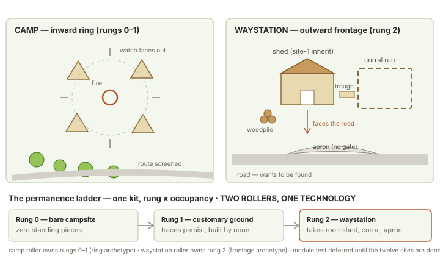

# SITE 2 — CAMP / SERVICE — WORKING SPEC

## Authority and honest status

This document translates the ruled Camp family into the Mine-standard generator and
proof contract. It does not replace the catalog's rulings.

Already ruled:

- a camp borrows ground beside a route and does not command it;
- camp and waystation are separate rollers sharing one kit and ladder;
- terrain owns ordinary elevation;
- tent masses carry collision/cover while decoration stays paint;
- form selection uses climate, material, mobility, duration, transport, household,
  status, standardization, and repair facts—not a culture label;
- camps may be hosted inside other sites;
- tents are not enterable volumes in v1;
- a readable central void has one dominant claimant; and
- militarized occupancies may license lashed watch platforms.

Still proposed:

- exact hosted-camp population/development caps;
- the detailed tent-family implementation order; and
- whether waystation eventually needs its own procedural module.

Those open choices remain proposals. They do not block an exterior Camp proof.

## Plain-English promise

A camp is a temporary pocket of safety, service, company, or threat beside the journey.
The player should understand who stopped here, what they need, what they offer or guard,
how long they expect to remain, and which parts of their arrangement could change.

It must feel assembled on borrowed ground. Remove the people and portable pieces and
the world is left with traces—not a miniature permanent settlement.

## What makes it a site family

Site 2 owns a **temporary service and social arrangement on borrowed ground**:

`route choice → claimed center → shelter and service belt → departure or promotion`

Shelter, water, food/fuel, stores, carriers, waste, watch, routine, and traces explain
how people pause here. The center gives the arrangement a readable social focus, while
the route remains a choice rather than property the camp automatically controls.

A scatter of tents without a center, service logic, routine, or route relationship is
not a Camp. A permanent block with rooted frontage belongs to the waystation expression
or another host family. A military occupation may threaten a road, but that behavior
comes from the occupancy roll rather than from “camp” itself.

## Required invariants

- **REQUIRED — beside, not astride.** An ordinary camp leaves the traveled route
  passable. A military toll-camp may screen or threaten it only when occupancy licenses
  that behavior.
- **REQUIRED — surface-anchored.** Rungs 0–1 use portable pieces and ground traces, not
  foundations. Rung 2 may inherit standing service structures.
- **REQUIRED — one readable center claimant.** Fire, well, cooking assembly, shrine, or
  another coherent social focus owns the central void.
- **REQUIRED — shelter has honest footprints.** Tent collision, cover, entrance side,
  and no-stand zones agree with the visible mass.
- **REQUIRED — life-support destinations exist.** Water, food/fuel, stores, animals or
  carrier, and waste/sanitation have plausible locations.
- **REQUIRED — the level offers plans.** The center, shelter belt, terrain edge, route
  threshold, schedule, and occupancy must create more than one useful approach.
- **DEFAULT — inward social topology.** Rungs 0–1 face the claimed center without
  requiring a perfect circle.
- **LICENSED — controlled entrance, earthwork, palisade, or watch platform.** These
  require occupancy, duration, threat, materials, and host space.
- **LICENSED — hosted expression.** Host geometry and population/development caps
  remain authoritative.

## Identity, culture, and circumstance

### Site identity

The identity is the reversible arrangement of center, shelter, service, supplies,
watch, traces, and departure beside a route. The player can understand and change the
site through hospitality, schedule, fire, water, animals, stores, watch posture,
screens, and escape lanes.

### Cultural expression

Culture strongly affects how households group, where guests sit, how status and privacy
are expressed, how shelters open toward or away from the center, how goods and animals
are managed, and which construction habits are preferred. It does **not** directly pick
one tent mesh. Climate, material, mobility, duration, transport, household, status,
standardization, repair, and cultural tradition jointly select a form.

### Local circumstance

Host terrain, climate, season, route traffic, available water and fuel, intended stay,
mobility, wealth, threat, population, animals/carriers, current occupants, damage, and
weather determine the actual layout and density.

## The site's deck

An ordinary Camp does not construct its high ground. The deck is a **terrain-owned
knoll, bank, wagon deck, rock shelf, or similar existing advantage** at the clearing's
edge. The camp may watch, avoid, contest, or temporarily occupy it, but the host terrain
created it.

This preserves the site's temporary nature and creates an intentional overlap between
the social pull of the center and the tactical pull of the edge. Militarized occupancies
may license a lashed watch platform; the exception must remain visibly portable and
mechanically reachable.

## Five-expression family

1. **Small — roadside sleep-and-fire stop.** One center claimant, one or two shelters,
   water/store evidence, a carrier or carried load, and a clear route back out.
2. **Ordinary — traveling camp.** An irregular inward-facing shelter belt, three legal
   shelter footprints, working center, service edges, carrier/store position, and
   terrain deck—the recommended first build.
3. **Large — customary or organized camp.** More households or crews, repeated-use
   traces, stronger service separation, watches, lanes, and licensed controlled entry
   without becoming a miniature town.
4. **Degraded or repurposed — disturbed camp.** Evacuation, storm damage, displaced
   occupants, raiding, military occupation, or partial abandonment changes routine,
   shelter, and traces while the temporary arrangement remains readable.
5. **Unusual — rooted or hosted expression.** A waystation/service yard promotes the
   shared kit into rooted frontage; a dungeon, lair, fortress, or urban host may instead
   admit a bounded guest camp under the host's geometry and caps.

Portfolio comparison:
[five-expression family board](diagrams/golden-site-five-expression-families.svg).

## Growth ladder and implementation order

### Scene ladder

1. **Rung 0 — bare campsite:** center assembly, one or more portable shelters, stores,
   water, carrier evidence, and fresh ground traces.
2. **Rung 1 — customary ground:** the same clearing remembers repeated use through
   pads, fire scar, cache, worn approaches, and accumulated traces.
3. **Rung 2 — waystation/service yard:** rooted frontage facing the road, apron without
   a gate, shed, corral/trough, stock, and service routine.
4. **Hosted expression:** a bounded Camp assembly borrowed by a dungeon, lair, urban
   lot, fortress, or other host under that host's rules.

### Implementation order

**Exterior Rung 0 Golden Seed → Rung 1 traces → militarized Rung 0–1 → Rung 2
waystation → hosted expressions.**

The first exterior camp proves footprint, route relation, center, social/tactical
choices, light, and occupancy without adding permanent architecture. Repeated-ground
traces are a cheap promotion. Military posture tests controlled access and vertical
exceptions. Waystation then adds frontage. Hosted camps wait for host proofs.

The detailed tent order remains `PROPOSED`: bell/cone → grid-exact troop tent → low open
span → dome/bender.

## Recommended first build

Build the ordinary exterior traveling camp before the rooted waystation or any hosted
expression. It is the smallest version that tests the family's hard shared problems:
multiple shelter footprints, an irregular but readable center, route ownership, service
destinations, terrain-owned high ground, firelight, collision, and both social and
hostile plans.

### Golden Seed — borrowed-clearing camp

An irregular inward-facing camp in a borrowed clearing beside a real route:

- one fire-centered social void;
- three visibly different legal shelter footprints;
- a wagon or local carrier at the store edge;
- water/service and downwind waste destinations;
- an unclaimed knoll at the clearing edge;
- an open route threshold and at least one screened shelter approach;
- legal deployment, observation, objective, and retreat ground; and
- a schedule/occupancy state that supports both social and hostile readings.

The seed is not required to be circular. It is required to read inward.

## Working spatial specification

### Required zones

1. **Route tangent:** the visible traveled path and the point where the player chooses
   to stop, hail, observe, or continue.
2. **Quiet observation edge:** enough cover or distance to read the camp before
   committing; never a guaranteed stealth win.
3. **Claimed center:** fire or other dominant social/service assembly with a clear
   working and gathering apron.
4. **Shelter belt:** tents or portable shelters whose openings, status, and spacing
   create lanes rather than a solid wall.
5. **Store/carrier edge:** wagon, sledge, pack area, feed, baggage, and valuable stock.
6. **Water/service edge:** cooking, repair, wash, trough, or water access with an
   understandable relation to center and route.
7. **Terrain deck:** knoll, rock shelf, bank, or other host-owned high ground.
8. **Waste/downwind edge:** ash, dung, refuse, latrine implication, or spoil placed away
   from water and ordinary gathering space.
9. **Retreat/exit:** a short path back to the route plus at least one side escape or
   break in the shelter belt.

### Provisional grid hypotheses

- Horizontal placement uses the 5-foot grid and `h = 2.5 feet`.
- The ruled Roman troop tent begins near **2 × 2 cells**; other forms receive
  small/ordinary/large tactical envelopes only after witness and collision proof.
- A center assembly reserves its interaction apron before shelters are placed. The
  apron size is derived from occupants and function, not a universal circle.
- Ordinary shelter lanes begin wide enough for the six-foot witness and likely traffic;
  deliberately narrow squeezes state their creature/cargo capacity.
- Wagon deck and knoll must hold a natural standee base without overlap or floating.
- Licensed watch platforms begin at the ruled **4h / 10-foot deck** and use
  `climb-cost` access until ladder movement exists.
- Fire clearance, tent separation, rope/stake no-stand margins, and dense-camp limits
  remain clay-calibrated.

No footprint is approved because a historical measurement fits the grid. It must also
create useful movement, believable density, and good fixed-camera silhouettes.

### Route promises

| approach | gives the player | asks the player to accept | capacity |
|---|---|---|---|
| route/front | fastest read; lawful arrival; access to leader/service | seen early; social rules; direct defenders | normal party, wagon/carrier where terrain permits |
| shelter seam | cover, eavesdropping, flank, access to stores | narrow lanes, ropes/stakes, occupants at close range | ordinary/small by default |
| terrain edge | height, information, ranged angle, alternative retreat | climb/time/exposure; may be unclaimed by either side | terrain-card dependent |
| schedule play | reduced witnesses, changed fire/light, sleeping or working routines | time cost and changing world state | non-spatial but map-visible |

At least two spatial approaches and one social/timing approach must be viable. If the
front is also the safest, quietest, fastest, and best-informed route, the seed fails.

### Tactical furnishing

- shelters create cover and sightline breaks without becoming an impassable fence;
- wagons, crates, troughs, wood, and bedrolls reserve collision before dressing;
- fire, water, valuable stores, leader/service point, animals, and watch position are
  candidate objectives;
- open ground near the center supports negotiation, defense, and chaotic movement;
- moving a wagon, opening a screen, waking a shift, dousing a fire, releasing animals,
  or raising an alarm changes understandable local facts;
- a large creature gets useful exterior ground but may be excluded from shelter seams;
  and
- a small creature may gain narrow access without receiving automatic invisibility.

## Seven operating circuits

1. **People and routine:** arrival, watch, work, gathering, sleep, departure.
2. **Shelter and weather:** occupied shelter, repair state, exposure, drainage, wind.
3. **Warmth and light:** fire/fuel, cooking, watch lights, carried light, darkness.
4. **Water and food:** source, storage, preparation, ration, trough, contamination.
5. **Stores and carrier:** wagon/animals, loading, valuables, repair, escape readiness.
6. **Watch and signal:** observation point, dogs/bells/calls, alert propagation.
7. **Waste and traces:** ash, refuse, dung, latrine, trample, abandoned evidence.

Friendly descriptions derive from factorized facts:

- **coverage:** sufficient / reduced / absent;
- **condition:** sound / worn / strained / failed;
- **access:** open / screened / controlled / blocked;
- **load:** sparse / normal / crowded / overloaded;
- **mode:** traveling / setting / active / resting / breaking / emergency;
- **cause and recovery:** who or what changed it, and how it could change again.

Do not implement `campState = hostile` or `campState = poor` as a visual/layout switch.
Faction attitude and material constraints are separate facts.

## Strategic gameplay contract

The camp must support at least three meaningfully different plans:

- **Open approach:** use faction relationships, trade, tribute, warning, hospitality, or
  deception at the route edge.
- **Shelter approach:** move through footprint-defined lanes to observe, steal, rescue,
  flank, or reach a specific shelter/store.
- **Terrain/timing approach:** take the knoll, wait for a shift, exploit darkness, or
  alter watch/light/animals before entering.

Site levers include fire, wagon/carrier readiness, watch/signal, shelter screens,
animals, water, stores, schedule, and controlled entrance. Each lever changes a circuit
and at least one plan. Noncombat play is mandatory for ordinary camps.

## Generator contract

### Inputs

- host and terrain envelope;
- route direction, traffic promise, and arrival side;
- rung and exterior/hosted mode;
- climate, weather, season, water, and wind;
- available materials and transport;
- mobility, duration, household/crew organization, status, standardization, and repair;
- occupancy, faction, relationship, routine, and alert;
- center claimant and offered/guarded service;
- shelter forms and footprint tiers;
- carrier/animal facts;
- light/fuel ownership;
- threat band, encounter objective, and creature envelopes.

### Semantic blueprint

Commit before geometry:

- route tangent and open passage;
- center claimant plus apron;
- shelter groups, entrances, occupants, and footprints;
- service, water, store/carrier, waste, and terrain-deck destinations;
- people/routine, light, watch, and resource circuits;
- approaches, capacities, objectives, retreat, and interaction anchors;
- hosted caps and host-owned elevation where applicable; and
- provenance, relaxation, and rejection records.

### Generation order

1. Commit host, route, weather, occupants, relationship, objective, and witnesses.
2. Select rung and exterior/hosted contract.
3. Reserve the route and quiet observation edge.
4. Place the center claimant and its working/social apron.
5. Choose shelter forms from concrete compatibility facts.
6. Place shelter groups inward-facing with honest entrances and collision.
7. Place store/carrier, water/service, and waste destinations.
8. Reserve terrain-deck access, side approach, deployment, and retreat.
9. Apply schedule, watch, light, shelter, and resource states.
10. Validate plans, center read, density, standees, host caps, camera, and lighting.
11. Dress retained ids without shifting tactical footprints.

### Required rejection checks

Reject when:

- an ordinary camp blocks or commands the route without a licensed occupancy;
- the center contains two unrelated equal claimants or has no usable apron;
- shelters overlap, hide their entrances, or create no passable internal lanes;
- a tent's visible mass, cover, collision, or no-stand margin disagree;
- form selection is justified only by culture, species, poverty, or “monster”;
- water, stores/carrier, or waste has no destination;
- the only useful approach is the open front;
- a licensed platform lacks legal access or grants an unproved cover class;
- practical light has no user, task, fuel, or schedule;
- a hosted camp exceeds its host or modifies host structure without permission;
- fixed-camera overlap erases shelter/status silhouettes; or
- large or small standees gain or lose routes accidentally.

### Deterministic fallback ladder

1. remove noncanonical loose props;
2. rotate or shift a shelter within its reserved sector;
3. widen one internal lane and reduce loose stores;
4. reduce shelter count while preserving occupancy logic;
5. remove a licensed platform, palisade, or secondary screen;
6. reduce the rung or hosted population under the recorded cap;
7. reject and reroll.

Never solve failure by overlapping bases, shrinking every tent, deleting water/waste,
moving the route, or turning an inward camp into a frontage yard.

## Culture, construction, and organization cards

Culture may influence climate adaptation, material traditions, household organization,
status expression, repair practice, color, marks, and ritual. The actual shelter form is
selected from the resulting facts.

The first pair must change at least four of:

- shelter construction and opening discipline;
- center use and assembly;
- household/crew grouping;
- stores/carrier organization;
- watch and signal;
- water/food handling;
- repair and reuse;
- status/authority visibility;
- hospitality/claim custom; and
- traces left after departure.

At least one change must be geometry or organization, one interaction/ownership, and one
material/mark. Palette alone fails.

## Occupancy states and hooks

Occupancies include military bivouac, caravan/traveling household, hunters or pilgrims,
bandits, displaced community, empty recent camp, rooted service yard, and licensed
nonhuman arrangements whose body/material facts are explicit.

Hooks include missing travelers, disputed hospitality, low supplies, sick animals,
guard change, stolen cargo, hostage/rescue, false toll, fire danger, contaminated water,
storm preparation, hurried departure, and a camp that appears occupied but is not.
Every hook touches a real circuit and a visible objective.

## Lighting and presentation

- Daylight and sky are environment-owned.
- Firelight is warm, local, shadow-casting, smoothly falling, and subtly animated when
  flame is visible.
- Additional lamps belong to a watch, task, shelter entrance, carrier, or occupant.
- Extinguished or low-fire states may make the lit subject easier or harder to see; the
  existing visibility rules own the mechanical result.
- Readable ambient, AO, contact, and honest silhouette shadows preserve tent spacing and
  terrain without inventing fill lamps.
- The selected standee's base-face emission remains presentation state, not camp light.

## Structure, mechanisms, and surfaces

### Inherited

Terrain, rock access, shed/lean-to, posts, crate stacks, ordinary water and ground,
generic light hardware, climb/catch rules, and host-owned elevation.

### Site-owned

Fire/center assembly · tent mass families and entrance sockets · wagon/carrier deck ·
ground trace/pad family · palisade/screen · service apron · corral/trough/woodpile ·
ditch-and-bank world assembly · licensed lashed platform.

### Material / paint / prop demand

- **Material:** canvas/hide/felt, roundwood, rope/lashing, scavenged plank, earth/mud,
  trampled ground, ash/scorch, water, wagon wood/hardware.
- **Paint/decal:** seams, patches, stripes, ownership/status marks, stake/rope rays,
  tracks, fire scar, spill, repair, weathering.
- **Prop/mechanism:** fire states, wagon/sledge, trough, stores, bedrolls, tools, food,
  water containers, signal objects, animal reservations.

Collision, cover, climb, light position, or interaction reach makes an item geometry or
a mechanism.

## Runtime facts and proof receipt

Retain equivalents of:

`rung` · `hostId` · `routeTangent` · `centerClaimantId` · `centerApron` ·
`shelterGroups` · `formCompatibilityFacts` · `entranceSides` · `footprintEnvelopes` ·
`serviceIds` · `waterPath` · `wasteDestination` · `carrierState` · `routineState` ·
`watchState` · `lightOwners` · `terrainDeckId` · `routeCapacities` · `objectiveIds` ·
`planTradeoffs` · `hostCaps` · `recoveryVerbs` · `relaxations` · `rejections`.

The receipt also records seed/version, camera, grid, standee envelopes, occupancy and
culture/organization cards, selected assemblies and provenance, clay/tactical/dressed
surface ids, captures, validation results, and failed candidates.

## First visual proof

Show one live exterior traveling-camp seed through the fixed production camera, then
keep the committed layout constant while cycling:

1. neutral clay with the four standee envelopes and visible legal shelter footprints;
2. tactical overlay naming center, shelter seams, route threshold, terrain deck,
   service/water/waste edges, objectives, capacities, and retreat;
3. dressed daylight and firelit night states with three genuinely different shelter
   families and culture/organization facts exposed;
4. two changed seeds—one sparse and one dense—plus a hostile overlap/camera case;
5. front/social, shelter-seam, terrain, and schedule plans with their tradeoffs.

The visible proof must show that the camp is inward-facing without requiring a circle,
that culture affects more than color, that the route remains passable, and that contact,
AO, fire shadows, and ambient readability do not invent an unexplained fill lamp.

## Site boundaries and stretch

- Site 1 owns actual route control.
- Site 7 owns the natural interior that may host a camp.
- Site 10 owns urban host geometry and the frontage technology a waystation may borrow.
- Site 3 owns the completed empty transformation and accumulated traces.
- A rooted camp becomes a waystation only through a new site roll; it does not silently
  escalate during one encounter.

## Proof → MVP → Ideal

### Proof

One deterministic exterior Rung-0 Golden Seed with nine zones, three shelter forms,
dominant fire center, route tangent, wagon/carrier, water/service, waste, knoll,
front/shelter/terrain approaches, four standee envelopes, clay/tactical/dressed views,
day/night/low-fire states, two changed seeds, dense and sparse adversarial cases, and
three demonstrated plans including an open noncombat approach.

### MVP

Exterior Rungs 0–1; three production-ready shelter families; fire/center, wagon,
knoll, water/service, waste, routine/watch/light circuits; military, traveler,
bandit, and empty occupancies; deterministic compatibility, density, rejection, and
receipts. No enterable shelter interiors.

### Ideal

Rung-2 waystation; full tent family; ditch/bank, palisade, platforms, animals, broad
condition traces; hosted dungeon/urban/lair expressions after host proofs; culture and
history card breadth; host-safe population/development caps.

## Remaining evidence and proof gaps

- clay-calibrate footprint tiers, fire margins, density, and natural-base fit;
- confirm tent compatibility weights through changed cultures/environments;
- prove irregular center layouts and dense/sparse envelopes;
- settle hosted caps after host proofs;
- rule the proposed tent implementation order; and
- build and retain the fixture in `GOLDEN-SITES-PROOF-QUEUE.md`.
