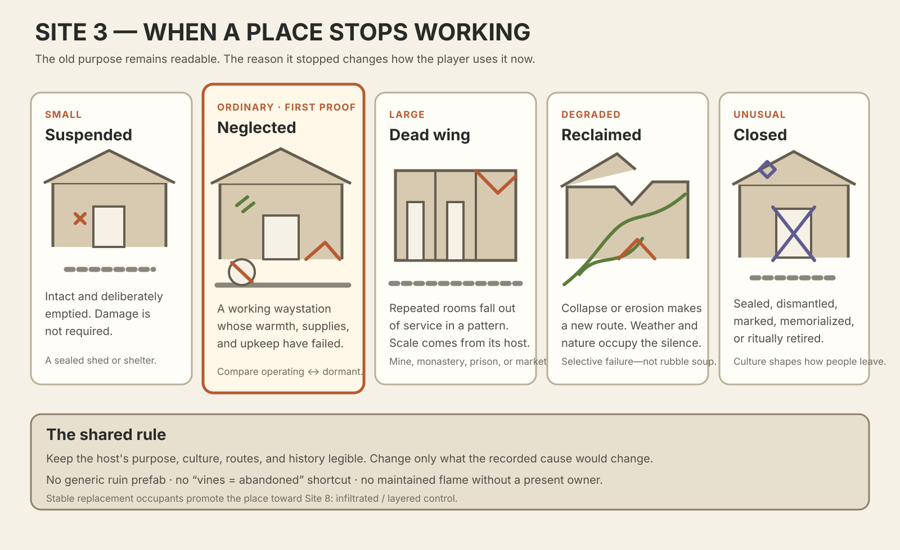
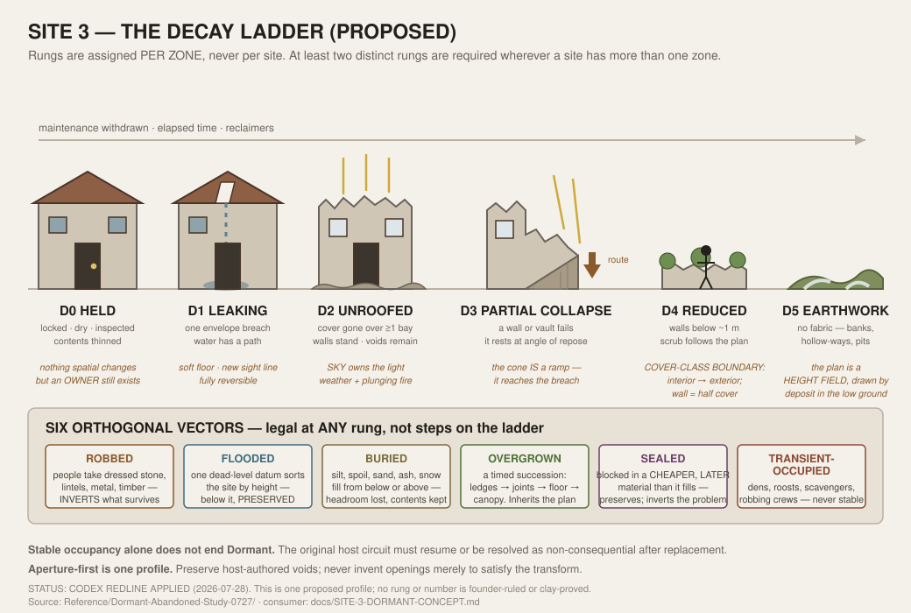

STATUS: DRAFT — PENDING CODEX ADVERSARIAL REVIEW (2026-07-27 campaign)

---
type: working-site-spec
created: 2026-07-25
updated: 2026-07-27
status: WORKING SPEC — cross-host transform; research PARTIAL; founder OPEN; clay OPEN
site: 3 — dormant / abandoned (a **cross-host transform**, not a host program)
standard: SITE-5-MINE-WORKSHOP-CONCEPT.md
method: GOLDEN-SITE-CONCEPTING-GUIDELINES.md
authority:
  - GOLDEN-SITE-ONTOLOGY-ENGINE-MARRIAGE.md
  - GOLDEN-SITES-CATALOG.md
  - SETTLED-LIFE-SITES-PROGRAM.md
preservation: GOLDEN-SITE-ROLLER-PRESERVATION-LEDGER.md
context-projection: GOLDEN-SITE-WORLD-CONTEXT-PROJECTION.md
research:
  - ../Reference/Dormant-Abandoned-Study-0727/synthesis.md
  - ../Reference/Dormant-Abandoned-Study-0727/lane-1-breadth-sweep.md
  - ../Reference/Dormant-Abandoned-Study-0727/lane-2-image-lane.md
  - ../Reference/Dormant-Abandoned-Study-0727/lane-3-fft-cohort.md
  - ../Reference/Dormant-Abandoned-Study-0727/lane-4-engine-content-audit.md
spawnables: intel-sites/SITE-3-SPAWNABLE.md
---

# SITE 3 — DORMANT / ABANDONED — WORKING SPEC

This document replaces the 2026-07-25 concept board in place. The concept board's promise,
invariants, five-expression family and return condition are all preserved below; what is new
is the research that grounds them, the factorized state model, the working spatial
specification, the generator contract, and an honest re-reading of the build order in the
light of the walk census.

---

## 1. Authority, honest gates, ruled decisions, unresolved proposals

### 1.1 What this document is

Site 3 is a **cross-host transform**. It owns no geometry generator of its own. It owns the
rules and deltas that explain how *any* host program — guard post, camp, monastery, mine,
prison, lair, urban institution, or an ordinary venue such as a manor or a shrine — stops
working, and what that does to play.

The corollary, stated once in `SETTLED-LIFE-SITES-PROGRAM.md` §2.2 and binding here: **a
transform never earns its own geometry generator, and a host program never earns a second
number for being in an unusual state.** A flooded manor is the manor host plus the flooding
vector of this transform. It is not a flood site.

This spec is a consumer and index of the ontology contract, the catalog, the roller ledger
and the world-context contract. It is not a replacement authority for any of them.

### 1.2 Proposed status-gate line

The catalog's status table currently carries Site 3 inside the composite row
`3/8/9/11/12 | OPEN | OPEN | OPEN | OPEN`. This spec **proposes** the following replacement
line. It does not edit the table; the catalog owner does that.

| site | role | researched | founder-ruled | brief-congruent | clay-proved | current reason |
|---|---|---|---|---|---|---|
| 3 Dormant / Abandoned | transform | PARTIAL | OPEN | PARTIAL | OPEN | full depth-law packet returned (sourced breadth sweep · 12 downloaded and individually read images with per-image ledger · FFT comparison with declared corpus narrowing · live-roller content audit); four research gaps declared open; every law, ladder rung, number and build order is `PROPOSED` and three founder questions are outstanding; no rendered fixture exists |

`RESEARCHED` is **PARTIAL and not PASS** because four substantive gaps are declared and open:
non-European construction and its different decay orders; no measured decay-rate data (the
elapsed bands are ordinal, never numeric); no image evidence for the ROBBED vector or for the
mothballed D0 rung; and the systematic 121-map FFT cohort classification could not be
re-verified in this worktree (see §1.5).

### 1.3 What is already ruled, and by whom

Only three things bind here, and none was ruled by this pass:

1. **Site 3 is a cross-host transform** — `GOLDEN-SITE-ONTOLOGY-ENGINE-MARRIAGE.md` §6,
   accepted direction, 2026-07-26.
2. **The noun/state distinction** — `SETTLED-LIFE-SITES-PROGRAM.md` §2, ruled by Adam
   2026-07-27 (morning).
3. **THE CAUSAL LIGHT LAW** — ruled by Adam 2026-07-24 on the lair packet and explicitly
   scoped as reaching beyond that site. Section 12 applies it here and proposes one addition.

Inherited from the 2026-07-25/26 concept board and retained: the plain-English promise, the
seven invariants, the identity/culture/circumstance split, the five-expression family, and
the rule that abandonment transforms the host's recorded facts, ids and components and never
swaps the host for a generic ruin prefab.

### 1.4 Unresolved proposals carrying load

Everything in §§3–15 marked `PROPOSED` is a build order or a hypothesis, never implementation
authority. The three that carry the most load are the founder questions in §16.

### 1.5 Working-environment note

Every image tracked in this repository is a git-LFS pointer in a fresh worktree, not bytes.
Research in this pass had to run `git lfs pull --include="Reference/FFT Battle Maps/*"` (a
read-only fetch) before any FFT frame could be inspected, and the Desktop-local 605-GIF
five-angle archive named by earlier studies no longer exists on this machine. That is why
parts of the FFT lane are documentary rather than pixel-verified, and it is declared rather
than hidden.

---

## 2. Plain-English promise and classified invariants

### 2.1 The promise

> You arrive somewhere that used to work and no longer does. The place should tell you what
> people once did here, suggest why that stopped, and make the silence matter to how you
> explore it now.

The player should feel they are reading the remains of a real place, not walking through a
generic pile of ruins. And they should be able to *do something about it*: a dormant site is
a machine that has been switched off, and parts of it can be switched back on.

### 2.2 What makes it a transform rather than a site family

Site 3 owns a **delta over a host's operating circuits**, not a room grammar:

`host circuits → maintenance withdrawn → elapsed time → reclaimers → transformed circuits`

The host still supplies purpose, culture, construction, topology, ownership history and
component provenance. Site 3 supplies why they no longer function and what the failure
created.

A pile of rubble with vines on it is not a Site 3 result. Neither is a working place with a
grey filter over it.

### 2.3 Invariants

- **REQUIRED — former purpose remains readable.** A player can form a useful idea of what the
  place was for, from geometry and residue alone, before anybody explains it.
- **REQUIRED — the stopped state has a named cause.** A rolled fact — supplies removed,
  access blocked, work unfinished, seam exhausted, route moved, water failed, war, closure,
  collapse — explains why it no longer operates. No cause, no candidate.
- **REQUIRED — the present condition changes play.** It must alter access, safety,
  information, shelter, salvage, visibility, light ownership, or route capacity. Concretely,
  not narratively.
- **REQUIRED — host truth survives.** Original surfaces, routes, ownership history, culture
  and component provenance are transformed, never replaced by a generic ruin prefab. Stable
  ids survive the transform.
- **REQUIRED — no stable new operator owns the place.** Passing scavengers, animals, weather,
  a robbing crew, or a single encounter are legal. A functioning replacement population removes
  the Dormant transform: it becomes Site 8 when at least two persistent simultaneous claims
  retain a consequential control difference, or Site 10/its own host when one population has
  simply moved in and started operating.
- **REQUIRED — the state is factorized, not a switch.** Rung and vectors are recorded per
  zone with a cause and a recovery. One site-wide `abandonedState = ruined` is rejected for
  exactly the reason `mineState = failing` is rejected in Site 5: it makes every consequence
  simultaneous and removes every lever.
- **REQUIRED — damage is causal.** Every collapse has a source above or beside it; every
  rubble cone has a hole it fell from; every water level has a source, a datum and a
  destination; every robbed element has a taker and a route out.
- **DEFAULT — damage is selective.** Most of the place stays coherent enough to make the
  important failure legible. FFT's own ruin composition agrees: one intact vertical element
  carries the silhouette while the low mass carries the damage.
- **DEFAULT — causes are mundane.** The desertion literature is emphatic: places stop for
  economic and environmental reasons far more often than dramatic ones. The weird cause is
  the exception, and it should feel like one.
- **LICENSED — supernatural persistence.** Haunting, magical stasis, cursed closure or
  impossible preservation appear only when realm, history and band facts support them.
- **LICENSED — funerary host.** A crypt, tomb, catacomb or ossuary is a *host program*
  (§11.5). Site 3 may transform it. Site 3 may not *be* it.

Simply removing NPCs, scattering rubble everywhere, adding vines, or applying a grey filter
does not satisfy the site.

---

## 3. Identity, culture and circumstance

### 3.1 Site identity

The visible relationship between **former function** and **present absence** is the identity.
Everything the player can do here follows from being able to see both halves at once.

### 3.2 Cultural expression

Culture decides how a place is shut, mourned, stripped, marked forbidden, or left for return.
It is at its most legible in the **closure act** — a blocked arch, a capped shaft, a
termination deposit, a memorial marker, a door left deliberately open — because that act is
performed *once*, by people, on purpose, and it survives.

Culture also remains visible in the host's construction, joinery, bond and proportion. What
culture does **not** decide is which rubble mesh appears; decay is physics, closure is
culture.

### 3.3 Local circumstance

Climate, material, elapsed time, terrain, disaster, maintenance history, evacuation speed,
wealth, scavenging pressure, groundwater, and former function decide how the site actually
decays and in what order. Construction material sets the *clock*; it does not change the
*sequence*.

---

## 4. The scene ladder, implementation order, learning rationale and Golden Seed

### 4.1 The decay ladder (`PROPOSED`) — per zone, never per site

| rung | real-world construction reading | play consequence |
|---|---|---|
| **D0 HELD** | maintenance stopped but the site is actively kept — locked, dried, greased, inspected. Industry calls this care and maintenance | nothing spatial changes. Contents are thinned to what is not worth removing. There is no light owner *on site* but there is still an **owner** — so the problem is legal and social, not physical |
| **D1 LEAKING** | the envelope is breached at one point: a slipped slate, a failed shutter, a sprung door. Water now has a path | one wet floor patch with reduced footing, one new sight or sound line, a smell. Fully reversible with an hour's work |
| **D2 UNROOFED** | the cover is gone over one or more bays. Walls stand near full height; openings survive as clean voids; the wall head is ragged; a rubble apron lies at the foot | the room becomes weather-exposed and **sky-lit**. Rain, snow, wind and ranged fire from above all apply. Walls still block sight |
| **D3 PARTIAL COLLAPSE** | one or more wall or vault sections fail. The material falls, spreads, and comes to rest at its angle of repose against the wall it fell from | a **rubble cone that is a ramp** — new elevation the host never had, usually reaching the breach it fell through. Also a new blockage somewhere else, and a horizontal scar band where the lost floor sat |
| **D4 REDUCED** | walls stand below about a metre; the plan survives as a kerb; hedge and scrub grow along the wall lines | **the interior stops being an interior.** Outdoor rules apply inside the footprint; the wall is half cover, not a blocker; sight lines open across the whole plan |
| **D5 EARTHWORK** | no fabric at all; platforms, banks, hollow-ways and robbing pits remain in the ground | the plan is a height field. It is legible because low ground holds different deposit — snow, standing water, frost, moss, a different grass value |

### 4.2 The six vectors (`PROPOSED`) — legal at any rung, orthogonal to it

| vector | what it does | why it is not a rung |
|---|---|---|
| **ROBBED** | people take dressed stone, lintels, metal, timber, glass, fixtures; footings are dug out | it is intelligent and selective, and it *inverts* the survivability order by targeting exactly what would otherwise last |
| **FLOODED** | water occupies everything below a datum; a band marks where it stood | it sorts the site by height rather than degrading it; below the datum things are *preserved* and inaccessible |
| **BURIED** | sediment, spoil, sand, ash or snow fills from below or above | it reduces headroom and seals lower volumes; it also preserves |
| **OVERGROWN** | plants colonise in a fixed order: horizontal ledges, then joints and verticals, then canopy | it is a timed succession with substrate preference, not an intensity slider |
| **SEALED** | openings deliberately blocked in a cheaper, later material; shafts capped; passages backfilled; a termination deposit laid | it *preserves*, and it inverts the problem from "survive the ruin" to "get in, and decide whether you should" |
| **TRANSIENT-OCCUPIED** | animals den, scavengers camp, a robbing crew works, a single monster claims it | strictly transient. A stable operator ends the transform (§2.3) |

### 4.3 Growth ladder and build order (`PROPOSED` under the generator principle)

The generator principle says founder either/or questions default to BOTH-ROLLED, and what
gets recorded is build order, learning rationale and ladder links. Accordingly:

| rung | build | learning rationale | ladder links |
|---|---|---|---|
| **A** | **The comparison pair on one small host** — an existing Site 1 Guard Post built twice from the same committed facts: operating, then dormant at D2 + SEALED | proves the transform *is* a delta: same ids, same footprint, same culture, only the caused facts differ. Site 1 is already `RESEARCHED/FOUNDER-RULED/BRIEF-CONGRUENT: PASS`, and its own spec already says "a dead checkpoint whose operating relationship has vanished belongs to Site 3" — so the handoff is pre-declared and the host costs nothing | promotes to B by adding a below-grade half; degrades to D5 |
| **B** | **The Sunken Estate** — a domestic/manor host, D2–D3 above the datum, D0-preserved below it, FLOODED vector, drawdown as a state change | proves the SUBTRACTIVE-SURVIVES law and the water datum, covers 10.3 % of dungeon rolls directly, and needs no new host program | promotes to C; degrades to a D4 wall-stub field on a dry season |
| **C** | **The lapsed crypt** — Funerary Store host (§11.5) + Dormant + SEALED + ROBBED | the largest single demand bucket at 21.3 %, and the two-route promise (ceremonial way vs robbers' tunnel) is the strongest strategic case in the whole site. Costs a new *host program*, which is why it is third and not first | promotes to a catacomb network; degrades to a robbed and empty gallery |
| **D** | **The dead wing** — one range of a still-operating Site 4 / 6 / 10 host gone dormant while the rest works | proves the transform at *sub-site* scale and proves it composes with a live host — the hardest and most valuable case | this is the promotion target for A–C |
| **E** | **The stopped mine** — Site 5's own declared handoff ("fully stopped, at which point Site 3 becomes the host") | closes the loop with an already-specced host and exercises D0 HELD, the industrial closure vocabulary, and the FLOODED vector underground | ideal-horizon |

Rungs map onto the L1–10 bands the way the other sites' ladders do: A is a low-tier
encounter, B and C are mid-tier, D and E are upper-tier where the host's own complexity
arrives with the dormancy.

### 4.4 The proposed Golden Seed

**`DA-SEED-01 — the drowned lower half`**: rung B. One domestic/manor host whose upper storey
is D2/D3 and open to the sky, whose lower storey and cellars are D0-preserved beneath a flat
water datum, with the drawdown clock as the site's central lever.

Why this and not the waystation the concept board proposed: the waystation is small,
above-ground, has no below-grade half, and touches neither of the two buckets that together
carry a third of dungeon demand. `DA-SEED-01` exercises the ladder, the water vector, the
subtractive-survives law, the aperture law, two genuinely different routes, and a state change
the player can cause — on a host that already exists.

The concept board's waystation is retained as rung A's alternate host if Adam prefers the
route-service reading to the checkpoint reading; both are the same amount of work.

### 4.5 The five-expression family (retained from the concept board, re-grounded)

1. **Small — the held shelter.** An intact hut, watch shelter or service shed, locked and
   dry, work stopped, useful supplies deliberately removed. Rung D0.
2. **Ordinary — the neglected waystation.** A once-working roadside stop whose service
   relationships remain obvious while warmth, provisions, maintenance and safe passage have
   failed. Rungs D1–D2.
3. **Large — the dead institutional wing.** A monastery range, prison block, market frontage
   or mine level falling out of service in a legible pattern while the rest lives. Mixed rungs.
4. **Degraded — breached and reclaimed.** Collapse or erosion creates an accidental route
   while vegetation, water, snow, sand or animals occupy the unattended space. Rung D3 +
   OVERGROWN or FLOODED.
5. **Unusual — deliberately closed.** A culture has sealed, dismantled, marked, memorialised,
   cursed or ritually retired the place rather than merely walking away. Any rung + SEALED.





---

## 5. Required spatial zones and provisional grid/standee hypotheses

### 5.1 Required zones

A valid dormant result must contain these five reads. They may share physical space; none may
disappear into dressing.

1. **The legible former function** — at least one zone where the host's purpose is still
   spatially obvious: the work face, the altar, the cell range, the counter, the barrier, the
   loculus wall. This is the invariant's home.
2. **The failure** — the located, caused thing that stopped it: the collapse and its source,
   the blocked opening, the water and its datum, the empty machine bed, the removed lintel.
3. **The aperture** — at least one motivated opening that admits light or weather, with a
   readable lit island beneath it and a dark rim around it.
4. **The residue field** — where the evidence-of-exit lives: what was taken, what was left,
   what was later tampered with. Usually the store, the yard, the sleeping range, or the floor
   under the fallen shelf.
5. **The reclaimed ground** — the part the site no longer controls: canopy, water, spoil,
   den, or a scavengers' fire. This is where the transient claimant is, if there is one.

A site at rung D5 keeps zones 1, 2 and 5 as ground modelling and loses 3 and 4 to the soil —
which is why D5 is rejected for encounters that need interior cover (§10).

### 5.2 Provisional grid hypotheses (`PROPOSED` — clay-calibrated, never binding)

Each restated as real-world construction first, per the 3D discipline.

- **Loculus gallery.** *Construction:* two workers cut a slot through soft rock wide enough
  for one person to pass carrying a basket, then cut burial shelves back into both side walls
  in tiers. *Hypothesis:* **1 cell / 5 ft clear is already generous** — the honest gallery is
  one cell wide with niche relief in the walls, and head height should start at **3h / 7.5 ft,
  not 4h / 10 ft**. Loculi are wall relief, not cells: roughly 0.4–0.5 m high, 0.5 m deep,
  body-length long, 4–6 tiers. **A large creature cannot use a gallery at all** — that is the
  capacity fact and it is a gameplay feature, not a defect.
- **Chambered / passage tomb.** *Construction:* a passage is built or cut, then covered by a
  mound whose flank is revetted at the entrance. *Hypothesis:* passage 1 cell, terminal
  chamber 2–3 cells across, and **the mound is terrain, not architecture** — it is a height
  field with one masonry socket in its flank.
- **Vaulted undercroft / crypt.** *Construction:* a barrel vault is built as repeated bays
  springing off a pier line. *Hypothesis:* **2-cell bays** on a pier line, springing near
  **2h / 5 ft**, crown near **3h / 7.5 ft**. Under cutaway the camera-facing vault is omitted,
  but the springings and the pier line must show — the FFT precedent is an arch *mass*, never
  a lid.
- **D3 collapse cone.** *Construction:* material falls through a hole, spreads, and comes to
  rest at its angle of repose against the wall it fell from — roughly 30–40°. *Hypothesis:* a
  cone reaching **1–2 h** high at the wall over a 2–3 cell base, climbable at a cost, and
  **reaching the breach it fell through** whenever the breach is within that height. This is
  causal geometry: the ramp exists *because* the hole does.
- **D4 wall stub.** *Construction:* a wall reduced to 0.5–1.2 m of surviving courses.
  *Hypothesis:* **0–1 h** — therefore **half cover, not a sight blocker**, and the enclosed
  volume flips to outdoor rules.
- **Water datum.** *Construction:* standing water finds one dead-level surface across the
  whole connected volume. *Hypothesis:* one datum per connected water body, expressed on the
  `h = 2.5 ft` quantum; the engine's own Flooded Chamber row already uses 2 ft of water with a
  3 ft dry island, which sits comfortably inside this.
- **Breach opening.** *Hypothesis:* start at **1 cell / 5 ft clear** for a passable breach and
  **under 1 cell** for a squeeze that is a genuine capacity limit. A breach that no standee can
  pass is not a route and must not be counted as one.

The first proof must show small, six-foot-human, presentation-large and largest-legal
standees against the gallery, the cone, the stub line and the water. No number becomes binding
until standee fit, collision, fixed-camera legibility and real play choices agree.

---

## 6. Route and plan promises

| route | gives the player | asks the player to accept | capacity |
|---|---|---|---|
| **the designed way** (the host's own front door, road, portal, ceremonial passage) | generous width, known geometry, the host's own affordances, safe retreat | it is the watched, sealed, or blocked one — the closure act is usually *here*, and paying it is social, ritual, or loud | full; large creatures where the host allowed them |
| **the breach** (collapse cone, fallen wall, eroded gap, sinkhole) | a way past the closure; elevation at the cone; surprise | unstable footing, noise, possible one-way drop, exposure on the lit island beneath the aperture | ordinary and small by default; capacity is a rolled fact |
| **the robbers' way** (a tunnel or hole cut by someone who came after) | secrecy, arrival inside the sealed volume, direct access to the valuable part | narrow, unlit, unsupported, capacity-limited, often one-way; and its existence tells you somebody got here first | small and ordinary only; never carts, never large |
| **the water** (flooded lower half, drain, sump, culvert) | access to the preserved volume nothing else can reach | light cost, carry cost, a clock, and a real drowning risk | swimmers and boats; state-dependent |
| **reactivation** (restore a circuit and open a route the site used to have) | the site's signature verb: a fourth route that did not exist when you arrived | time, materials, noise, and often the loss of another advantage — a drained cellar is no longer a barrier to what lives down there | as the original route allowed |

Changing a seed may change which route is strongest. It may **not** erase the choice, and no
single route may lead on speed, safety, capacity and information at once.

---

## 7. Operating circuits and factorized mutable state

### 7.1 Site 3 does not own circuits — it transforms the host's

Site 5 defines six circuits (product, people, water, air, support, light). Site 1 defines
observation, barrier control, shelter, readiness, supply and elevation. Site 6 defines
custody, intake, property and control. **Site 3 sets a state on whichever circuits its host
has**, using the same vocabulary Site 5 established, and adds two circuits of its own that
only exist once maintenance stops.

Per circuit, the transform records:

- **coverage:** normal / reduced / zero;
- **integrity:** sound / strained / critical / failed;
- **access:** open / restricted / blocked / **sealed**;
- **load:** under / near / over capacity;
- **mode:** active / maintenance / **held** / offline / **derelict**;
- **cause and recovery:** what stopped it and what could restart it.

`held` and `sealed` and `derelict` are the values this transform adds. `held` is the D0 rung's
mode: stopped, but somebody is still looking after it.

### 7.2 The two circuits dormancy creates

1. **The ingress circuit.** Once maintenance stops, the site's *permeability* becomes a system
   in its own right: which openings are original, which are breaches, which are blockings,
   which are robbers' cuts, and what each admits — people, water, air, animals, light, sound.
   This is the circuit the player mostly plays with.
2. **The load circuit.** An unmaintained structure is carrying loads it was not designed for
   and losing members that used to carry them. Every element gets a `load flag` — sound,
   strained, critical, failed — and the flags are connected: pulling a member propagates. This
   is what makes structural gambling legible instead of arbitrary, and the engine's Support
   Pillars rows already provide the damage thresholds.

### 7.3 The factorization, in full

```text
dormant(host) =
    exitMode          ∈ {orderly, hasty, violent, gradual, unfinished, ritual, evicted}
  × elapsedBand       ∈ {season, years, decades, generations, ancient}   [ordinal only]
  × cause             (a rolled world/place/host fact — never invented locally)
  × zoneRungs[]       ∈ D0..D5 per zone, not per site
  × vectors[]         ⊆ {ROBBED, FLOODED, BURIED, OVERGROWN, SEALED, TRANSIENT-OCCUPIED}
  × reclaimers[]      (transient only)
  → circuit deltas + ingress circuit + load circuit + residue field + light owners
```

One site-wide "ruined" boolean is **rejected**. So is any expression that sets every zone to
the same rung — that is the grey-filter failure and §10 rejects it by count.

---

## 8. Strategic levers and demonstrable plans

### 8.1 The four levers this site owns and no other does

1. **Reactivation.** Clear a drain, prop a beam, re-hang a door, re-block a breach, relight a
   furnace, work a rusted winch. Site 5 *repairs a running system*; Site 3 *restarts a dead
   one*, and the restart changes the map. This is the signature verb.
2. **Structural gambling.** The load circuit is a weapon and a hazard. Bringing a gallery down
   on a pursuer costs you the route. The engine already prices this (pillar collapse
   thresholds, Structural Groan, Collapsing Ceiling).
3. **Reading the exit.** What was taken versus left tells you who left, how fast, whether they
   meant to return, and who has been through since. It is information as loot, it gates
   everything else, and it is entirely non-combat.
4. **The ownership vacuum.** Nobody is in charge. Every meeting here is a negotiation between
   transient claimants over a place none of them holds — which makes social and avoidance
   plans genuinely competitive with force.

### 8.2 Three demonstrable plans for `DA-SEED-01` (one non-combat)

- **Plan A — the dry approach (non-combat).** Read the residue field to work out which wing
  the family stripped and which they abandoned; enter through the designed door on the sound
  half; take the intact stair down to the water datum; recover the objective from the shelf
  just above the waterline without ever going under. *Buys:* no swimming, no light problem, no
  fight. *Costs:* only reaches what is above the datum, and the noisy stair announces you.
- **Plan B — the breach and the cone.** Enter through the collapsed corner; take the rubble
  cone up to the surviving gallery for ranged control of the hall floor. *Buys:* elevation and
  surprise. *Costs:* the aperture above the cone lights you from behind, the footing is a
  hazard, and the cone is loud.
- **Plan C — drawdown (reactivation).** Find and clear the blocked culvert or breach the
  sluice; drop the datum a level; walk into the preserved lower rooms dry. *Buys:* the whole
  hidden volume and everything preserved in it. *Costs:* time, noise, and the water was the
  only thing keeping the lower half's occupant contained.

All three must remain viable across changed seeds, and the tradeoffs must survive a changed
cause.

---

## 9. Current roller sources and preservation

Statuses use the `GOLDEN-SITE-ROLLER-PRESERVATION-LEDGER.md` vocabulary. Verified by reading
Engine markdown and `src/` this pass; the full row-by-row inventory is
`intel-sites/SITE-3-SPAWNABLE.md`.

### 9.1 LIVE

- **World axes:** `T.master`, `T.arch`, `T.nearby`, `T.faction`, `T.pressure`, `T.taboo`,
  `T.myth` via `data/creation-flow.js` `STAGES` and `src/world/play.js`.
- **Dungeon walk** (`src/engine/dungeon-walk.js`): `dungeon-type` (carries **Subterranean
  Crypt** and **Sunken Estate**, whose Original Purpose column reads "Manor house / Basement
  levels"), `dungeon-origin`, `dungeon-topology`, `dungeon-area-type` (carries Crypt with
  twelve tiered sarcophagi, Tomb with a false-tomb trap room, Flooded Chamber with a dry
  island, ruined structures inside caves, failed shoring, collapsed sections, collapsed flues,
  ruined bunk frames, a hastily looted treasury, a triple-locked vault),
  `room-elevation-profile`, `dungeon-feature` (Crumbled Masonry, Support Pillars, Sarcophagus
  seal states, Collapsed Bridge, Drainage Grate, Stagnant Pool, Refuse Pile),
  `dungeon-interactable-object`, `dungeon-set-dressing`, **`dungeon-set-dressing-condition`**
  (Fresh / Decayed / Waterlogged / Burned / **Tampered** / Uncanny), `dungeon-lighting` (four
  Pitch Black rows; "light pools in islands between dark gaps"), `dungeon-hazard` (Brittle
  Masonry, Structural Groan, Collapsing Ceiling, Flash Flood, Slick Lichen, Yellow Mold),
  `dungeon-empty-result` (Faded Wall Markings, Abandoned Debris, Natural Overgrowth, Inert
  Machinery, Loose Masonry, Draft of Fresh Air), `dungeon-exit-state`, the secret/discovery/
  lore/revelation families, `dungeon-threat-identity-t1/t2`, `dungeon-boss`, the loot family,
  `walk-skin-dungeon`.
- **Urban walk** (`src/engine/walk.js`): `urban-type` (**Ruined Quarter**),
  `urban-set-dressing-condition`, the urban scene/encounter/dressing/light families.
- **Wilderness walk** (`src/engine/wild-walk.js`): `wilderness-feature`,
  `wilderness-set-dressing-condition`, `wilderness-sign-of-passage`.
- **Place/world drift:** `place-drift` via `src/world/turn.js`.
- **Place spine / skins / building kits / building interior** — as recorded in the ledger.

### 9.2 LIVE-COMPOSED

Ruined quarter + condition + threat identity; flooded chamber + sump + elevation profile;
crypt area type + sarcophagus seal states + tampered condition; cave containing a partially
intact ruined structure + failed shoring; place history + place drift + a dungeon origin
implying a stopped purpose. Each is reachable today from live axes; none is named by a single
row, and each must retain every contributing axis in its receipt.

### 9.3 ORACLE-MANUAL / AUTHORED-UNWIRED

- `place-history`, `place-secret` — consumed by `src/engine/codex-roll.js` (the codex/oracle
  path), not by the walk rollers.
- `dungeon-door-state` — reference verified in `src/world/wiring-b.js`; the player-facing
  caller path was **not** confirmed this pass and must be resolved by the spawn-audit lane
  before anyone calls it live.
- `art-condition` (d100), `dungeon-secret-type`, `urban-area-type` — present only in the
  generated `data/table-atlas.js` / `data/table-usage.js` indexes, or authored-unwired for the
  relevant roller. Evidence and candidate content, not current behaviour.

### 9.4 TARGET-ADAPTER — what Site 3 actually proposes to build

**The coherence layer.** A typed boundary that (a) commits `exitMode`, `elapsedBand`, `cause`,
per-zone `rung`, `vectors` and `reclaimers` *before* the condition rolls fire, (b) **biases**
the live condition rollers with those facts, and (c) **validates** the result against §10.
It adds no new geometry generator and it reroutes no existing roller.

This is the whole build. Lane 4 of the research packet is the argument for it: the engine can
already roll a tampered sarcophagus, an intact triple-locked vault, a failed shoring set and a
pitch-black room *in the same site*, with nothing making them agree.

### 9.5 Retained composition to preserve

`RC-DORMANT-01` (`PROPOSED`) — **the crypt whose seals disagree.** A `dungeon-type` Subterranean
Crypt, `dungeon-area-type` 156 (twelve sarcophagi in two tiers plus a charnel alcove), one
sarcophagus rolled *sealed with mortar*, one rolled *chisel marks suggest recent tampering*,
`dungeon-set-dressing-condition` **Tampered**, and a Pitch Black lighting row. This composition
is reachable from live rollers today. What the transform must add is the fact that makes the
disagreement mean something: somebody has been here since, they came in a particular way, and
they have not finished. New generation must reproduce that *capability* without checking for
these row numbers.

### 9.6 Receipt obligation

Every retained plan carries `rollerLineage` and `sourceRollRefs` per the ledger, plus the
transform-specific fields in §14.

---

## 10. Generator contract

### 10.1 Inputs committed before layout

Host program and operating model id; host's committed zones and circuits; world axes
(setting, architecture/material, faction, pressure, taboo, myth, nearby); walk family and
approach; **cause**; **exit mode**; **elapsed band**; per-zone **rung**; **vectors**;
**reclaimers**; realm/culture closure practice; groundwater and climate; encounter objective,
threat band, creature envelopes, arrival direction.

### 10.2 Semantic blueprint (named before any scenery)

Former-function anchors · the failure and its source · apertures and their lit islands ·
ingress graph (original openings, breaches, blockings, robbers' cuts, water routes) · load
graph with per-element flags · water datum and its source/destination · residue field with
taken/left/tampered flags per object · reclaimed ground and its claimant · the light owners
that legally remain · candidate plans and their tradeoffs · reactivation verbs and what each
one changes · promotion candidates (Site 8, Site 2 hosted camp, Site 7 den).

### 10.3 Generation order

1. Commit the host, its zones, circuits and ids. **Nothing is deleted yet.**
2. Commit cause, exit mode, elapsed band, reclaimers.
3. Assign rungs per zone under the selectivity rule; assign vectors.
4. Apply the failure: place the collapse and its source, or the water and its datum, or the
   blocking and its opening — cause first, consequence second, never the reverse.
5. Derive the ingress graph: which original openings survive, which are blocked, which
   breaches exist, where a robbers' cut would plausibly have been driven.
6. Derive the load graph and flag elements.
7. Derive apertures and light owners. Delete every practical light that has lost its owner.
8. Resolve the residue field from exit mode + elapsed band + robbing pressure.
9. Place reclaimed ground and any transient claimant.
10. Reserve approaches, objectives, retreat, cover, quiet ground and interaction space.
11. Validate against §10.4.
12. Dress the retained ids. Never move gameplay geometry to improve a beauty shot.

### 10.4 Countable rejection rules

Reject the candidate before presentation when:

1. no `cause` is bound to the dormant state;
2. the host program cannot be named from the geometry and residue alone by the readability
   gate;
3. **every zone carries the same rung** (the grey-filter failure) — at least two distinct rung
   values are required whenever the site has more than one zone;
4. a collapse exists with no source above or beside it;
5. a rubble cone exists that does not sit against the surface it fell from;
6. a rubble cone reaches a breach but is not climbable, or is climbable but is not recorded as
   a route;
7. a water body has no source, no dead-level datum, or no destination;
8. an object below the water datum weathers as if it were dry;
9. a practical light exists with no current owner, fuel and legal operating condition;
10. an aperture exists with no lit island beneath it, or a lit island with no aperture;
11. a robbed element was load-bearing and the structure above it is intact;
12. de facto refuse contradicts the exit mode (an orderly withdrawal leaving portable valuables
    on the floor, or a violent end with the stores neatly emptied);
13. overgrowth appears on a surface whose stage index has not been reached (canopy at rung D1,
    joint growth with no joints exposed);
14. a stable operating population is present — that is Site 8 or the host's own number;
15. the only route is a breach that no legal standee can pass, and no alternative exists;
16. a large creature is placed in a volume whose capacity fact excludes it;
17. rung D5 is selected but the encounter requires interior cover or an aperture;
18. the fixed camera hides a required choice, objective or aperture;
19. **the silhouette fails at a second camera rotation** — the ruin composes from the authored
    angle only (the FFT lane's flagged transfer risk, and worse for this site than any other);
20. a changed seed preserves the picture by destroying the gameplay.

### 10.5 Deterministic fallback ladder

If placement fails, try in this order and record the relaxation:

1. move non-canonical dressing;
2. reduce the residue field's object count while preserving its taken/left ratio;
3. lower one zone's rung by one step (less damage is always safer than more);
4. drop one vector, in the order TRANSIENT-OCCUPIED → OVERGROWN → BURIED → ROBBED;
5. shorten the reclaimed ground while preserving the claimant's presence;
6. move the water datum by one `h` step;
7. reduce the site one scale rung while keeping cause, failure, aperture and residue;
8. reject and reroll.

The generator may not silently delete the cause, invent an aperture the structure cannot
justify, hand-place a robbers' tunnel after the player needs it, overlap standee bases, or
turn a squeeze into a full-capacity route to make a candidate fit.

---

## 11. Cards — culture, construction, ecology, occupants, and the funerary host

### 11.1 Closure cards (culture)

A closure card must change a *construction, workflow, ownership or interaction* fact, never
only a palette. The first pair should differ on at least four of:

sealing technique and material · whether the closure is meant to be reversible · what is left
inside deliberately · marking, warning or memorial practice · whether the dead or the tools
are removed · who is permitted to reopen it and at what cost · offering, deposit or destruction
at the moment of leaving · whether the way in is hidden or advertised.

The blocked arch in the image lane is the archetype: **a cheaper, later material filling a
finer, earlier opening.** That single relationship carries culture, chronology, poverty and
intent at once.

### 11.2 Construction cards (circumstance)

Construction sets the elapsed-time clock and the failure mode, not the ladder order. Cards
needed: dressed masonry · random rubble with lime · mudbrick or rammed earth · timber frame
with thatch · timber frame with tile · rock-cut · earth-and-turf · realm-strange material.
**Declared gap:** the research packet's evidence is stone-and-timber biased; mudbrick,
rammed-earth and thatch-only construction decay in a different order and are currently
unsupported by evidence.

### 11.3 Reclaimer cards (ecology)

Ruderal succession stages tied to substrate role (ledge → joint → floor → canopy) · water
colonisation · burrowing and denning · roosting · scavenger foraging. The animal occupant is a
*consequence* of the plant and water stage, not an independent roll — that is what makes it
feel earned.

### 11.4 Transient-occupant cards

Robbing crew with a cart and a route out · scavenger family in one dry corner · a den · a
roost · a single monster that has claimed the best-protected volume · pilgrims or mourners
visiting a closed place on a schedule · a rival party who arrived an hour ago. Every one of
these has a *way in*, and their way in is a route the player can use.

### 11.5 THE FUNERARY STORE — a host program, not a state (`PROPOSED`)

The census maps Subterranean Crypt (21.3 %) to Site 3. That mapping is half right, and the
wrong half is load-bearing: **a crypt with a living cult is a maintained institution and must
not take the Dormant transform.**

Under the ontology contract's bin (b), the Funerary Store is an **ordinary venue program**
deserving a retained Golden Venue fixture — not a thirteenth Golden Site. Its operating model:

- **roles:** keeper/sexton, officiant, mourners, the enrolled dead, the excluded dead;
- **workflow:** receive → prepare → deposit → seal → commemorate → (reopen · translate ·
  clear to bulk store);
- **capacities:** niche count, chamber count, ossuary volume, and what happens at overfill —
  which is the *reason* a charnel house exists;
- **property flows:** grave goods, relics, offerings, memorial fittings, and their custody;
- **permissions:** who may enter, when, and what a violation costs socially;
- **failure modes:** robbery, flooding, overfill, collapse, and **cult lapse** — the last of
  which is the doorway into Site 3;
- **light:** votive flame owned by a named practice; nothing else.

Four sub-programs, all of which the transform can then act on:

| sub-program | construction | signature |
|---|---|---|
| **loculus gallery** | subtractive corridors cut through soft rock, burial shelves cut back into both walls in tiers | the wall *is* a matrix of voids; each void is cover, concealment, loot, spawn and evidence at once |
| **passage / chambered tomb** | a built or cut passage covered by a mound, revetted at the entrance | terrain with one masonry socket; the whole exterior is a height field |
| **vault / undercroft crypt** | repeated barrel-vaulted bays on a pier line, usually beneath a standing host | the part of a building that outlives the building |
| **ossuary / charnel store** | a vaulted room receiving bulk secondary deposits | bones as architecture and as inventory; the overfill endpoint of the whole workflow |

**The tomb's inverted problem.** Getting in *is* the level. And a robbed tomb hands the
designer a second route for free: crews cut tunnels through soft rock over long periods to
reach a chamber they believed was rich. That tunnel is narrow, unlit, unsupported,
capacity-limited and often one-way — a genuinely different offer from the ceremonial way, and
it is the strongest strategic case in this whole site.

---

## 12. Occupancy, hooks, light, cutaway, world context and site boundaries

### 12.1 Occupancy states

Empty and unvisited · empty but recently searched · a den · a roost · a scavenger camp in one
dry corner (this is Site 2's hosted-camp guest-family property landing inside a Site 3 host) ·
a robbing crew mid-extraction · pilgrims on a schedule · a rival party · a bound or persistent
supernatural presence (LICENSED). **A stable operating population is not an occupancy state
here — it ends the transform.**

### 12.2 Arrival hooks

Recover something the owners could not carry · find out why they left · reach the part the
water is hiding · beat a robbing crew to it · stop the robbing crew · re-seal something a
robbing crew opened · shelter here and discover you are not the first · restart one circuit
for somebody who needs it · verify a death · return something to a closed place · trace where
the removed machinery went. Each must touch a real circuit and at least one map lever.

### 12.3 Lighting — the CAUSAL LIGHT LAW plus THE APERTURE LAW

The ruled law applies at its purest here: **withdrawal of maintenance removes the light owner
by definition.** The transform must therefore *delete* practical light sources unless a
current fact owns them — a transient's fire, a votive flame belonging to a live practice,
fungal glow, lava, or a licensed magical source.

The image lane shows exactly what that produces: an unowned interior is roughly nine-tenths
black, and the read is carried by grazing light on the near wall, specular sheen on wet
horizontal floor, and two or three high-albedo objects. Nothing else in the volume is legible.

**THE APERTURE LAW (`PROPOSED`, an addition to the ruled law).** Dormancy destroys light
owners and *creates apertures*. Every breach, roof hole, collapsed vault and open portal is a
motivated light source; the lit island beneath it is exposed ground and the dark rim is not.
This resolves the tension between the causal law and the fixed-camera readability gate without
inventing a lamp: the site does not need a light, it needs a hole, and dormancy makes holes
for free.

Teeth: a rolled dormant interior whose census has no light-needing occupant emits **zero**
unmotivated practicals, while the readability gate still passes — and it passes because every
zone that must be read either has an aperture or is deliberately dark.

### 12.4 Cutaway

Built dormant interiors are **dug-by-culture** in the FFT sense and therefore carry an
**unlit overburden mass** rather than the natural cave's absent ceiling. The camera-facing
vault or roof is omitted; springings, pier lines, lintels, jambs and the back mass remain, so
enclosure and clearance stay believable. A missing roof at rung D2+ is a *world fact*, not a
cutaway choice, and it must read differently from cutaway omission — sky, weather and light
enter through it.

### 12.5 Rolled world-context projection

Dormant context must explain what the place was *connected to*, because the loss of that
connection is usually the cause: the road that moved, the water that failed, the settlement
that shrank, the works that closed, the estate that sold up. Legal projection includes the
host's own continuation beyond the playfield, the surviving approach, spoil and earthworks,
the water body and its far shore, and the settlement or works the site used to serve.

Forbidden: painting a functioning provider that canon does not have; implying an inhabited
neighbour to make the frame less lonely; adding a lit window in the far field. Context-off/on
captures must retain identical apertures, routes, water datum, ingress graph, residue,
occupants, knowledge and ids.

**Evidence gap:** no world-context receipt has been rolled for this site. The Mine's
`CTX-MINE-39` is the model to follow; Site 3 has no equivalent yet and this spec does not
pretend otherwise.

### 12.6 Boundaries with other sites

- **Site 1 Guard Post** — owns the operated threshold. Its own spec already hands over: "a
  dead checkpoint whose operating relationship has vanished belongs to Site 3."
- **Site 2 Camp / Service** — owns transient service. A camp *inside* a dormant host is the
  ruled hosted-camp guest-family property, and it does not end the transform because a camp is
  itself transient.
- **Site 4 / 6 / 10** — own their institutions. A dead *wing* of a live institution is this
  transform at sub-site scale; a dead *institution* is this transform over the whole host.
- **Site 5 Mine / Workshop** — owns the strained-but-operating chain and has already declared
  the handoff: "fully stopped, at which point Site 3 becomes the host."
- **Site 7 Natural Lair** — owns natural and feral voids and the occupant's ecology. Site 3
  supplies a **third origin** alongside the ruled found-or-dug pair: **inherited** — a void
  dug by people for a purpose that has died. An inherited void keeps its tool marks, its
  shoring, its right angles and its human ids; it does not become a natural cave because
  something moved in.
- **Site 8 Layered Control** — owns persistent competing claims. Transient claimants belong
  here; two persistent claims with a consequential control difference belong there.
- **Site 9 Contested Fortress** — a dormant fortress is this transform over that host, not a
  new case.
- **Site 11 / 12** — scale and substrate stress cases; a dormant expression of either is this
  transform over them.

---

## 13. Structure, mechanisms and surface demand

### 13.1 Inherited structure

**Everything.** The host supplies walls, floors, roofs, stairs, openings, terrain, water
surfaces, piers, and its own fixtures. The transform inherits and modifies; it mints no
building.

### 13.2 Site-owned structure and mechanisms (the whole shopping list)

Ragged wall-head profile (a displaced top edge on an existing wall run) · roof/floor scar
band (decal) · **blocking panel** (flat infill in an existing opening socket, cheaper material
card) · breach opening (a subtractive gap with a rough face) · **rubble cone / ramp** (the
only genuinely new walkable geometry in the site) · rubble apron and spread (ground material
region) · wall stub run (an existing wall at 0–1 h, half cover) · **niche socket array** (a
tiling wall relief for loculi, with a per-socket seal panel) · sarcophagus/chest lid state ·
water datum surface and waterline band (decal) · silt/spoil fill volume · robbers' cut segment
(a narrow, unlined, off-grammar tunnel) · robbed-element negative (a socket with its dressed
stone gone) · earthwork height-field (rung D5) · differential-deposit ground layer · capped
shaft / grille / backfill plug · termination-deposit anchor · shoring set in its failed state
(Site 5 already owns the sound version).

Proof subset: ragged wall head, scar band, blocking panel, breach, rubble cone, wall stub run,
water datum + band, niche socket array with two seal states.

### 13.3 Material, decal and prop demand

- **Material:** weathered dressed stone · decayed rubble-and-lime walling · exposed wall core
  · fallen render/plaster · rotted and lost timber · rusted iron · wet stone · silt and
  organic floor · standing water (still, dark, low-clarity) · algal/mineral waterline band ·
  soot and burn · soft rock tool-cut face · turfed earthwork · bone and dry organic.
- **Decal / paint:** roof and floor scar bands · vertical water streaks below every horizontal
  break · joint growth · lichen and moss on horizontals · waterline · robbing scars and
  tool marks around removed elements · closure marks, warnings, memorials and inscriptions ·
  later graffiti and tallies from people who came after · faded original wall markings (the
  engine's `dungeon-empty-result` already names these).
- **Props:** de facto refuse — the heavy, the broken, the worthless-to-carry · abandoned
  fittings · a robbing crew's tools and cart · a scavenger's bedding and cold fire · offerings
  and grave goods left by intent · nesting and denning material · the one valuable thing
  nobody found.

Anything that changes collision, cover, route capacity, sight, support, light position or
interaction reach is geometry or a mechanism, never a prop.

### 13.4 Structural coverage banked (BATTLEMAP-TOWNTRAY-COMPOSITION §10.3)

**Broken wall and gate** (primary — this site's signature dimension) · **tight interior whose
valid result is intentionally simple** (the loculus gallery is the purest case in the whole
portfolio) · **basin and rim** (the flooded lower volume with its dry island) · **forest
pocket and clearing** (the rung-D4/D5 reclaimed footprint reading as a clearing bounded by a
kerb).

### 13.5 Stretch analysis

The transform's reach is unusually wide because it is a *modifier over everything else*:

- **Every host, immediately.** The same delta over seven ruled or specced host programs, with
  no host-specific branch. That is the acceptance test the ontology contract already names.
- **The dungeon-skin rhyme.** The lair's ruled dungeon-skin stretch and this site's
  **inherited-void** origin are the same trade in opposite directions: Site 7 lends its
  chamber grammar to dungeons; Site 3 lends dungeons their human ancestry.
- **The blocking panel is portable.** A cheaper-material infill in an existing opening is
  useful in a live prison (a walled-up cell), a live monastery (a closed chapel), a live
  urban institution (a bricked shopfront) — the same asset with no dormancy at all.
- **The waterline band and datum** serve any flooded live host: a working mine's sump, a
  harbour, a cistern, a flooded street.
- **The niche socket array** serves libraries, columbaria, apothecaries, armouries, and
  storerooms — anywhere a wall is a matrix of compartments.
- **The residue field** is a *narrative system*, not a set piece: any host that people have
  left in a hurry, at any time, can use it.
- **The earthwork height-field** serves wilderness landmarks, old field systems, siege lines,
  and the approach aprons of every other site.

---

## 14. Runtime facts, ids, provenance and proof receipt

Schema names may change; the fixture must retain the equivalent of:

`hostProgramId` · `hostOperatingModelId` · `hostZoneIds[]` (unchanged from the operating
state) · `dormantCauseId` · `causeSourceRef` · `exitMode` · `elapsedBand` · `zoneRungs[]` ·
`vectorFlags[]` · `apertureIds[]` · `litIslandIds[]` · `breachIds[]` · `rubbleConeIds[]` ·
`blockingIds[]` · `robbersCutIds[]` · `robbedElementIds[]` · `ingressGraph` ·
`loadFlags[]` · `waterDatum` · `waterSourceRef` · `waterDestinationRef` · `drawdownState` ·
`residueField[]` with `taken` / `left` / `tampered` per object · `curatedAwayIds[]` ·
`reclaimerIds[]` and their transience proof · `lightOwners[]` (may legally be empty) ·
`reactivationVerbs[]` · `restoredCircuits[]` · `routeCapacities[]` · `objectiveIds[]` ·
`planTradeoffs[]` · `promotionCandidates[]` · `relaxations[]` · `rejections[]`.

Plus the standard receipt: seed/version, `rollerLineage`, `sourceRollRefs`, committed grid,
camera, standee envelopes, culture/construction/closure cards, selected assemblies,
provenance, clay/tactical/dressed surface ids, capture ids, validation results, and any
fallback used.

**Two receipt obligations unique to this transform:**

1. **The delta receipt.** The fixture must record *which host facts changed and which did
   not*, as a diff against the operating state of the same host. Without it, nobody can tell
   whether the system told a history or decorated a ruin — which is the entire point of the
   comparison-pair first build.
2. **The light-deletion receipt.** Every practical light removed by the transform must be
   listed with its former owner, so the causal law is auditable rather than asserted.

---

## 15. Proof → MVP → Ideal

### 15.1 Proof

One deterministic **rung-A comparison pair plus one unlike host**:

- an existing Site 1 Guard Post built twice from the same committed facts — operating, then
  dormant at D2 + SEALED — with a delta receipt showing exactly which facts changed;
- the same transform, with **no host-specific branch**, applied to `DA-SEED-01`'s manor host
  at D2/D3 above the water datum and D0 below it;
- five required zones present in both;
- at least two distinct rung values per site;
- three viable plans on `DA-SEED-01`, one non-combat;
- four standee envelopes against the gallery, cone, stub line and water;
- clay, tactical and dressed captures over the same retained ids;
- daylight, aperture-lit and unowned-dark captures, with the light-deletion receipt;
- one drawdown state change and its consequences;
- two changed causes on the same host;
- **two camera rotations** (the FFT-flagged silhouette risk);
- one adversarial over-damage case where the former function is at risk of becoming
  unreadable, and the fallback ladder is shown handling it.

### 15.2 MVP

Rungs D0–D4 with per-zone assignment; ROBBED, FLOODED, OVERGROWN and SEALED vectors; the
blocking panel, breach, rubble cone, wall-stub run, scar band, water datum and waterline;
closure cards for at least two cultures; construction cards for at least two materials; the
residue field with working exit modes; the ingress and load circuits; reactivation on at least
three verbs; transient occupancy including a hosted camp and a den; the aperture law
implemented with its receipt; honest promotion into Site 8 when a second persistent claim
appears.

### 15.3 Ideal

The transform working across all twelve Golden Sites with no host-specific branch; the
Funerary Store host program and its four sub-programs as a retained Golden Venue fixture;
BURIED and full TRANSIENT-OCCUPIED; multiple elapsed bands and climate-specific decay orders
including mudbrick, thatch, permafrost and desert; repair, reoccupation and reactivation as
*played* processes with visible historical layers; rung D5 earthworks as a wilderness-walk
citizen; Grounded-through-Mythic causes; and the whole thing reversible — a place the players
themselves bring back.

### 15.4 Remaining evidence and the next visible demonstration

**Open evidence:** non-European construction and decay order · measured or at least
consistently ordinal elapsed bands · image evidence for ROBBED and for D0 HELD · the
systematic FFT cohort re-verification · a rolled world-context receipt for this site · the
`dungeon-door-state` caller path.

**Next visible demonstration:** the rung-A comparison pair, in clay, from the fixed camera,
with the delta receipt beside it. Not a beautiful ruin — a *pair*, because the only thing that
proves a transform is the difference between two pictures of the same place.

---

## 16. Founder questions

Each arrives as a proposed build order, not an A-or-B choice (the generator principle).

### Q3-1 — Does the aperture become the default light owner for dormant interiors?

**The choice, plainly.** A dormant interior has nobody to light it. Two ways to keep it
readable: (a) hole-first — every zone that must be read gets a motivated opening, and the
rest is genuinely dark; (b) dark-first — the site is mostly black and the player's own light
is the primary tool, with apertures kept rare.

**Recommendation:** (a) as the build order, with (b) always legal and rolled. Apertures are
free (dormancy makes holes anyway), they are causal, they create the exposed-island /
safe-rim tactical figure, and they let the fixed-camera gate pass without inventing a lamp.

**What it changes later:** the entire look of every dormant interior, and how often the party's
torch is the only thing lit. **Easy to revise?** Yes — it is a weight, not a structure.
**Proof needed:** the aperture-lit and unowned-dark captures in §15.1, side by side.

### Q3-2 — Is the Funerary Store a host program we build, or does Site 3 keep swallowing crypts?

**The choice, plainly.** Subterranean Crypt is 21.3 % of dungeon rolls — the single biggest
bucket in the census. Today it is mapped to "dormant". But a crypt with a living cult is a
*working institution*, and building it as a ruin would make a fifth of all dungeons quietly
wrong.

**Recommendation:** build the Funerary Store as an **ordinary venue program with a retained
fixture** — bin (b), one program row plus arrangement tables, not a thirteenth Golden number
— and let Site 3 transform it like any other host. Build order: rung A pair first (cheapest
proof of the transform), Sunken Estate second (no new host), Funerary Store third (the only
one that costs a new host).

**What it changes later:** whether a fifth of the dungeon supply gets a real operating model
or an aesthetic. **Easy to revise?** No — this is a taxonomy decision and it gets more
expensive the longer crypts are generated as ruins. **Proof needed:** a maintained crypt and a
lapsed crypt from the same committed host, side by side.

### Q3-3 — Do we build the transform now, or hold it until all twelve hosts exist?

**The choice, plainly.** The concept board deferred Site 3 to last, on the reasoning that it
consumes the other hosts. That is true of *portfolio coverage*. It is not true of the
*transform proof* — the ontology contract's acceptance test asks for one transform over at
least three unlike hosts, and two spec-grade hosts already exist (Guard Post at PASS/PASS/PASS,
Mine at working-spec grade).

**Recommendation:** split the claim. Build the transform proof **now**, at rung A, on hosts
that already exist; keep portfolio coverage deferred to last as originally ruled. The
research's strongest finding argues for this: the engine already rolls the condition content
and cannot make it agree, so the coherence layer pays off on every dungeon generated between
now and the twelfth site — not only on Site 3's own fixtures.

**What it changes later:** whether roughly a third of dungeon rolls keep producing
mutually contradictory condition results for another several months. **Easy to revise?** Yes
— the coherence layer is additive and can be switched off. **Proof needed:** the rung-A
comparison pair, which is also the cheapest thing in the whole build queue.

---

## 17. Return condition

The original return condition stands with one amendment. Resume **portfolio coverage** after
the remaining host families exist, and at that point choose the operating/abandoned comparison
that maximises coverage rather than assuming any earlier recommendation still holds.

The amendment: **the transform proof does not wait.** It has two spec-grade hosts available
today, and its cheapest fixture is also its most informative one.
