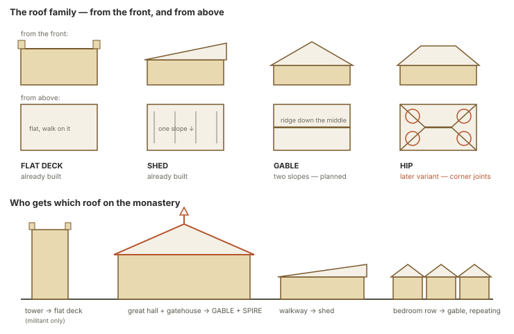

STATUS: DRAFT — PENDING CODEX ADVERSARIAL REVIEW (2026-07-27 campaign)

---
type: working-site-spec
created: 2026-07-25
updated: 2026-07-27
status: WORKING SPEC — research PASS (evidence-thickened 2026-07-27); founder and brief PARTIAL; clay OPEN
site: 4 — monastery / commune
standard: SITE-5-MINE-WORKSHOP-CONCEPT.md
authority:
  - GOLDEN-SITES-CATALOG.md
  - GOLDEN-SITE-ONTOLOGY-ENGINE-MARRIAGE.md
  - STRUCTURE-KIT-CATALOG.md
research:
  - ../Reference/Monastery-Study/
  - ../Reference/Monastery-Study-0727/
spawnable: intel-sites/SITE-4-SPAWNABLE.md
preservation: GOLDEN-SITE-ROLLER-PRESERVATION-LEDGER.md
context-projection: GOLDEN-SITE-WORLD-CONTEXT-PROJECTION.md
---

# SITE 4 — MONASTERY / COMMUNE — WORKING SPEC

## Authority and honest status

This document translates the ruled Monastery/Commune family into the Mine-standard
generator and proof contract. The catalog remains the authority for decisions.

Already ruled:

- a closed communal world organized around a courtyard;
- a spur approach and ceremonial gate, deliberately off the through-route;
- repeated arcade bays as the structural signature;
- a head platform reached by processional climb as the deck;
- shared dormitory as default, cell row as variant;
- circulation, outward face, room depth, access, and court subdivision change with
  institution;
- library over the walk first, descending library later;
- ceremonial gate plus one service door in the sample;
- defended and austere/tower-forbidden variants;
- gable-plus-spire seed roof; and
- other institutions are licensed guest expressions, not furniture reskins.

Still proposed:

- B level court → C stacked courts → A terrace-face arcade;
- centered gate before corner-gate variant;
- one court before the outer/inner filter;
- head-commanding chapel before free-standing chapel.

All variants are admitted. Their implementation order remains founder-facing and this
spec must not promote the proposal to a ruling.

**2026-07-27 evidence-thickening addendum.** `../Reference/Monastery-Study-0727/` broadens the
cultural sweep to eight monastic/communal building traditions (four new: Coptic/Egyptian,
Ethiopian/Aksumite, Japanese Zen Buddhist, Islamic Sufi; three new commune variants never
researched before this pass: American Shaker, Oneida, Israeli kibbutz) and adds real measured
cell/refectory/cloister dimensions plus Genesis's own live Monastery Cloister / Gate House
scene-frame numbers (`Reference/Monastery-Study-0727/MEASURED-REFERENCES.md` §5). Its
`synthesis.md` §2 produces a decision-ready founder packet for the M1/M2/M4/M5 build order
below — every question stated with alternatives, a recommendation, and a reason. **The build
order remains PROPOSED; this addendum makes it cheap to rule, it does not rule it.** One
out-of-frame finding (the Japanese Zen *shichidō garan* is a sequence of separate halls, not a
wrapped-courtyard chassis) is flagged as an open classification question, not folded into any
existing category.

A courtyard inn or hostel is a licensed **guest program** over this chassis, not proof
that all taverns are Site 4 institutions. Its hospitality/lodging obligations come from
`TAVERN-VENUE-ROUTING-BRIEF.md`; Site 4 contributes only the court, range, guest-filter,
and communal-circulation relationships that the rolled form actually licenses.

## Plain-English promise

This is a community whose daily rule has become architecture.

The player should understand how strangers are received, how residents move through
their day, which spaces are shared or restricted, where authority and meaning gather,
and how the same peaceful order can become a tactical problem when conflict arrives.

The courtyard is not empty scenery. It is the house's common clock, circulation hub,
social stage, and line of sight.

## What makes it a site family

Site 4 owns a **communal rule made spatial**:

`departure from public route → filtered threshold → shared court and repeated walk
→ daily ranges → head position and service return`

Enclosure, repetition, circulation, routine, privacy, hospitality, work, provision, and
authority form one institutional chassis. A culture or institution changes how those
relationships are solved; it cannot be represented by replacing a chapel prop while
the plan stays unchanged.

A courtyard building without a shared rule is not automatically a Monastery/Commune.
A fortified compound whose primary purpose is military belongs elsewhere. Guest
institutions remain licensed only when their own circulation, access, privacy, outward
face, and program change the chassis.

## Required invariants

- **REQUIRED — enclosure for separation.** The boundary protects routine, privacy, and
  identity. Defense may overlay it but cannot be assumed.
- **REQUIRED — court-centered circulation.** The common void and repeated range
  organize movement and daily life.
- **REQUIRED — rule becomes spatial.** Threshold, schedule, privacy, shared work,
  authority, hospitality, and service have visible consequences.
- **REQUIRED — repetition remains legible.** Arcade rhythm survives fixed camera,
  material, clutter, damage, and changed seeds.
- **REQUIRED — ceremonial and service access differ.** The first build has a low gate
  plus one service exit with different ownership and use.
- **REQUIRED — the head position is earned.** The platform has legal access, tactical
  value, ritual/social meaning, and at least one counterplay.
- **REQUIRED — multiple plans.** Processional, arcade, service/schedule, and vertical
  relationships create distinct approaches.
- **DEFAULT — communal dormitory and one level court.**
- **LICENSED — tower, fortification, individual cells, descending library, or guest
  institution.** Each requires purpose, culture, occupancy, and program facts.

## Identity, culture, and circumstance

### Site identity

The identity is the relationship among enclosure, common court, repeated circulation,
daily ranges, ceremonial/service thresholds, and a meaningful head position. The
player can learn the institution's rule, use its schedule, negotiate its permissions,
move through public and restricted bands, or contest authority and vertical access.

### Cultural expression

Culture affects threshold etiquette, court proportions, bay rhythm, column/wall
construction, roof posture, privacy, sleeping arrangements, water and garden practice,
knowledge storage, symbols, hierarchy, hospitality, maintenance, and how authority
occupies the head position. Those choices should change assemblies, routes, access, and
routine as well as appearance.

### Local circumstance

Institutional purpose, terrain, climate, material, wealth, population, degree of
withdrawal, defense pressure, water, food production, schedule, age, damage, current
occupants, and guest obligations determine the generated compound.

## The site's deck

The Monastery/Commune's deck is the **head platform reached by the processional climb**.
It is simultaneously a ritual or command position, a social destination, a sightline
advantage, and a tactical commitment.

The platform may hold a chapel, hall, council focus, shrine, teaching position, or
another institution-owned head. It must have legal access, landing capacity,
fixed-camera visibility, and counterplay. A random roof or tower does not become the
deck merely because it is higher.

## Five-expression family

1. **Small — communal house.** A bounded yard, shared hall, communal sleeping, service
   work, and a modest ritual or authority focus establish the rule at household scale.
2. **Ordinary — level wrapped court.** Repeated arcade, centered low gate, shared
   ranges, service exit, and one broad climb to the head platform form the current
   recommended first build.
3. **Large — filtered or stacked institution.** Outer and inner courts or linked level
   courts deepen privacy, schedule, service, and authority without abandoning the
   repeated circulation grammar.
4. **Degraded or repurposed — divided communal chassis.** Damage, occupation, refuge,
   siege, reform, or partial abandonment changes access and routine while the court,
   repeated walk, ranges, and head relation remain legible.
5. **Unusual — terrain- or institution-specific expression.** A terrace-face commune,
   austere tower-forbidden house, defended order, school, hospice, inn, or prison is
   admitted only when its culture, terrain, and program rewrite the relevant spatial
   facts rather than merely redressing rooms.

Portfolio comparison:
[five-expression family board](diagrams/golden-site-five-expression-families.svg).

## Growth ladder and implementation order

### Scene ladder

1. **Rung A — small commune/house:** bounded yard, shared hall, dormitory, service, and
   modest ritual/authority focus.
2. **Rung B — level wrapped court:** repeated arcade, centered low gate, shared ranges,
   one broad stair to head platform—the Golden Seed.
3. **Rung C — filtered or stacked courts:** outer/inner threshold or two level courts
   joined by a stair.
4. **Rung D — terrace-face/defended institution:** arcade promoted onto retaining face,
   stronger vertical hierarchy, free-standing head building or fortified merge.
5. **Guest institution:** school, hospital/hospice, inn, or prison only after its own
   circulation, outward face, access, privacy, and court facts are licensed.

### Current implementation proposal

**B → C → A/D**, with centered gate, one court, and head-commanding chapel first.

The reason is sound: B proves the reusable arcade and ordinary court cheaply; C repeats
that technology; the terrace-face version adds the hardest support and camera problem
last. Because the exact order remains open in the founder queue, implementations must
mark it `PROPOSED` until ruled.

## Recommended first build

The current recommendation is Rung B: the level wrapped court. It proves the reusable
arcade, court circulation, ceremonial/service split, communal ranges, and head climb
before the harder stacked and retaining-face problems. The exact B → C → A/D order,
centered-gate priority, one-court priority, and head-chapel priority remain
`PROPOSED`; this section records the learning case, not a founder ruling.

### Golden Seed — level wrapped court

A hillside-bench communal compound:

- spur approach leaving the valley road at a meaningful marker;
- one centered ceremonial gate at the low end;
- a level court wrapped by a repeated arcade;
- shared hall and communal dormitory in distinct ranges;
- water/garden/service work at the low or side range;
- library over the walk;
- one broad processional stair to a head chapel/authority platform;
- one separate service exit;
- day/night routines and owned practical lights; and
- direct, arcade, service/timing, and deck-taking plans.

## Working spatial specification

### Required zones

1. **Road departure:** the visible moment the site renounces the through-route.
2. **Spur approach:** enough length and elevation to read withdrawal and prepare.
3. **Ceremonial gate/filter:** the formal social threshold and primary arrival.
4. **Common court:** reserved shared void and circulation hub.
5. **Arcade ring:** repeated, covered movement connecting the primary ranges.
6. **Shared hall:** meals, work, assembly, hospitality, or common decision.
7. **Residential range:** communal dormitory by default; licensed cells as variant.
8. **Service/water/garden range:** supplies, cooking, maintenance, water, waste, and
   ordinary labor.
9. **Knowledge range:** library/records over or beside the walk.
10. **Head stair/platform:** ritual/command deck and its broad approach.
11. **Service exit:** distinct route for labor, supplies, quiet access, and retreat.

### Provisional grid hypotheses

- Horizontal movement uses the 5-foot grid; vertical changes use `h = 2.5 feet`; normal
  storeys begin at the shared 4h / 10-foot assumption.
- The Golden court is one level datum. It does not fake the later terrace family with
  small decorative steps.
- The processional stair begins as a **2-cell-wide hypothesis** so groups, large
  witnesses, and counterflow can be tested; the number is not approved.
- Arcade bay width, column depth, corner solution, and range depth remain measurement
  and clay questions. Repetition must read without trapping standees between columns.
- Arcade walk, gate apron, court objective, well, and head landing reserve natural
  standee footprints before furniture and planting.
- Low-pitch roofs become standable only under the shared slope/access law and only when
  a legal non-flying route exists.
- Large and small bodies may use different service/arcade shortcuts, but the primary
  ceremonial and retreat routes must admit the encounter's required witnesses.

### Route promises

| approach | gives the player | asks the player to accept | capacity |
|---|---|---|---|
| ceremonial axis | fastest comprehension; lawful/social access; broad movement | visible, filtered, schedule/authority rules, head position watches it | group and presentation-large where gate/stair permit |
| arcade ring | cover, lateral movement, multiple room thresholds | repeated sightlines, resident traffic, corner commitments | ordinary party |
| service route | quieter access, supplies, backstage objectives, retreat | narrower, work-owned, possibly locked or scheduled | ordinary/small; cargo card dependent |
| roof/head route | height, bell/signal/authority control, flank | climb/stair time, exposure, limited exits | surface and access-card dependent |

At least three approaches must remain meaningfully different. The arcade cannot simply
be a safer copy of the open court, and the service door cannot be a free unguarded back
door.

### Tactical furnishing

- arcade posts and corners create a readable cover rhythm without clogging the walk;
- well, tables, garden beds, screens, shelves, benches, and beds reserve collision only
  when geometry exists;
- gate/filter, bell/signal, water, records, stores, residents, service exit, and head
  position are candidate objectives;
- closing the gate, ringing a schedule, opening service access, moving a screen,
  controlling water, protecting/burning records, or forbidding the tower changes local
  play;
- quiet court space supports negotiation, gathering, defense, and ritual; and
- the level provides retreat without forcing a full reverse traversal.

## Seven operating circuits

1. **Access and hospitality:** road departure, gate, guest filter, permitted rooms,
   service entry, closure.
2. **Routine and schedule:** bells/signals, meals, work, study, worship, sleep, watch.
3. **People and privacy:** resident groups, guests, patients/students where licensed,
   shared versus restricted space.
4. **Food, water, and service:** well, garden, kitchen, stores, maintenance, waste.
5. **Knowledge and records:** library, archive, teaching, custody, loss, secrecy.
6. **Authority and devotion:** head platform, chapel/assembly, ritual, leadership,
   dissent, defense license.
7. **Light, heat, and weather:** daylight court, covered walk, owned lamps/fire,
   shutters/doors, night routine.

Friendly state labels derive from:

- **access:** open / received / filtered / restricted / sealed;
- **routine:** ordinary / gathering / quiet / disrupted / emergency;
- **occupancy:** staffed / reduced / displaced / contested / empty;
- **provision:** sufficient / rationed / interrupted / exhausted;
- **authority:** recognized / disputed / seized / absent;
- **condition:** maintained / worn / strained / damaged;
- **cause and recovery:** who changed it and what action can restore or redirect it.

Do not implement `monasteryState = corrupt` or `holy` as a layout/material switch.

## Strategic gameplay contract

The Golden Seed must demonstrate:

- **Formal/social plan:** enter by the ceremonial gate under the house's relationship,
  hospitality, schedule, and authority rules.
- **Arcade/control plan:** use covered lateral circulation and repeated thresholds to
  flank, defend, evacuate, investigate, or reach several ranges.
- **Service/timing plan:** use work routines, supplies, water, service entry, records,
  bell, or a scheduled gathering to solve the problem with different witnesses and
  access.
- **Head-position plan:** claim or bypass the high platform at a movement/exposure cost.

At least three must be viable; one must be noncombat. Site levers change circuits and
routes rather than merely triggering narration.

## Generator contract

### Inputs

- communal institution purpose and admitted guest type;
- culture/house-rule cards;
- terrain bench, spur relation, and site rung;
- court count/type, gate placement, head-building relation, and defense posture;
- privacy model, residential type, hospitality, service and knowledge programs;
- routine/schedule, occupants, faction, relationship, authority, and current strain;
- construction/material/roof cards;
- light/heat ownership and time;
- encounter objective, threat band, arrival side, and creature envelopes.

### Current-roller preservation

This spec consumes the Site 4 record in
`GOLDEN-SITE-ROLLER-PRESERVATION-LEDGER.md`.

- `LIVE`: world `master`/`arch`/nearby/myth/taboo/faction/pressure axes; Place Spine
  Shrine, Seat-of-learning, Lodging, House-of-healing, and compatible Commons/Works
  expressions; building-interior religious lodging/cell programs; dungeon cloister,
  chapel, elevation, and walk-skin facts where called.
- `LIVE-COMPOSED`: cliff-carved, vertical processional, pilgrimage-route,
  distributed-house, guest-house, and level-court communities.
- `TARGET-ADAPTER`: the Monastery/Commune grammar translating those sources into
  communal routine, ritual threshold, work/service flow, and guest access.

Before implementation, retain one cliff-carved or strongly vertical result and one
distributed or guest-house result in addition to the level wrapped court. The Golden
Seed proves communal organization and repetition, not a universal courtyard topology.
Cell rows remain lodging/discipline expressions here; involuntary custody belongs to
Site 6. The receipt preserves upstream world/place/building/walk facts.

### Semantic blueprint

Commit:

- road departure, spur, gate/filter, and service exit;
- court, arcade circuit, ranges, room programs, and outward faces;
- processional and service circulation;
- head platform, access, cover/authority promise, and counterplay;
- routine, hospitality, service, knowledge, authority, and light circuits;
- resident/guest permissions and interaction anchors;
- routes, capacities, objectives, retreat, and plan tradeoffs;
- roof/access and cutaway facts; and
- provenance, proposals, relaxations, and rejections.

### Generation order

1. Commit purpose, culture/rule, occupants, authority, routine, terrain, and encounter.
2. Select scene rung and only ruled/proposed variants legal for this build.
3. Place road departure, spur approach, and compound envelope.
4. Reserve court void and arcade circuit.
5. Place ceremonial gate and service exit with distinct ownership.
6. Allocate shared hall, residential, service/water, and knowledge ranges.
7. Place broad head stair, platform, and licensed head building.
8. Apply outward openings, privacy, defense, roof, and institution mutations.
9. Reserve objectives, approaches, quiet ground, cover, deployment, and retreat.
10. Apply routine, access, provision, authority, condition, and light states.
11. Validate repetition, routes, standees, collision, camera, roofs, and changed seeds.
12. Dress retained ids without shifting architectural or tactical facts.

### Required rejection checks

Reject when:

- the site accidentally becomes a through-route;
- the court does not organize circulation or is filled by unrelated landmarks;
- arcade rhythm disappears, columns trap normal standees, or corners do not resolve;
- ceremony and service use the same undifferentiated entrance;
- a required room program has no circulation, outward face, service, or privacy;
- the head platform has no legal access, no meaning, or no counterplay;
- the service door is a consequence-free universal shortcut;
- roof/deck is declared walkable without access and support;
- practical lights have no routine, occupant, fuel/power, or task;
- culture is expressed only through palette/motif;
- a guest institution is admitted by furniture swap alone;
- the fixed camera hides gate, court, head stair, or arcade continuity;
- changed terrain collapses every plan into the processional axis; or
- an unresolved proposal is treated as locked implementation law.

### Deterministic fallback ladder

1. remove noncanonical furniture and planting;
2. shift a loose well/garden/prop reservation within its service zone;
3. simplify room partitions while preserving the room program;
4. reduce optional roof/deck or defended features;
5. reduce to one court and one level while preserving gate, arcade, ranges, and head;
6. shorten ranges or reduce the site one rung;
7. reject and reroll.

Never solve failure by filling the court, deleting the service exit, breaking arcade
rhythm, making all doors public, flattening authority into color, or hand-authoring an
unrecorded shortcut.

## Culture and house-rule cards

Culture and institutional rule answer:

- who may enter and how they are received;
- what schedule orders the day and who signals it;
- what is shared, private, guarded, or forbidden;
- how food, water, work, study, care, worship, and rest are organized;
- what authority looks like and how it may be challenged;
- whether elevation/tower is desired, licensed, or forbidden;
- how construction, repair, repetition, and thresholds are expressed;
- what objects/records carry memory and legitimacy;
- how strangers, crisis, illness, death, and defense are handled.

The first pair changes at least four construction, circulation, schedule, ownership,
privacy, authority, light, or interaction facts. At least one is noncolor geometry, one
is behavior/permission, and one is a visible owned object or mark.

## Occupancy states and hooks

Working commune/order, school or hospice only when licensed, militant/defended order,
overwhelmed house, disputed leadership, faction-seized institution, hidden cult,
recently empty house, and an impossible routine that continues may roll by band.

Hooks include sanctuary request, missing novice/resident, poisoned or failing well,
stolen record/relic, disputed succession, broken routine, inspection, siege/refuge,
secret service entrance, forbidden tower, patient/student crisis, library fire, and a
bell that rings without an acknowledged owner. Every hook touches a circuit and map
lever.

## Lighting, roofs, and cutaway

- Daylight belongs to court, openings, and time/weather.
- Lamps, candles, hearths, and work lights belong to rooms, routines, occupants, and
  fuel/power.
- Night state changes permitted routes and occupied ranges; it is not a blue tint over
  the day population.
- Ambient, AO, contact, and silhouette separation keep the arcade and stair readable.
- Gable-plus-spire is the Golden Seed hall roof; shed covers the walk; flat tower deck
  is licensed; hip promotes later.
- Walkable roofs require pitch, support, route, collision, standee, and fixed-camera
  proof.
- Cutaway omits camera-facing roof/upper wall pieces while preserving room, support,
  rain, light, and access facts.

### Rolled world-context projection

The commune's context projection continues its real arrival/processional route,
cliff/court/terrace support, surrounding work/service landscape, and licensed guest or
pilgrimage relationship. It may imply a larger communal world through broad ranges and
silhouettes, but every distinct shrine, cell row, bell, garden, archive, or service
building needs a real provider.

The first context receipt is
`../Reference/Golden-Site-World-Context/ROLL-RECEIPTS.json#CTX-MONASTERY-68`:
The Pilgrim's Ascent + Sounded Glass. Cliff switchbacks, carved mass, and sounded-glass
construction are direct. A healer's garden, Signal Cairn, or auction crowd appears
only when its node/site/state is mounted. The Dream-Eater and restricted knowledge stay
latent.

Context-off/on captures retain identical court, arcade, permissions, routines, actors,
knowledge, and ids. The receipt adds `worldContextPlanId`, band/recipe ids,
processional/portal/support refs, source refs, omissions, false-affordance rejections,
and fallbacks.

## Structure, mechanisms, and surfaces

### Inherited

Walls, gates, terrain/retaining faces, stairs/slopes, posts, gable/shed/flat roofs,
garden/ground, well/fountain, doors, water, generic lights, and climb/access rules.

### Site-owned

Arcade bay and corner · wrapped court range · processional head platform/stair · shared
dormitory range · library-over-walk slot · guest filter · outer/inner filter later ·
institution-circulation mutation contract.

### Material / paint / prop demand

- **Material:** dressed/plastered masonry, arcade soffit/vault, tile/timber roof,
  processional paving, limewash/repair, garden soil, basin water.
- **Paint/decal:** routine/authority marks, room/threshold permissions, wear paths,
  repair, memorial/ritual, records/signage.
- **Prop/mechanism:** gate/filter states, bell/signal, well, tables/benches/beds,
  screens, library/records, garden/service, hearth/lamp, supplies.

Anything changing collision, cover, sight, privacy, light position, or interaction
reach requires physical geometry and a reservation.

## Runtime facts and proof receipt

Retain equivalents of:

`institutionPurpose` · `sceneRung` · `courtIds` · `arcadeCircuit` · `gateId` ·
`serviceExitId` · `rangePrograms` · `privacyPermissions` · `headPlatformId` ·
`processionalRoute` · `serviceRoute` · `routineState` · `hospitalityState` ·
`provisionState` · `authorityState` · `knowledgeCustody` · `lightOwners` ·
`roofAccess` · `routeCapacities` · `objectiveIds` · `planTradeoffs` ·
`proposalFlags` · `recoveryVerbs` · `relaxations` · `rejections`.

The receipt records seed/version, grid, fixed camera, standee envelopes, culture/rule
and occupancy cards, selected structures/materials/provenance, clay/tactical/day/night/
dressed ids and captures, validator results, failed candidates, `rollerLineage`, and
`sourceRollRefs`.

## First visual proof

Show one live Rung-B level-court seed through the fixed production camera, then keep the
committed layout constant while cycling:

1. neutral clay with four standee envelopes, arcade rhythm, court, gate, service exit,
   broad head stair, and platform support visible;
2. tactical overlay naming ceremonial, arcade, service/timing, and head-position plans,
   capacities, permissions, objectives, cover, and retreat;
3. dressed day and occupied-night states with routine-owned practical lights, readable
   arcade contact/AO, and honest roof cutaway;
4. two changed seeds plus one deliberately occlusion-heavy court;
5. a plain `PROPOSED` label on every unresolved build-order choice.

The visible proof must read as a community's rule rather than a generic courtyard with
a chapel prop. Reject it if fixed-camera occlusion hides the circulation, night erases
the arcade or stair, or the head platform becomes the only useful plan.

## Site boundaries and stretch

- Site 6 owns prison cells, gratings, secure subdivisions, and custody rules.
- Site 10 may borrow repeated bays and licensed guest institutions after its own proof.
- Site 3 owns a fully stopped/empty transformation.
- Site 8 owns stable competing control of the host.
- Shared massing does not make school, hospital, inn, monastery, and prison identical.

## Proof → MVP → Ideal

### Proof

One deterministic B-seed with eleven zones, centered low gate, level court, readable
arcade and corners, shared hall/dormitory, service/water, library-over-walk, broad stair
to head platform, service exit, four standee envelopes, clay/tactical/day/night/dressed
captures, two changed seeds, dense-occluder adversarial case, and at least three plans
including ceremonial noncombat and service/timing play.

### MVP

One-court communal monastery/commune; complete arcade family; shared dormitory default;
library over walk; centered gate plus service exit; gable hall/spire, shed walk, licensed
flat deck; ordinary and defended occupancies; routine/access/provision/authority/light
states; deterministic rejection and receipts.

### Ideal

Stacked and terrace-face courts; corner gate; cells; outer/inner filter; free-standing
chapel; fortified merge; descending library; hip/estate roof; broad non-European and
non-Christian communal examples; guest institutions after their own evidence/proof.

## Remaining evidence and proof gaps

- ~~obtain measured arcade bay/section before dimensions become cards~~ — **evidence-thickened
  2026-07-27**: real cell/refectory/cloister dimensions plus Genesis's own live Monastery
  Cloister/Gate House scene-frame numbers now exist (`Reference/Monastery-Study-0727/
  MEASURED-REFERENCES.md`); no arcade bay has been clay-measured, so this remains open at the
  clay-proof gate even though the research gate is closed;
- ~~broaden cultural and non-Christian/non-European communal evidence~~ — **evidence-thickened
  2026-07-27**: four new monastic building cultures and three new commune variants now
  researched and imaged (`Reference/Monastery-Study-0727/BREADTH-SWEEP.md`); still open —
  broader African, South/Southeast Asian, and pre-Columbian communal evidence beyond this pass's
  eight traditions;
- obtain guest-institution circulation evidence (unchanged — still open);
- rule M1/M2/M4/M5 implementation order — **now decision-ready**
  (`Reference/Monastery-Study-0727/synthesis.md` §2), still requires Adam's ruling;
- resolve the Japanese Zen *shichidō garan* classification question (new, 2026-07-27: is a
  sequence-of-halls institution a Site 4 chassis variant or an out-of-scope host, per
  `GOLDEN-SITE-CONCEPTING-GUIDELINES.md` step 0.5?);
- clay-prove court size, stair width, arcade fit, roofs, camera, plans, and lighting; and
- build and retain the fixture in `GOLDEN-SITES-PROOF-QUEUE.md`.
