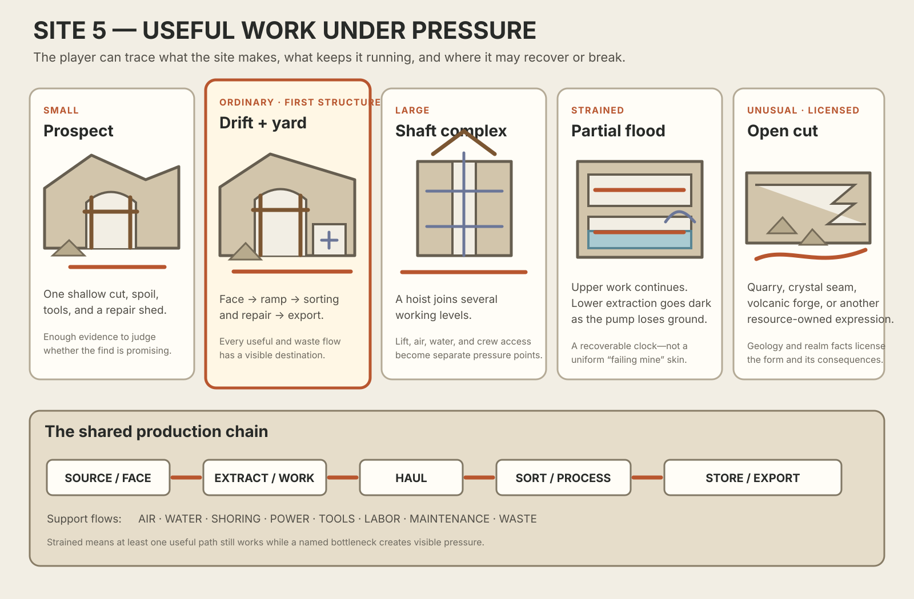
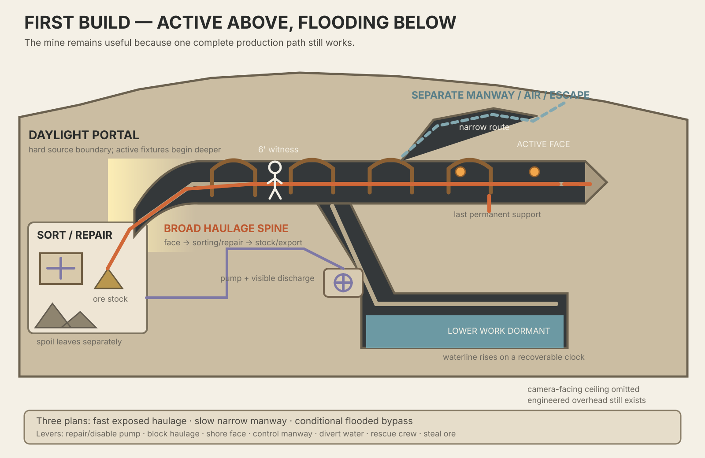
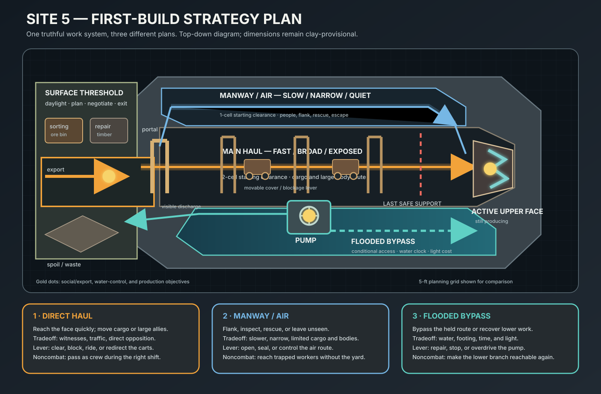

STATUS: DRAFT — CODEX ADVERSARIAL REDLINE APPLIED; RESEARCH REMAINS PARTIAL

---
type: working-site-spec
created: 2026-07-25
updated: 2026-07-28 (Codex adversarial review applied to the 2026-07-27 gap-close addendum;
  research remains PARTIAL)
status: WORKING SPEC — founder foundation accepted; research PARTIAL after adversarial
  review; clay OPEN
site: 5 — strained mine / workshop
method: GOLDEN-SITE-CONCEPTING-GUIDELINES.md
preservation: GOLDEN-SITE-ROLLER-PRESERVATION-LEDGER.md
context-projection: GOLDEN-SITE-WORLD-CONTEXT-PROJECTION.md
research:
  - ../Reference/Mine-Workshop-Study/SOURCE-LEDGER.md
  - ../Reference/Mine-Workshop-Study/synthesis.md
  - ../Reference/Mine-Workshop-Study-0727/synthesis.md
  - ../Reference/Mine-Workshop-Study-0727/FFT-COHORT-COMPARISON.md
  - ../Reference/Mine-Workshop-Study-0727/MEASURED-REFERENCES.md
  - ../Reference/Mine-Workshop-Study-0727/BREADTH-SWEEP.md
---

# SITE 5 — STRAINED MINE / WORKSHOP

## Founder ruling — 2026-07-25

Adam accepted all three opening recommendations:

1. **Promise accepted:** useful production remains active while a visible part of the
   chain is under pressure.
2. **First build accepted:** active upper mine with a lower branch flooding as the pump
   loses ground.
3. **Stretch accepted:** the family may extend into quarries and attached processing
   workshops when each version preserves an honest source-to-export chain.

These rulings establish the concept and build target. The initial research pass has now
returned with declared gaps. It supports a detailed working specification, but it does
not yet earn a completed research gate or a clay proof.

## Gap-closure addendum (2026-07-27 campaign) — authority, honest gates, and proposed status

This section is additive. It changes no ruling, invariant, capsule, deck, growth ladder, or
operating-circuit definition above or below it. It exists to hold the §1-equivalent authority
statement the working-spec standard requires (guidelines step 8, section 1: "authority, honest
gates, ruled decisions, and unresolved proposals") for the evidence added this pass.

**Authority.** This addendum is authored under the 2026-07-27 golden-sites campaign brief:
"Site 5 — GAP-CLOSE the existing working spec... its declared gaps are direct tactical-map
evidence and broader measured/cultural breadth." It is subordinate to every ruling already
recorded in this document and in `GOLDEN-SITES-CATALOG.md`.

**Honest gates.** The catalog's status-gate table (as of the 2026-07-25 audit) records Site 5
as `RESEARCHED: PARTIAL`, `FOUNDER-RULED: PARTIAL`, `BRIEF-CONGRUENT: PARTIAL`,
`CLAY-PROVED: OPEN`, with the stated reason: "working spec and initial source-led synthesis
exist; direct tactical-map and broader measured/cultural evidence gaps remain; no rendered
proof exists." This addendum closes the two named evidence gaps:

- a direct FFT tactical-map mine cohort now exists, read in place from the sibling `genesis`
  worktree's archive per THE FFT BOUNDARY — `Reference/Mine-Workshop-Study-0727/
  FFT-COHORT-COMPARISON.md`;
- measured/cultural breadth beyond the original packet's Agricola-only tradition now exists —
  `Reference/Mine-Workshop-Study-0727/MEASURED-REFERENCES.md` (real Cornish 1670 regulation and
  unregulated gallery dimensions, U.S. room-and-pillar entry ranges, a measured 19th-century
  workshop footprint, real mine-cart rail gauges, real quarry-bench dimensions, and one
  additional culturally distinct UNESCO case with a measured chamber figure).

A real-image reference lane (12 Wikimedia Commons images, full licence ledger) and a breadth
sweep ("what else could this site be": salt, peat, and gem extraction; one cross-media
comparison; the `BF-SHOP-WORKSHOP` boundary test) also now exist, completing the depth law's
three-part requirement. Full detail: `Reference/Mine-Workshop-Study-0727/`.

**Adversarially reviewed status-gate values (not founder rulings):**

| gate | catalog value (2026-07-25) | proposed value (this pass) | reason |
|---|---|---|---|
| RESEARCHED | PARTIAL | **PARTIAL** | all three packet limbs exist, but the proof queue still lacks sufficiently broad measured/cultural work-organization evidence; file presence does not itself close the gate |
| FOUNDER-RULED | PARTIAL | PARTIAL (unchanged) | no card selection (support/carrier/pump/ventilation/processing/light/culture/organization) was ruled this pass |
| BRIEF-CONGRUENT | PARTIAL | PARTIAL (unchanged) | this pass adds an addendum; it does not restructure the existing ten/fifteen-section standard |
| CLAY-PROVED | OPEN | OPEN (unchanged) | no fixture was built this pass |

The 2026-07-28 adversarial pass rejects the packet's proposed research promotion, keeps the
gate at `PARTIAL`, and folds that reading into `GOLDEN-SITES-CATALOG.md`. It does not rule
any founder proposal below.

**Ruled decisions.** None added this pass. Every finding in the 2026-07-27 packet is offered
as evidence or as a `PROPOSED` candidate under the generator principle (arriving as a build-
order suggestion, never an A-or-B pick presented as decided).

**Unresolved proposals carried forward from this pass** (none are ruled; all await founder
review):

1. **The Site 5 / `BF-SHOP-WORKSHOP` boundary (adversarial direction accepted).** A workshop belongs to Site 5 only when it
   sits at the terminus of its own production chain (fed by the mine/quarry's haul spine,
   sharing its water/power/support circuits, with a distinct waste/export edge); a freestanding
   urban or settlement workshop that sources stock from elsewhere and sells or services at a
   customer-facing counter belongs to `docs/BUILDING-PROGRAM-TABLE-FAMILIES.md`'s
   `BF-SHOP-WORKSHOP` family instead. Full reasoning and photographic anchor (MW-11, a real
   Italian street-level smithy with no visible ore/haulage chain):
   `Reference/Mine-Workshop-Study-0727/synthesis.md` §3.
2. **Support rhythm may be expressed as portal repetition, not only mid-route timber sets.**
   FFT's Colliery Underground Second Floor shows a repeated row of identical door-frames set
   into a terrace riser as its support-rhythm signal. Offered as an alternative or
   supplementary expression to the existing "repeated timber support ~9 ft apart" hypothesis,
   not a replacement for it. `FFT-COHORT-COMPARISON.md` §2, finding MW-FFT-1.
3. **The 10-ft main-haul hypothesis is a knowing gameplay oversize, not a historical
   default.** Real Cornish regulation drifts ran 7 ft × 3 ft in 1670, and unregulated
   historic crosscuts as narrow as 4 ft × 2 ft 4 in. The working spec's manway hypothesis
   (1 cell/5 ft) has real historic precedent on both sides of it; the main-haul hypothesis does
   not, because nothing in the real tradition anticipated cart-and-large-creature traffic
   sharing one route. Recorded so the number is chosen knowingly at clay calibration rather
   than defaulted. `MEASURED-REFERENCES.md` §1.
4. **Salt, peat, and gem extraction all license under existing family members rather than
   requiring new rows** — salt as an unusual/realm-owned Site 5 host with a Site 4/10 guest
   relation (the Wieliczka cathedral-in-a-mine case), peat under the existing prospect/open-cut
   family, gem/crystal seams already named in the five-expression family with security-of-
   product as an occupancy pressure rather than a new host trait. `BREADTH-SWEEP.md` §1, §3.

## The plain-English promise

This is a place that wrests something valuable from the world and makes it useful. The
work is still happening, but the system is close enough to its limits that the player
can see where it might recover, break, or be deliberately pushed.

The player should not simply feel that a mine is dangerous. They should understand what
the place produces, how that production moves, what is currently going wrong, and which
part of the chain they could affect.

## What makes it a site family

Site 5 owns an engineered production chain:

`source or work face → extraction/work → haulage → sorting or processing → storage/export`

Air, water, structural support, tools, power, labor, maintenance, and waste removal keep
that chain alive. The site becomes strained when one or more of those supporting flows
approaches or exceeds capacity while meaningful production still continues.

The mine is the Golden Seed because it makes all of those relationships spatial and
tactically visible. Quarry and workshop expressions may inherit the same grammar when
their real workflow supports it; they do not receive mine scenery merely because they
are production sites.

## Proposed invariants

- **REQUIRED — a legible product flow.** The player can trace what enters, what work
  happens, what moves, what changes, what waits, and what leaves.
- **REQUIRED — an honest working surface.** A work face, cut, bench, machine, forge,
  assembly floor, or other source of production physically owns the activity.
- **REQUIRED — an honest haulage spine.** Workers, carts, lifts, ramps, rails, animals,
  or another licensed carrier can actually move input, product, tools, and waste.
- **REQUIRED — support has consequences.** Air, water, shoring, power, tools,
  maintenance, labor, or waste removal must affect reachable space or throughput.
- **REQUIRED — strained still means operating.** At least one important production
  path remains live. A completely empty or dead operation belongs to Site 3.
- **REQUIRED — waste has somewhere to go.** Spoil, tailings, slag, offcuts, smoke,
  water, or broken material cannot disappear from the plan.
- **DEFAULT — pressure is uneven.** One level, crew, machine, route, or supporting flow
  suffers before the entire site receives a generic “failing” treatment.
- **LICENSED — coercive labor or custody.** These require actual social facts. A mine
  does not become a prison merely because its work is hard.
- **LICENSED — magical extraction or power.** Realm and resource facts must own the
  impossible mechanism, its cost, and its visible consequences.

A natural cave with rails and random crates is not a Site 5 mine. A room full of generic
workbench props is not a Site 5 workshop.

## Identity, culture, and circumstance

### Site identity

The linked production and support flows are the identity. The player can change the
site by repairing, blocking, rerouting, stealing from, protecting, or overloading a
real part of that chain.

### Cultural expression

Culture affects how workers organize a shift, mark hazards and claims, shape supports,
move loads, divide skilled work, maintain tools, treat the extracted material, and
honor or fear the ground. Those choices should change proportions, assemblies,
interfaces, sounds, marks, and routines—not merely surface decoration.

### Local circumstance

Resource geometry, rock or soil, water, depth, ventilation, terrain, available timber
or masonry, technology, power source, labor, age, output demand, and the active
bottleneck determine the actual plan.

## The site's deck

The Mine's “deck” is its **haulage spine**: the route joining the productive face to
processing and export.

Depending on the rolled facts, it may be a broad ramp, stepped cart road, rail drift,
shaft with landings, winch incline, water route, beast path, or licensed magical
carrier. Controlling it should control the site's tempo. Breaking it should create a
specific backlog, detour, or danger rather than shutting down the whole site by fiat.

## Five-expression family

1. **Small — prospect and repair shed.** One exploratory cut or shallow adit, a spoil
   pile, tool shelter, and enough evidence to show whether the find is promising.
2. **Ordinary — drift mine and sorting yard.** The recommended first structural family:
   a portal, one primary haul route, active face, support frames, sorting/repair work,
   stockpile, and export threshold.
3. **Large — shaft and level complex.** A hoist connects several working levels while
   air, water, crew access, and haul capacity create distinct pressure points.
4. **Strained — upper works active, lower works flooded.** A failed or overloaded pump
   makes deep extraction dormant while upper extraction, sorting, storage, and repair
   continue. Water rises on a recoverable clock.
5. **Unusual — open cut or realm-owned extraction.** Resource geometry licenses a
   quarry, terraced cut, crystal seam, volcanic forge, or another culturally and
   environmentally supported production form.

## Growth ladder and build order

The **scene ladder** and the **implementation order** are deliberately different.

The scene grows like this:

1. **Rung A — prospect:** one shallow cut, one useful find, a spoil destination, and
   temporary tool/repair cover.
2. **Rung B — drift operation:** portal, upper face, broad haul spine, narrow service
   route, sorting/repair threshold, supports, water control, spoil, and export.
3. **Rung C — inclined or shaft complex:** vertical carrier, landings, distinct levels,
   stronger air/water burdens, and separated people/material circulation.
4. **Rung D — production district:** repeated workings plus quarry, wash, forge, mill,
   or other licensed processing linked into a wider settlement or transport system.

The implementation order is **B → A → C → D**:

- Rung B is built first because it contains the smallest useful version of every
  load-bearing relationship.
- Rung A is then produced by honest degradation: remove the mature circulation and
  processing, never by shrinking every object.
- Rung C adds the hard vertical movement, hoist, landing, and camera problems only
  after the horizontal grammar works.
- Rung D recombines proven mine and workshop chains rather than inventing a whole
  industrial district at once.

This order is a learning strategy, not a statement that ordinary mines are the first
ones the world creates.

## Recommended first build

### Strained drift mine with a flooded lower branch

Build a medium mine that is visibly doing useful work:

- a daylight-owned portal and surface threshold;
- an upper work face that is still producing;
- repeated shoring frames and an engineered ceiling profile;
- a broad, standee-safe haul ramp connecting the face to a sorting/repair workshop;
- a separate narrow manway/air/escape route that creates a tactical loop instead of
  pretending the haul ramp serves every purpose;
- stockpile, spoil destination, and export route;
- a lower branch becoming inaccessible as its pump loses the water fight;
- a visible, maintainable pump and discharge path;
- a marked last-safe support before the active face; and
- a short-exit solution consistent with the dungeon circulation law.

This composition proves the difference between a strained site and a uniformly ruined
one. The lower mine can be dark, flooded, and dangerous while the upper operation
remains staffed, lit, noisy, and economically important.

## Strategic gameplay test

The mine does not pass because its production flow is realistic. That flow must create
fun plans.

The first build should support at least these contrasting approaches:

- **Main haul route:** fast, broad, well lit, and easy to understand—but exposed to
  workers, carts, guards, and direct opposition.
- **Manway/air route:** narrow, slower, and less suitable for large creatures or cargo,
  but useful for stealth, flanking, rescue, escape, or reaching a blocked section.
- **Lower flooded route:** dangerous and time-sensitive, but capable of bypassing a
  controlled upper position or reaching something otherwise inaccessible when water
  level and creature capability permit.

Its machinery and work state must also create levers:

- repairing, disabling, or overdriving the pump changes the water clock and reachable
  ground;
- clearing or blocking haulage changes production, reinforcement, retreat, and cover;
- shoring the face makes passage safer, while damaging or neglecting support creates a
  specific danger rather than a scripted collapse anywhere;
- shift timing changes witnesses, traffic, noise, light ownership, and social access;
- moving ore, carts, spoil, and tools changes useful space without filling every floor
  with clutter; and
- opening, sealing, or controlling the manway changes air, escape, and tactical access.

The site must remain interesting without combat. Negotiation with a strained crew,
repair, rescue, theft, investigation, production defense, and deliberate sabotage should
all be able to use the same spatial truths.

Reject or revise the first build if one route is always best, the pump and supports are
only props, the lower level is merely decorative, large/small creatures have no
meaningful tradeoffs, retreat is a slog, or a changed seed erases the competing plans.

## Working spatial specification

### Required zones

The Golden Seed must contain seven readable zones. They may overlap where the real work
allows it, but none may disappear into dressing:

1. **Surface threshold:** daylight, arrival, shift control, export promise, and a short
   safe staging area before the operation narrows.
2. **Sorting/repair yard:** the first place where useful material and waste visibly
   separate; also a social and noncombat objective.
3. **Upper haul:** the broad, fast, occupied route between the active face and surface.
4. **Upper face:** the still-productive source and the visible last-safe-support line.
5. **Manway/air route:** a narrow alternate path for people, air, inspection, flank,
   rescue, or escape—not normal heavy cargo.
6. **Pump ledge and sump:** the controllable boundary between working upper ground and
   the flooding lower branch.
7. **Lower branch:** conditional ground whose value and danger are both legible before
   the player commits.

### Provisional grid hypotheses

These numbers are starting points for clay, not universal architecture:

- **Main haul:** begin at 2 cells / 10 feet clear wherever carts and the presentation
  large-creature witness must pass.
- **Manway:** begin at 1 cell / 5 feet clear. Its capacity limit is part of its value;
  a large creature does not get every route for free.
- **Work overhead:** begin at 4h / 10 feet where ordinary work and the large witness
  are intended. Low seams declare a smaller-body or crouched envelope instead of
  visually crushing every sprite.
- **Support rhythm:** begin near 2 cells between major timber sets in weak ground,
  derived from an approximately 9-foot historical example, then vary by ground and
  construction card.
- **Sorting surface:** begin as a one-cell assembly; leave working clearance around it.
- **Vertical movement:** use the established `h = 2.5 feet` quantum. Broad ramps,
  terraces, and short stairs come before ladders and deep hoists.

The first proof must show small, six-foot-human, presentation-large, and largest-legal
standees. Any route or landing whose legal capacity changes must say so in the tactical
overlay. No number becomes binding until standee fit, collision, fixed-camera
legibility, and actual play choices agree.

### Route promises

| route | gives the player | asks the player to accept | capacity |
|---|---|---|---|
| main haul | speed, visibility, cargo movement, quick retreat | witnesses, traffic, direct opposition, few hiding places | carts and presentation-large creatures |
| manway/air | stealth, flank, rescue access, protected escape | delay, constriction, limited cover/cargo, possible air-control exposure | ordinary and small creatures by default |
| flooded branch | bypass, hidden objective, lower-face access | water clock, uncertain footing, light cost, possible one-way commitment | state- and creature-dependent |

Changing a seed may change which route is strongest. It may not erase the choice or
make one route dominate in speed, safety, access, and information at the same time.

### Tactical furnishing

The level needs a few useful obstructions, not a carpet of mining props:

- parked cart or sledge bays create movable cover without blocking the only route;
- sorting bins distinguish ore and waste while creating a defensible working edge;
- spare timber and repair stations explain support recovery;
- water troughs, drains, and pump parts mark the water circuit;
- a shift/tally point creates a social threshold;
- a quiet patch near the portal gives the player somewhere to observe and form a plan;
- each objective has at least two approach directions or one approach plus a meaningful
  timing/resource lever; and
- retreat from the lower branch uses a short exit, opened loop, or earned shortcut
  rather than replaying the entire ingress.

## The six operating circuits

The mine tracks six connected systems. Each can change without repainting the whole
site as generically “broken.”

1. **Product:** face → carrier → sort/process → stock → export, with waste routed
   separately.
2. **People:** arrival → tally/shift → work assignment → travel → rest/escape.
3. **Water:** seep/source → drain → sump → pump → discharge, with a visible destination.
4. **Air:** portal/intake → working route → face/lower work → return/exhaust.
5. **Support:** material stock → installation front → last-safe support → inspection
   and repair.
6. **Light:** daylight boundary plus worker-carried or station-owned practicals, each
   with an owner, fuel/power source, shift, and legal operating condition.

The script may show friendly labels such as “pump losing ground” or “lower shift cut
off,” but those labels derive from separate facts:

- **coverage:** normal / reduced / zero;
- **integrity:** sound / strained / critical / failed;
- **access:** open / restricted / blocked;
- **load:** under capacity / near capacity / over capacity;
- **mode:** active / maintenance / offline / emergency;
- **cause and recovery:** what changed it and what could change it back.

One giant `mineState = failing` switch is rejected. It would make every consequence
simultaneous and rob both the player and the DM of understandable levers.

## Generator contract

### Inputs

Before layout, the roll commits:

- resource or productive work;
- deposit posture and host terrain;
- ground strength and water pressure;
- size rung and production demand;
- operator/occupancy and current shift;
- culture/organization cards;
- carrier, power, support, pump, ventilation, processing, and light technologies;
- current bottleneck and recovery possibility;
- realm-owned exceptions; and
- encounter objective, threat band, creature envelopes, and arrival direction.

### Current-roller preservation

This spec consumes the Site 5 record in
`GOLDEN-SITE-ROLLER-PRESERVATION-LEDGER.md`.

- `LIVE`: world `master`/`arch`/nearby/faction/pressure axes; Place Spine Workplace,
  Workshop, Works, Storehouse, and compatible place/camp expressions; live building
  interiors, dungeon area/elevation/feature results, and dungeon/wilderness walk skins.
- `LIVE-COMPOSED`: drift mine, vertical quarry, boomtown, penal works, smelter,
  mill/workshop, flooded machinery, failed machinery, and strange-material extraction.
- `TARGET-ADAPTER`: the Mine/Workshop grammar translating those facts into the
  source-to-processing-to-export chain and its labor, maintenance, hazard, and custody
  circuits.

Before implementation, retain one vertical quarry or shaft, one workshop or mill, and
one failed, flooded, penal, or strange-material result in addition to the strained drift
mine. The Golden Seed proves interacting production and hazard circuits; it is not the
universal underground form. The receipt preserves upstream world/place/building/walk
facts and the local area/elevation/feature refs.

### Semantic blueprint

The roll produces named nodes and connections before it places scenery:

- source/work face;
- useful-material and waste destinations;
- haul, people, water, air, support, power, maintenance, and information links;
- surface threshold and export promise;
- operating-state facts for the six circuits;
- three candidate plans and their tradeoffs;
- capacity limits for routes and mechanisms; and
- hooks, occupants, interaction anchors, and recovery verbs.

The rendered map is one realization of this blueprint. Tactical overlay, narration,
and dressing all quote the same ids.

### Generation order

1. Commit world facts, occupants, strain, encounter needs, and creature envelopes.
2. Choose drift, slope, shaft, room, stope, open-cut, gradient, or workshop form from
   resource geometry and terrain.
3. Build the product/support blueprint.
4. Place the surface threshold, export edge, and useful/waste destinations.
5. Lay the broad haul spine.
6. Lay people/air/escape circulation without pretending it is a second haul route.
7. Realize faces, levels, supports, drainage, pump, and processing.
8. Apply strain to a specific circuit and propagate only causal consequences.
9. Reserve approaches, objectives, retreat, cover, quiet ground, and interaction space.
10. Validate fixed camera, routes, standees, collision, light ownership, and changed
    operating states.
11. Dress the retained ids; never move gameplay geometry to improve a beauty shot.

### Required rejection checks

Reject the candidate before presentation when:

- the source, useful product, waste, or export promise has no connected destination;
- no production path remains live;
- the broad and narrow routes make the same strategic offer;
- one plan is best on speed, safety, capacity, and information;
- the lower branch has no understandable water cause, clock, or recovery;
- the unsupported boundary is hidden or arbitrary;
- air, water, support, light, or machinery exists only as unconnected props;
- the only legal route is blocked by a normal standee or routine traffic;
- the fixed camera hides a required choice or objective;
- a large creature blocks the only required path without an explicit capacity fact;
- practical light has no owner, fuel/power, shift, or process; or
- a changed seed preserves the picture by destroying the gameplay.

### Deterministic fallback ladder

If placement fails, try in this order and record the relaxation:

1. move noncanonical dressing;
2. shift or widen an optional landing or route within its form envelope;
3. reduce loose storage and secondary processing;
4. shorten the lower branch while preserving its decision;
5. reduce the site one scale rung while keeping the complete causal chain;
6. reject and reroll.

The generator may not silently overlap standee bases, hand-place an exit, delete waste,
or turn the manway into a second full-capacity road to make a candidate fit.

## Culture and organization cards

Geology chooses where the mine can go. Culture and organization decide how people make
that difficult place work.

The first culture pair should alter at least four of these without changing the
committed resource:

- claim and entry ritual;
- household, cooperative, guild, temple, state, company, or contested control;
- shift, tally, pay/share, custody, and maintenance practice;
- support joinery, masonry, repair marks, and danger marking;
- carrier and available power traditions;
- where sorting and processing sit in the chain;
- treatment of water as waste, hazard, power, product, or shared/sacred resource;
- light ownership and fuel ration;
- waste/spoil practice; and
- memorial, offering, warning, or closure behavior.

Each culture card must change a construction, workflow, ownership, or interaction fact.
Palette, motifs, and prop swaps support the read but cannot carry it alone. Coercive
labor is never an automatic mine flavor; it requires explicit history, institutions,
and encounter consequences.

## Occupancy states and hooks

The same valid operation may currently be:

- cooperative or household-run;
- guild- or temple-run;
- state/company-run;
- contested by rival claims;
- held by a faction while the old crew still knows the system;
- under rescue, strike, lockout, inspection, or emergency operation;
- partially evacuated but still producing; or
- fully stopped, at which point Site 3 becomes the host.

Useful arrival hooks include a pump dispute, trapped crew, stolen output, claim-line
conflict, dangerous rich seam, support sabotage, missing inspector, pay/share dispute,
air failure, shift change, creature intrusion, deliberate flooding, or a request to
defend production without damaging it. The hook must touch a real circuit and at least
one map lever.

## Structure, mechanisms, and surfaces

### Inherited structure

Terrain slabs, terraces, stairs, ordinary wall/shell pieces, posts, beams, plank floors,
gable/shed cover, doorframe sockets, water surfaces, rock clusters, and ordinary
workshop frontage are shared kit resources.

### Site-owned structure

Worked portal and lintel · support set (post/cap/sill) · lagging · work-face end · mine
pillar · haul ramp/landing · manway segment · drain/channel · sump edge · waterline ·
spoil/tailings terrain · shaft collar/landing (later) · processing threshold ·
last-safe-support marker socket.

### Mechanism and interaction ownership

Cart/sledge and parking states · pump and discharge family · winch/hoist · sorting
table/tray/tub · ore and waste bins · air duct/fan/bellows · work-lamp sockets ·
shift/tally point · crusher/stamp/wash/forge variants.

These are not all first-build purchases. The Proof subset is support set, haul surface,
manway, pump/sump/discharge, sorting surface, two destinations, and legal light sockets.

### Material, paint, and prop demand

- **Material:** worked hard/soft/stratified rock; packed dirt and gravel; wet stone;
  support timber; metal hardware; rope/leather; still/running water; ore/mineral;
  spoil/tailings/slag; workshop stone/plank; soot/heat.
- **Decal/paint:** tool cuts; wheel/runner wear; seep/mineral stain; waterline;
  smoke/soot; grade/claim/survey marks; shift/tally marks; last-safe-support warning;
  maintenance/repair; ownership, memorial, and ritual marks.
- **Props:** tools; buckets/baskets; spare timber; oil/fuel; work clothing, food, and
  water; ledgers/tallies; sacks/crates; assay samples; repair stock.

Anything that changes collision, cover, route capacity, sight, support, light position,
or interaction reach is geometry or a mechanism—not a decorative prop.

## Runtime facts and proof receipt

The eventual schema names may change, but the fixture must retain the equivalent of:

`resourceKind` · `formFamily` · `sizeRung` · `activeFaceIds` · `productPath` ·
`wastePath` · `exportPromise` · `haulState` · `manwayState` · `airState` ·
`supportFront` · `waterLevelBand` · `pumpState` · `dischargePath` · `shiftState` ·
`lightOwners` · `routeCapacities` · `objectiveIds` · `planTradeoffs` ·
`recoveryVerbs` · `relaxations` · `rejections`.

The proof receipt must also record seed/version, `rollerLineage`, `sourceRollRefs`,
committed grid, camera, standee envelopes, culture/organization cards, operating-state
causes, selected assemblies, provenance, clay/tactical/dressed surface ids, capture ids,
validation results, and any fallback used. A screenshot without that receipt is a study
image, not retained proof.

## Lighting and cutaway

- Portal daylight should enter as a motivated pool with a readable boundary.
- Maintained work lights belong to crews, shifts, fuel, power, or fixed workstations.
- Carried lanterns may move with workers; they are not permanent room fill.
- Forge, lava, luminous ore, or magical light is licensed only by the actual process
  and realm.
- An offline or flooded branch may contain no practical light. Exposure, restrained
  ambient bounce, AO, contact, and honest reflections should preserve nearby form
  without pretending that someone placed a lamp there.
- The mine has an engineered overhead boundary. The fixed camera omits the
  camera-facing ceiling while showing enough lintel, frame, side wall, and back mass
  to make support and clearance believable.

### Rolled world-context projection

Mine context must explain the larger source-to-processing-to-export host: geology,
quarry or mountain mass, spoil, water, roads, hoists, settlement support, and the
continuation of real shafts or haul routes. A painted crane, tunnel mouth, leat, cart
road, or workshop cannot replace a canonical connector, mechanism, provider, or
destination.

The first context receipt is
`../Reference/Golden-Site-World-Context/ROLL-RECEIPTS.json#CTX-MINE-39`:
The Ivory Pit + Rough-Hewn Basalt. The vertical exhausted white-marble quarry and dark
basalt structures directly license a strong far-field geology/construction contrast.
Cart traffic, the Miller's Leat, Color-Miner traces, and curious residents require
their actual route, work, or actor state.

Context-off/on captures retain identical working faces, haulage/manway routes, water,
support, product, waste, actors, knowledge, and ids. The receipt adds
`worldContextPlanId`, band/recipe ids, geology/portal/support refs, source refs,
omissions, false-affordance rejections, and fallbacks.

## Boundaries with other sites

- **Site 7 — Natural Lair:** owns natural and feral voids. Site 5 owns deliberate cuts,
  shoring, shafts, haulage, processing, and maintained industrial flows.
- **Site 3 — Dormant/Abandoned:** owns the fully stopped transformation. Site 5 owns a
  strained operation with at least one meaningful production path still working.
- **Site 6 — Prison/Institution:** owns custody. Exploitation, debt, or forced labor can
  overlay Site 5 only when world facts support it.
- **Site 8 — Infiltrated/Layered:** owns stable competing control of the host.
- **Site 10 — Urban Institution:** may consume workshop/frontage vocabulary, while
  Site 5 remains the authority for the production and support-flow grammar.
- **Site 12 — Anomalous/Living/Mobile:** owns the place itself being living or
  impossible. Ordinary magic does not automatically move a mine there.

## First visual proof

Show:

- a fixed-camera section/plan hybrid with the haulage spine continuously readable;
- a human plus small and large standee checks on the ramp, landings, and work areas;
- active upper work and flooded lower work in the same causal state;
- separate haulage and manway/escape routes plus air, water, support, product, waste,
  and crew flows;
- clay, tactical, and dressed captures over the same ids;
- daylight, active-shift lighting, and unstaffed-dark captures;
- at least three plausible player plans, including one noncombat plan, with their
  position/timing/resource tradeoffs shown;
- a top-down strategy capture matching the plan diagram as well as the production-camera
  beauty view;
- one pump-repaired state and one pump-worsened state;
- two changed resources/geologies; and
- one adversarial narrow seam or high-water case that forces an honest rejection,
  reroute, or reduced output.

## Proof → MVP → Ideal

### Proof

One deterministic Rung-B strained drift mine: working upper face, flooded lower branch,
seven required zones, three route offers, honest product/waste/export paths, six
operating circuits, support and water consequences, four standee envelopes, clay/
tactical/dressed surfaces over retained ids, daylight/active-shift/unstaffed-dark
captures, pump-improved/pump-worsened states, two changed cases, and one adversarial
envelope. At least three viable plans must be demonstrated, one noncombat.

### MVP

Prospect, drift, and slope families; portal, frame, lagging, ramp, landing, stockpile,
sorting/repair, cart/sledge, pump, discharge, waterline, spoil, and export assemblies;
hand/animal/water mechanism cards; at least two geology cases and two organizational
cards; working/strained operating bands; crew cadence; legal lighting; deterministic
failure/recovery; social, repair, rescue, theft, sabotage, and defense hook support.

### Ideal

Shaft, room-and-pillar, stope, deep multi-level, quarry, gradient-work, and attached
workshop families; hoists and landings; complex ventilation/drainage; processing and
power networks; broad cultural evidence; climate and realm-specific extraction;
competing crews and claims; construction/expansion states; disaster and rescue play;
and honest promotion into dormant, infiltrated, fortress, dragon-scale, or anomalous
hosts.

## Next phase

Build the deterministic Rung-B proof fixture described above. In parallel with that
implementation, close the declared research gaps: restore or replace the direct tactical
map cohort; obtain broader measured preindustrial plans/sections; select the first
support, pump, ventilation, processing, and culture cards; and measure the route/water
choices in actual play.

**2026-07-27 update:** the direct tactical-map cohort and the broader measured/cultural
plans are now addressed — see the Gap-closure addendum above and the packet listed below.
Card selection and the clay fixture remain the open next-phase work; they were not in scope
for this evidence pass.

Research packet (original, 2026-07-25):

- `Reference/Mine-Workshop-Study/SOURCE-LEDGER.md`
- `Reference/Mine-Workshop-Study/synthesis.md`
- `Reference/Mine-Workshop-Study/foundation-scan.md`

Research packet (gap-close addendum, 2026-07-27 — additive, does not replace the above):

- `Reference/Mine-Workshop-Study-0727/README.md`
- `Reference/Mine-Workshop-Study-0727/synthesis.md`
- `Reference/Mine-Workshop-Study-0727/FFT-COHORT-COMPARISON.md`
- `Reference/Mine-Workshop-Study-0727/MEASURED-REFERENCES.md`
- `Reference/Mine-Workshop-Study-0727/BREADTH-SWEEP.md`
- `Reference/Mine-Workshop-Study-0727/LICENSE-LEDGER.md`

The original packet supports this working spec; its declared gaps kept `RESEARCHED` at
`PARTIAL`. The 2026-07-27 addendum proposed `RESEARCHED: PASS`; the 2026-07-28 adversarial
review rejected that promotion and retained `PARTIAL`. This document still cannot advance
`CLAY-PROVED` without the retained fixture, and `FOUNDER-RULED`/`BRIEF-CONGRUENT` remain
`PARTIAL` until the open card selections are founder-ruled.
