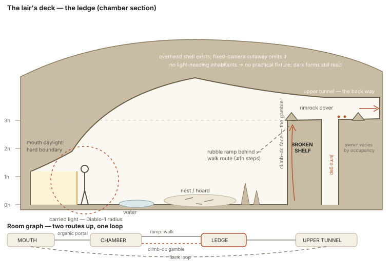

# SITE 7 — NATURAL LAIR — WORKING SPEC

## Authority and honest status

This document translates the ruled Lair family into the Mine-standard generator and
proof contract. The catalog remains the ruling authority.

The lair has passed research, founder, and brief-congruence gates. That means its family
and first build are decided; it does not mean its route weights, darkness, creature
fit, or fixed-camera shell have passed clay.

## Plain-English promise

A lair is a found or creature-dug interior whose shape, resources, hazards, and
adaptations reveal how its occupant—or its absence—uses the place.

The player should be able to read the mouth, the claimed floor, the advantageous ledge,
the way deeper, and the way out. Darkness and irregular rock create uncertainty, but
they must not erase the decisions.

## What makes it a site family

Site 7 owns an **inhabited or recently inhabited void whose form has a natural or bodily
cause**:

`outside → mouth transition → claimed interior → advantageous or hazardous terrain
→ deeper destination or short exit`

Geology or an excavating creature owns the major space. Occupant behavior, resources,
adaptation, hazard, light, scent, water, and sound explain how it is used. The same
grammar can form one chamber, a pocket, a longer natural dungeon, or a hybrid attached
to built work.

A generic cave with crates is not a Lair. A worked extraction chain belongs to Site 5.
A wholly dead remnant whose main identity is abandonment belongs to Site 3, even if a
creature later nests in one corner.

## Required invariants

- **REQUIRED — geology or excavator owns the void.** Natural process or a named creature
  body/behavior explains the major form.
- **REQUIRED — the mouth is a transition.** Outside and inside have a readable light,
  space, sound, and tactical relation.
- **REQUIRED — claimed use is spatial.** Nest, larder, hoard, water, nursery, bones,
  territory, or empty evidence has a destination.
- **REQUIRED — darkness is causal.** Every practical/emissive has an inhabitant,
  process, resource, or environment owner.
- **REQUIRED — every standable objective is honestly reachable.** A walk or
  `climb-cost` route exists; `climb-dc` may be a shortcut but never the only route.
- **REQUIRED — finite exploration and short exit.** A chain has a committed far end and
  a loop-back, separate organic exit, or earned one-way shortcut.
- **REQUIRED — strategic alternatives.** Floor, ledge, organic portal, hazard, light,
  timing, and occupant behavior produce different plans.
- **DEFAULT — descent and broken ledge.** These are Golden-Seed gameplay defaults, not
  universal geology.
- **LICENSED — bolt-hole.** Excavator body, behavior, colony plan, and reachable
  destination must support it.
- **LICENSED — adaptation.** Barricade, camp, hoard, or worked remnant belongs to an
  occupant or host; it does not turn natural rock into generic architecture.

## Identity, culture, and circumstance

### Site identity

The identity is the causal relationship among origin, mouth, occupant or absence,
claimed floor, resources, routes, hazards, advantageous terrain, and exit. The player
can change the site by disturbing a claim, controlling light, exploiting ecology,
altering water or rubble, using body-specific access, or changing the occupant's
awareness and retreat.

### Cultural expression

There is no mandatory builder culture. Culture matters when a sapient occupant adapts
the void: how it marks territory, stores value, treats remains, builds screens or
barricades, manages light and water, negotiates access, or reuses worked remnants. Such
adaptation overlays the origin; it does not replace geology with a culture-themed cave
mesh.

### Local circumstance

Origin process, excavator body and behavior, rock/soil, water, depth, climate,
resources, hazards, ceiling envelope, available exits, occupant scale, life cycle,
current occupancy, disturbance, and host connection determine the actual lair.

## The site's deck

The Golden Lair's deck is a **broken ledge or natural shelf** overlooking the claimed
floor. It is a gameplay default for the first build, not a claim that every cave
contains the same balcony.

Other origins may produce a rubble crown, terrace, higher tunnel lip, root mass, dry
island, or excavator-made shelf. The origin must explain it; a legal route and landing
must support it; and taking it must cost movement, exposure, capacity, time, or
commitment. A decorative unreachable shelf is not a deck.

## Five-expression family

1. **Small — one-off claimed chamber.** One mouth, one claimed floor, one meaningful
   hazard or advantage, and an honest route back out.
2. **Ordinary — walk-in karst lair.** Mouth-light boundary, staging strip, claimed
   floor, broken ledge, organic continuation, and short-exit logic form the recommended
   first build.
3. **Large — pocket or natural dungeon.** Chained chambers escalate resources,
   occupants, route commitments, and return solutions without becoming a random cave
   maze.
4. **Degraded or repurposed — displaced or adopted lair.** Empty traces, a returning
   occupant, a feral mine, a ruined host, or a later claimant creates layered use while
   origin and route ownership remain readable.
5. **Unusual — body- or environment-authored interior.** A dug bore, colony pocket,
   flooded/siphon system, pit, volcanic cavity, grown void, or giant-scale chamber is
   legal only when origin, body, hazard, light, and route facts support it.

Portfolio comparison:
[five-expression family board](diagrams/golden-site-five-expression-families.svg).

## Growth ladder and implementation order

### Scene ladder

1. **One-off chamber:** one mouth, claim/nest floor, one meaningful hazard or deck.
2. **Pocket lair:** two or more chambers joined by organic portals with a short-exit
   solution.
3. **Natural dungeon identity:** a longer chain with escalating resources, occupants,
   and route choices.
4. **Hybrid identity:** natural chain joins built dungeon, abandoned mine, ruin, or
   another host without losing ownership boundaries.

### Implementation order

**Walk-in karst chamber → two-room pocket/floor loop → dug bore → ledge loop → adopted
feral mine → pit and flooded/siphon postures → full natural/hybrid identity.**

The walk-in chamber proves mouth light, shell, claimed floor, ledge, routes, darkness,
ceiling implication, and creature fit at the lowest cost. The second room proves
canonical organic portals and the short-exit law. Dug origin adds body-authored bores and
licensed bolt-holes. Vertical/water families wait for their movement and camera proof.

## Recommended first build

Build the walk-in karst chamber first. It is the smallest retained scene that can prove
the mouth transition, readable darkness, claimed use, causal ceiling implication,
origin-owned deck, creature fit, competing routes, organic continuation, and retreat
under the fixed camera.

### Golden Seed — walk-in karst chamber

A walk-in karst chamber with:

- a hard mouth-light boundary and visible exterior escape;
- a readable staging strip just inside the mouth;
- a claimed nest/resource floor;
- a broken natural ledge overlooking the floor;
- one walk/rough-climb route to the ledge and one optional riskier climb face;
- an organic portal or upper tunnel that hints at continuation;
- a ceiling-implying back mass without a camera-facing roof;
- occupant, empty-state, water/scent/trace, and light facts; and
- enough space for direct, ledge, light/timing, and noncombat/ecological plans.

## Working spatial specification

### Required zones

1. **Exterior reveal:** the last readable outside ground and the mouth silhouette.
2. **Mouth threshold:** the hard transition in light, width, sound, and exposure.
3. **Inner staging strip:** a temporary place to see choices, deploy, or retreat without
   beginning on the final objective.
4. **Claimed floor:** nest, larder, hoard, water, prey remains, ritual, or empty evidence.
5. **Natural deck:** broken shelf, rubble crown, terrace, higher tunnel lip, or other
   origin-supported overlook.
6. **Deck access:** guaranteed walk/`climb-cost` route plus any licensed gamble face.
7. **Deeper connector:** organic portal to a committed destination or a visibly closed
   boundary in a one-room expression.
8. **Hazard/resource edge:** water, drop, unstable rubble, heat, spores, narrow body
   route, or another causal terrain fact.
9. **Short-exit solution:** mouth loop, separate exit, or earned shortcut.

### Provisional grid hypotheses

- Horizontal movement uses the 5-foot grid and vertical change uses `h = 2.5 feet`.
- Golden ledge begins around **2h–4h above the floor**, then clay determines where
  height, cover, camera, and standee base remain convincing.
- Ordinary walk routes start at one witness-safe cell; large-creature lairs widen from
  the excavator/occupant envelope rather than scaling every chamber uniformly.
- Squeezes declare exact body/cargo capacity and must have a reachable destination.
- Ledge landings reserve the natural standee footprint before rim rocks and dressing.
- The mouth reserves enough depth to show a hard light boundary without spawning the
  party directly in melee.
- Ceiling height is an origin/occupant fact. Low overhead restricts bodies honestly;
  presentation-large and largest-legal witnesses appear only where the roll admits them.

### Route promises

| approach | gives the player | asks the player to accept | capacity |
|---|---|---|---|
| floor route | fastest access to claim/resource; broad movement | occupant attention, lower position, exposed crossing | ordinary party; large if origin permits |
| ledge route | height, cover, information, flank | climb/time, broken-gap commitment, limited landing | body- and landing-dependent |
| light/timing route | reveal hazards, control visibility, draw or avoid occupants | carried-light exposure, fuel/hand cost, waiting/world change | non-spatial but position-visible |
| licensed bolt-hole/water route | surprise, escape, bypass, ecological access | squeeze, wetness, one-way risk, creature restrictions | explicitly limited |

The floor route cannot be simultaneously fastest, safest, highest, and best-informed.
The ledge may be strong, but taking it must cost movement, exposure, route capacity, or
commitment.

### Tactical furnishing

- rim rock grants coherent cover at the actual lip;
- rubble, stalagmites, water edges, roots, bones, nest material, and hoard reservations
  affect collision only when geometry exists;
- claim/resource, ledge, exit, light position, and deeper connector are candidate
  objectives;
- breaking a shelf, moving rubble, lighting/extinguishing a source, disturbing a nest,
  opening a bolt-hole, or changing water affects local routes or behavior;
- no decorative stalagmite may destroy the only readable route; and
- small and large creatures receive different route opportunities from real body
  envelopes, never invisible exceptions.

## Seven operating circuits

1. **Occupant movement:** mouth, patrol, nest, larder, water, roost, escape.
2. **Access and exit:** floor path, deck access, portals, squeezes, short exit.
3. **Visibility and light:** mouth daylight, carried light, nature-owned emissive,
   darkness, occlusion.
4. **Claim and resources:** nest/hoard/prey/water/territory and disturbance.
5. **Air, scent, and sound:** drafts, smoke, calls, scent trails, warning propagation.
6. **Water and terrain hazard:** flow, pool, siphon, heat, rubble, stability.
7. **Intruder response:** unaware, investigating, warning, defending, fleeing,
   returning—owned by occupants, not by the room as a free-floating AI.

Friendly state labels derive from:

- **occupancy:** empty / resting / active / displaced / returning;
- **awareness:** unaware / suspicious / alert / engaged / fleeing;
- **access:** open / narrow / obstructed / blocked;
- **visibility:** mouth-lit / carried-lit / emissive / dark;
- **stability:** sound / shifting / critical / changed;
- **resource:** intact / disturbed / removed / contaminated;
- **cause and recovery:** the event and the world action that can change it.

One `lairState = dangerous` field is rejected. Hazard, occupant, darkness, and route
facts remain independent.

## Strategic gameplay contract

At least three plans must be demonstrable:

- **Floor/direct:** accept exposure and lower ground for speed and body capacity.
- **Ledge/flank:** spend movement or risk to claim height and information.
- **Light/ecology:** manipulate visibility, scent, noise, food, water, routine, or
  occupant needs to avoid, lure, negotiate with, rescue, or displace inhabitants.

Site levers include carried light, claim/resource disturbance, rubble, water, organic
portals, bolt-hole, ledge access, sound/scent, and the occupant's exit. Empty lairs still
need investigation, traversal, rescue, resource, or environmental plans.

## Generator contract

### Inputs

- high-level dungeon identity: natural / built / hybrid;
- origin: karst, lava, sea, ice, dug, adopted void, grown, collapse, or licensed other;
- posture: walk-in, pit, flooded/siphon;
- chamber/chain rung and entrance count;
- occupant species/body/behavior/needs or uninhabited fact;
- claimed resources and ecological relationships;
- host terrain, water, air, temperature, and material;
- ledge/loop family and short-exit form;
- light-needing inhabitants, nature emissives, and carried-light expectation;
- occupancy posture, alert, objective, threat band, and creature witnesses.

### Current-roller preservation

This spec consumes the Site 7 record in
`GOLDEN-SITE-ROLLER-PRESERVATION-LEDGER.md`.

- `LIVE`: world `master`/`arch`/nearby/faction/pressure axes; compatible Place Spine
  Wild-margin, Hideout, Ruin, and natural-nearby expressions; wilderness/dungeon skins;
  dungeon cave, cavern, ledge, fissure, shaft, pool, area, elevation, and feature facts.
- `LIVE-COMPOSED`: organic, creature-dug, grown, collapsed, flooded, adopted-worked,
  small-den, and massive-lair expressions assembled from origin, occupant, ecology,
  material, and host history.
- `TARGET-ADAPTER`: the Natural Lair grammar translating those facts into mouth,
  claim/resource, occupant travel, hazard, deck, deeper way, and short-exit truth.

Before implementation, retain one non-karst organic or grown result, one vertical or
flooded result, and one adopted-worked or unusually large result in addition to the
walk-in karst seed. The Golden Seed proves a readable mouth, claim, deck, and short exit;
it is not the family. The receipt preserves upstream world/place/walk facts and the
room-level area/elevation/feature refs.

### Semantic blueprint

Commit:

- mouth/exterior relation;
- chambers and canonical organic connections;
- occupant travel/escape graph;
- claimed resources and disturbance verbs;
- floor, deck, hazard, light, and short-exit facts;
- route access classes and creature capacities;
- ceiling/back-mass and ceiling-owned sockets;
- player approaches, objectives, retreat, and interactions;
- cause/recovery for mutable state; and
- provenance, relaxations, and rejections.

### Generation order

1. Commit identity, origin, posture, occupant/ecology, objective, and witnesses.
2. Build the finite chamber/connection graph and short-exit solution.
3. Place mouth and exterior reveal from terrain/origin.
4. Reserve inner staging and primary floor route.
5. Place the claimed floor/resource and occupant travel.
6. Place the Golden deck and guaranteed access where the selected chamber admits it.
7. Add hazard/resource edge, deeper connector, and licensed squeeze/bolt-hole.
8. Resolve ceiling truth, cutaway back mass, and owned sockets.
9. Apply occupancy, awareness, water/stability, sound/scent, and light states.
10. Validate plans, capacities, standees, collision, camera, darkness, and exit length.
11. Dress retained ids without changing shell or tactical surfaces.

### Required rejection checks

Reject when:

- origin or excavator cannot explain the principal void;
- a natural chamber uses mine supports, rails, or flat construction without a host fact;
- the mouth/exterior relation or hard light boundary is unreadable;
- the claimed resource/nest has no occupant/ecological relation;
- a ledge objective has no guaranteed walk/`climb-cost` access;
- a bolt-hole lacks body/behavior provenance or destination;
- a squeeze admits a sprite whose standee/base cannot actually pass;
- darkness removes stairs, ledges, silhouettes, contact, or objective read;
- an uninhabited/dark-sighted lair receives unowned practical lights;
- ceiling omission makes support, hanging objects, or clearance incoherent;
- the only plan is a direct floor crossing;
- the far end violates the short-exit guarantee;
- camera occlusion hides the mouth, deck, or connector; or
- changed origin merely reskins the same cave while contradicting its process.

### Deterministic fallback ladder

1. remove noncanonical litter and small rocks;
2. shift a loose hazard/cluster within its origin envelope;
3. widen a landing or ordinary route without changing the origin;
4. lower or simplify the optional deck while preserving its tradeoff;
5. remove an optional bolt-hole or secondary portal;
6. reduce the chamber chain one rung while preserving mouth, claim, plan, and exit;
7. reject and reroll.

Never hand-cut a hidden route, invent a lamp, flatten all elevation, overlap a standee,
or relabel a worked mine as natural to save a seed.

## Origin, occupant, and adaptation cards

The lair has no universal builder culture. Its variation comes from:

- origin process and material;
- excavator body and movement when dug;
- occupant needs, senses, social pattern, prey/storage, and escape;
- adaptation materials and available craft;
- length of occupancy and maintenance;
- host history, including adopted mines or ruins.

Sapient or community occupancies may add organization, marks, ritual, barricades, or a
guest Camp, but those remain occupant/host layers. A creature species name alone cannot
select the entire shell.

The first changed pair should alter at least four of: mouth, chamber proportion,
surface finish, movement graph, claim/resource position, deck type, light facts,
hazard, adaptation, and exit behavior.

## Occupancy states and hooks

Beast den, burrower warren, dragon-scale-borrowing lair, colony/nursery, bandit hideout
through guest Camp, haunted hollow, displaced occupant, returning occupant, and
uninhabited void are legal.

Hooks include missing prey or traveler, wounded occupant, stolen egg/hoard, blocked
exit, flooded chamber, unstable shelf, strange warmth, intruding rival, resource
harvest, peaceful relocation, rescued young, collapsed travel entry, and an apparently
empty den whose owner is returning. Each touches a circuit and map lever.

## Lighting, ceiling, and cutaway

- Mouth daylight has a hard, motivated boundary.
- Carried light creates the existing seen/unseen trade; it is not free ambient fill.
- Fungal glow, lava, reflective water, or magical emission requires an origin/resource
  fact.
- Ambient value separation, exposure floor, AO, contact, wet reflection, and silhouette
  separation are legal presentation support.
- Practical lights require an owner and task.
- Ceilings are world facts. The normal view omits the camera-facing shell, preserves
  back/side mass and clearance, and retains sockets for drips, roots, stalactites,
  hazards, and collapse.

### Rolled world-context projection

The lair projects biome, ecology, occupant scale, origin, water, entrance light, and
enclosing mass. Band 1 explains the mouth, terrain support, shell, or true bolt-hole
portal. Bands 2–3 may show canopy, cliff, cavern, water, host ruin, or regional anomaly.
Worked background construction requires a licensed adopted/host history.

The first context receipt is
`../Reference/Golden-Site-World-Context/ROLL-RECEIPTS.json#CTX-LAIR-254`:
The Gravity-Well + Fieldstone & Mortar. Trees physically growing toward the floating
magnetic stone are direct world context. Fieldstone appears only on licensed worked or
adopted structure. Cart traffic needs a route; the quarantined exit must be a real
route state; taboo, myth, and faction goal do not become scenery.

Context does not invent practical lights, exits, climb routes, prey, or occupants.
Context-off/on captures retain identical mouth, chambers, routes, hazards, actors,
knowledge, and ids. The receipt adds `worldContextPlanId`, band/recipe ids,
mouth/portal/support refs, source refs, omissions, false-affordance rejections, and
fallbacks.

## Structure, mechanisms, and surfaces

### Inherited

Terrain slabs, rock clusters, access rocks, water surfaces, generic cutaway rules,
climb/access classes, carried light, makeshift adaptation, and canonical connections.

### Site-owned

Mouth-with-reveal · chamber shell · organic portal/throat/squeeze · bore finish/segment ·
interior ledge and rim cover · rubble cone/ramp · stalagmite relational cluster ·
pool/channel · ceiling/back-mass sockets.

### Material / paint / prop demand

- **Material:** geological parent, wet/dripstone, eroded/bore/claw/smooth/melt finish,
  rubble, water/ice/lava where licensed.
- **Paint/decal:** moisture, mineral deposits, tracks, scent/territory, nest/litter,
  bones, scratch, soot, blood, old waterline.
- **Prop/mechanism:** nest/hoard/larder reservations, carried light, emissive resource,
  movable rubble, barricade/camp adaptation, ceiling hazard.

Anything changing route, cover, climb, support, collision, visibility, or interaction
reach is governed geometry or a mechanism.

## Runtime facts and proof receipt

Retain equivalents of:

`dungeonIdentity` · `origin` · `posture` · `chainRung` · `chamberIds` ·
`connectionIds` · `mouthBoundary` · `occupantProfile` · `occupantRoutes` ·
`claimResourceIds` · `deckId` · `accessClasses` · `hazardIds` · `lightOwners` ·
`visibilityState` · `ceilingFacts` · `boltHoleLicense` · `routeCapacities` ·
`shortExitType` · `objectiveIds` · `planTradeoffs` · `disturbanceVerbs` ·
`relaxations` · `rejections`.

The receipt records seed/version, grid, fixed camera, standee envelopes, origin and
occupancy cards, shell/connection/material provenance, clay/tactical/dark/dressed
surface ids, light state, captures, validation results, failed candidates,
`rollerLineage`, and `sourceRollRefs`.

## First visual proof

Show one live walk-in karst seed through the fixed production camera, then keep the
committed layout constant while cycling:

1. neutral clay with every admitted standee envelope, mouth, staging strip, claimed
   floor, ledge, access, organic portal, back mass, and short exit visible;
2. tactical overlay naming floor, ledge, light/ecology, and any licensed conditional
   route with capacity and commitment;
3. dressed mouth-lit and carried-light states, including a deep-dark comparison with
   readable stairs, ledge edge, standee contact, AO, and honest silhouette shadows;
4. two changed origins/occupants plus one hostile deep-room or large-body envelope;
5. disturbance of claim, light, rubble/water, or occupant awareness with visible
   consequences.

The ceiling remains a world and collision fact while the camera-facing shell is omitted.
Reject the proof if darkness removes the choices, the ledge is decorative or
unreachable, the light has no cause, or the cave becomes an unstructured rock room.

## Site boundaries and stretch

- Site 5 owns deliberate mine construction and working production flows.
- Site 11 owns mixed-scale/titan structural variants; Site 7 owns ordinary lair grammar.
- Site 2 may appear as an occupant adaptation but cannot replace the natural host.
- Site 3 owns a completed dormant transformation, not mere emptiness.
- True architecture requires a host or occupant fact and keeps its original owner.

## Proof → MVP → Ideal

### Proof

One deterministic walk-in karst Golden Seed with nine zones, hard mouth light, inner
staging, claimed floor, broken ledge, guaranteed walk/rough-climb access, optional
gamble face, organic portal, ceiling-implying mass, short exit, four standee envelopes,
clay/tactical/dark/dressed captures, carried-light on/off comparison, two changed seeds,
deep-room adversarial case, and three demonstrated plans including ecological or
noncombat play.

### MVP

One-off and two-room pocket lairs; karst and dug origins; walk-in and pit postures;
organic portals; floor loop; optional ledge and licensed bolt-hole; beast, burrower,
bandit, and empty occupancies; mouth, carried, and one nature-emissive light case;
deterministic state, rejection, short exit, and receipts.

### Ideal

Full natural/hybrid dungeon identities; lava, sea, ice, grown, collapse, and adopted
origins; water/siphon play; both loop families; ceiling hazards; site-11 scale borrowing;
montage exit; broad ecology, condition, inhabitation, and realm coverage.

## Remaining evidence and proof gaps

- add cave surveys before route weights become data;
- prove ceiling sockets with cutaway omission;
- clay-check ledge height, landing, mouth depth, darkness, and creature envelopes;
- verify licensed bolt-holes across changed excavators;
- demonstrate honest silhouette/contact shadows and readable darkness; and
- build and retain the fixture in `GOLDEN-SITES-PROOF-QUEUE.md`.

## Architecture integration ruling — 2026-07-30

A pure cavern is terrain and does not imply a lair. Site 7 begins only when the request
supplies an explicit ecology claim: occupant, origin, shaping, claim/nest evidence,
body-scaled mouth, route/ledge use, bolt-hole, short exit, and causal light.

Most lairs remain natural terrain windows rather than architecture. A
`CAUSALLY_JUSTIFIED_HYBRID` is legal only when a creature adopted, built into, or dug
through sourced construction. Original excavator, current occupant, intruder, and
future claimant body profiles remain separate; none may be replaced by a generic
“monster scale.”
