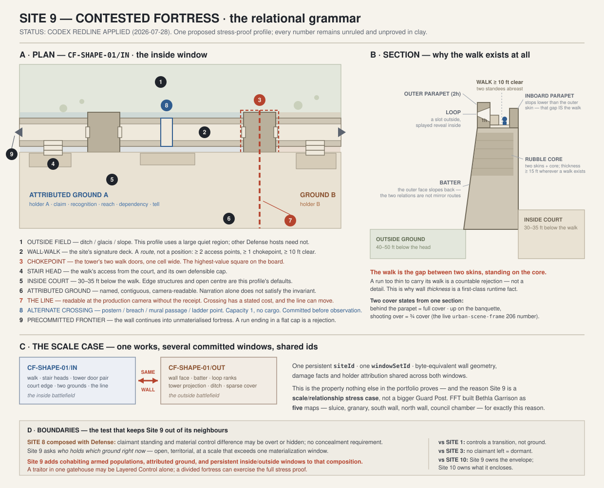

STATUS: DRAFT — CODEX ADVERSARIAL REDLINE APPLIED; FOUNDER QUESTIONS REMAIN OPEN

---
type: working-site-spec
created: 2026-07-27
updated: 2026-07-28
status: WORKING SPEC — first pipeline pass; adversarial redline applied; founder gate OPEN; clay OPEN
site: 9 — contested fortress
role: scale/relationship stress case (GOLDEN-SITE-ONTOLOGY-ENGINE-MARRIAGE.md §6)
standard: SITE-5-MINE-WORKSHOP-CONCEPT.md
authority:
  - GOLDEN-SITES-CATALOG.md
  - GOLDEN-SITE-ONTOLOGY-ENGINE-MARRIAGE.md
  - STRUCTURE-KIT-CATALOG.md
research:
  - ../Reference/Contested-Fortress-Study-0727/
preservation: GOLDEN-SITE-ROLLER-PRESERVATION-LEDGER.md
context-projection: GOLDEN-SITE-WORLD-CONTEXT-PROJECTION.md
inherits-from: SITE-1-GUARD-POST-SPEC.md
---

# SITE 9 — CONTESTED FORTRESS — WORKING SPEC

---

## 1. Authority, honest gates, ruled decisions, unresolved proposals

### 1.1 What this document is

The first working spec for Golden Site 9, written from the research packet at
[`../Reference/Contested-Fortress-Study-0727/`](../Reference/Contested-Fortress-Study-0727/).
It is a **consumer** of the Golden Site, Ontology, Structure Kit and Roller-Preservation
authorities, not a replacement for any of them. Where it names a piece another site owns, it
consumes that site's ruling; where it proposes a new piece, it says `PROPOSED` and means it.

Site 9 is classified as a **scale/relationship stress case**, not a host program
(`GOLDEN-SITE-ONTOLOGY-ENGINE-MARRIAGE.md` §6; restated in `SETTLED-LIFE-SITES-PROGRAM.md`
§2, where the seven-host / five-transform-and-stress split is written down). Its host
vernacular is **military-masonry**, which Site 1 founded and Site 9 inherits whole
(`STRUCTURE-KIT-CATALOG.md` §11: *site 9 · military-masonry · inherits full site-1 kit ·
invents gatehouse, keep storeys, broken wall + gate*).

**Site 9 does not get its own castle generator.** The ordinary `Defense/Fortification`
HostProgram owns the works and operating model. `LayeredControl` owns claimants and
attributed ground. `MaterializationWindow` owns honest cross-window extent. Site 9 is the
retained proof that those three systems survive composition at fortress scale.

### 1.2 Adversarially integrated status-gate line

The 2026-07-28 integration pass applies the following row in the catalog:

```
| 9 Contested Fortress | PARTIAL | OPEN | PARTIAL | OPEN | breadth sweep, 15-image licensed
  reference lane, FFT fortress cohort and live-roller audit returned (Contested-Fortress-
  Study-0727); interior imagery, fortified-town imagery, FFT castle interiors, a legible plan,
  the cultural axis and the site's world-context receipt are all declared gaps; no founder
  ruling of any kind exists; no clay fixture exists |
```

**Why `RESEARCHED: PARTIAL` and not `PASS`.** The depth law's three legs are served — a
sourced breadth sweep, a real-image lane with a per-image licence ledger, and an FFT cohort
comparison — and a fourth (the live-roller audit) besides. But the research's own headline
finding is that **the demand is for fortification interiors**, and the image lane contains no
fortification interior, the FFT lane left the castle interiors unopened, and the
fortified-town reading has no photographic evidence at all. Claiming `PASS` while the
evidence is thinnest exactly where the demand is loudest would be the overstatement the
honest-gates law exists to prevent.

`FOUNDER-RULED: OPEN` is not a formality. **Nothing about this site has been ruled by Adam.**
Every capsule item, deck reading, build order and card in this document is `PROPOSED`.

### 1.3 What is ruled (inherited, not re-decided here)

These are load-bearing and already `LOCKED` or `RULED` elsewhere. Site 9 consumes them:

- the FFT-derived relational grammar, all ten rules (`GOLDEN-SITES-CATALOG.md`);
- the three-layer visual law and the FFT-economy construction laws (same);
- the fixed production camera, and camera visibility as a grammatical acceptance test;
- **the arrival-hook law** — every arrival requires an active hook (Site 1);
- **the flat walkable deck** and **defensive-edge cover-class equality across cultures**
  (Site 1, founder-locked 2026-07-24);
- the grid constants: `h = 2.5 ft`, storey `4h`/10 ft, parapet `2h`, 30° slope
  (`STRUCTURE-KIT-CATALOG.md` R1, locked);
- the golden-seed law: a retained ordinary seed, no hand-authored map, no seed-specific
  branch;
- THE GENERATOR PRINCIPLE — founder either/or questions default to BOTH-ROLLED, and arrive as
  **proposed build orders** with a learning rationale and ladder links;
- THE DEPTH LAW and the four honest gates.

### 1.4 Unresolved proposals carried by this spec

Numbered so review can answer them individually. All are `PROPOSED`.

| # | proposal | where |
|---|---|---|
| P1 | The site's promise and classified proof obligations | §2 |
| P2 | The four-rung ladder and its implementation order A → B → C → D | §3 |
| P3 | `CF-SHAPE-01` as the Golden Seed — a **window pair**, not a single board | §3.4 |
| P4 | Fourteen required zones and the provisional grid band | §4 |
| P5 | Four route promises with capacities | §5 |
| P6 | Eight operating circuits and the ten-axis state factorization | §6 |
| P7 | Five extensions to Site 9's structure buy beyond the matrix's three | §13.2 |
| P8 | The **Holder view** — a fortress-facing projection of the shared Layered-Control claimant record, one per population | §11.2 |
| P9 | The **line tell** as a decal-bin dressing rather than geometry | §13.4 |
| P10 | A third culture profile (`Massed Rampart Tradition`) beside Site 1's MVP pair | §11.1 |
| P11 | Commission a Site 9 world-context receipt (`CTX-FORT-*`) — none exists | §12.4 |
| P12 | Wire `urban-area-type` rows 195/196 rather than authoring new gate rooms | §8.3 |

---

## 2. Plain-English promise and classified invariants

### 2.1 The promise

> **A Contested Fortress is a Defense/Fortification host whose consequential claims and
> defensive extent cannot be honestly shown in one materialization window.**
>
> Play here is about ground. Which side of which line you are standing on, what it costs to
> cross, who has to let you, and what changes when the line moves. The walls were built to
> keep one thing out; now they run between two things that are both already in.

What should be felt on first sight: **the works are out of scale with the life in them.** A
wall built for a garrison of three hundred, with forty people behind it. A killing ground with
washing hung across it. A gate that four people cannot close.

What makes playing here different from any other site: **the fortification is terrain for
both sides at once.** Everywhere else, the defences belong to somebody and the player is
outside them or inside them. Here the player is inside somebody's defences *with somebody
else*, and the wall that protects one population is the obstacle the other has to solve.

### 2.2 What makes it a stress proof

Site 9 proves this composition:

`Defense/Fortification host + LayeredControl + persistent multi-window extent`

Two things must be simultaneously true or it is not this site:

- **the relationship** — at least two populations, each with attributed ground, and a line
  between them that both can read; and
- **the scale** — the works exceed the materialization window, so the site is played as a
  set of committed windows on one persistent identity, with honest frontiers into
  unmaterialised fortress.

Drop the relationship and it remains an ordinary Defense/Fortification host, possibly the
large end of Site 1's family. Drop the multi-window extent and it remains Layered Control on
a fortification host. Hide one claim and Site 8 still applies; Site 9's first proof simply
requires enough attributed ground to make the cross-window stress legible. Drop the
claimants entirely and the defense host remains; add Dormant only when its operating model
has actually stopped.

### 2.3 Required invariants

Classified per the catalog's recommendation classes. `REQUIRED` violations reject the
candidate.

- **REQUIRED — two attributed grounds.** At least two populations hold named, contiguous,
  camera-readable ground. Narration alone does not satisfy this; each holder's ground carries
  a visible tell (§13.4).
- **REQUIRED — a readable line.** The boundary between attributed grounds is legible at the
  production camera without the receipt, and crossing it has a stated cost.
- **REQUIRED — the works exceed the window.** At least one edge of the active window is a
  **precommitted frontier** into unmaterialised fortress — a wall run continuing, a stair
  going up out of frame, a gate to somewhere the plan already owns. A wall that ends in a flat
  cap is a rejection.
- **REQUIRED — the wall has two relations.** Every enceinte run in the retained window set
  declares an inboard and outboard relation. Either face may be traversable, inaccessible,
  buried, flooded or external; the spec may not invent playable ground merely to complete a
  pair.
- **PROFILE — the lengthened entrance.** The gate-window proof turns, offsets, climbs, or
  doubles back under observation. Straight gates, breached lines and gate-less works remain
  legal Defense/Fortification results outside that profile.
- **PROFILE — the gate is a sequence.** The gate-window proof carries at least two
  independently operable barriers and an occupied machinery position with its own access.
  This is not a universal requirement for every fortress window.
- **REQUIRED — the walk is a route.** Where a wall-walk exists it has at least two access
  points and at least one chokepoint, and it connects things. A deck you can only stand on is
  Site 1's deck, not Site 9's.
- **DEFAULT PROFILE — quiet ground is the largest single region.** Glacis, court, ward,
  plateau or water. Dense fortified towns, packed refuges and compact cliff works may reject
  this profile without rejecting the host.
- **DEFAULT PROFILE — structures line the enceinte.** Buildings often sit against the wall
  while the ward centre stays open. A licensed civic, ritual, water, command or terrain fact
  may put the main mass elsewhere.
- **PROOF ORDER — cohabitation before assault.** Rows 51 and 71 in the broad
  `place-master-setting` screen directly support inherited/cohabited works. Build that retained
  state first, then prove assault using the same systems. This is a learning order, not a global
  world-state weighting; story canon chooses the actual state.
- **LICENSED — assault, mutiny, refuge overload, undermining, construction, slighting.** Each
  is a condition or occupancy card over the same works, legal when its facts are rolled.
- **VARIANT — fortified town, refuge enclosure, earthwork/timber expression, gate-only
  window.** Alternate compositions in the roller with their own ladder links (§3, §11).

### 2.4 The grammar in one picture



Panel A is the plan of `CF-SHAPE-01/IN` with its nine numbered relations. Panel B is the wall
in section and answers the question the whole site rests on — *why does a walk exist at all,
and what makes one illegal.* Panel C is the scale case. Panel D is the Site 8 boundary.

### 2.5 Identity, culture, and circumstance

**Site identity.** The live relationship among defensive lines, attributed grounds, the
crossings between them, and the populations that need each other's ground. The player changes
the site by moving the line — taking a stair head, opening or jamming a barrier, being
recognised by a holder, cutting or restoring water or stores, revealing a crossing, or getting
one holder to trade ground for something they need more.

**Cultural expression.** Culture decides how the defensive edge is built (crenellation, massed
arched merlons, earth bank and palisade, timber bratticing), how the wall face is finished
(coursed ashlar, rubble with whitewash, batter with plinth, turf revetment), how the gate is
dressed (heraldic cloth, carved tympanum, painted post, hung skulls), how the walk is carried
(wall-thickness, corbels, arcade, timber gallery), and what the tokens of belonging look like.
It must not change the tactical topology in the MVP — the same cover class, the same route
graph, the same capacities.

**Local circumstance.** Terrain and the shape of the defended ground; who built it and who
lives in it now; how long ago the authority lapsed; the ratio of works to population; stores,
water, sanitation; damage history and whether it was slighting or neglect; season and weather;
what is outside; and what each holder currently needs.

---

## 3. Scene ladder, implementation order, learning rationale, and Golden Seed

### 3.1 Five-expression family

1. **Smallest — the gate window.** One gatehouse: a barbican outwork or forecourt, a passage
   with two or more barriers, a murder-hole gallery or portcullis chamber above, and the two
   sides of the passage held by different people. No second enceinte needed. Serves the
   dungeon walk's interior demand directly.
2. **Ordinary — the contested wall segment.** A run of curtain between two towers, its walk
   held at one end by one holder and the other end by another, stairs dropping to a court
   inside, the wall face falling to open ground outside. **The recommended Golden Seed** —
   see §3.4.
3. **Large — the double line.** Outer ward and inner ward, the narrow ring between them, and
   offset gates so the way in must travel that ring. The full concentric reading.
4. **Degraded or repurposed — the colonised works.** Civil quarter grown inside the old
   killing ground; the garrison reduced, changed, or gone; a rent collector arriving for a
   lord nobody has met. If *no* claimant remains and nothing is contested, the scene crosses
   into Site 3.
5. **Unusual — the earth-and-timber, terraced, or anomalous expression.** Multivallate bank
   and ditch; palisade and terrace with the water and storage inside the defended area;
   frozen-water walls; a fortification interior read as a pure dungeon room-chain.

### 3.2 Scene ladder (rungs)

| rung | scene | proves |
|---|---|---|
| **A** | **Gate passage interior** — forecourt/barbican → passage with two barriers → gallery above, with the passage's two ends held by different people | the barrier sequence, the staffed machinery room, an interior chokepoint, and the 14.6 % dungeon-interior demand |
| **B** | **Contested wall segment, two relations** — one wall run projected through an *inside* window and an *outside* window sharing ids | the portfolio stress proof's distinctive obligation: one persistent works, several committed windows, one geometry read from two relations |
| **C** | **The double line** — outer ward, inner ward, the ring between, offset gates | nested enceintes, legal overflow across a precommitted frontier, and the true concentric geometry |
| **D** | **The colonised works** — civil infill in the killing ground, lapsed authority, arriving second claimant | the strongest directly supported non-siege state, the makeshift vernacular over military masonry, and the Site 10 seam |

### 3.3 Implementation order and learning rationale — `PROPOSED`

**A → B → C → D.**

- **A first** because it is the cheapest place to fail. A gate passage is a short room-chain;
  it isolates the multi-barrier sequence, the machinery room, collision through a portcullis
  slot, and murder-hole sight relations without any terrain, any enceinte, or any second
  population's ground. It is also the rung that consumes `urban-area-type` rows 195/196
  (§8.3), so it doubles as the wiring proof for content that already exists.
- **B is the Golden Seed** because it is the smallest composition that can prove the thing
  only Site 9 proves. If one wall can be committed once and read correctly from both sides
  with stable ids, the scale case is real. If it cannot, no amount of concentric geometry
  will save the site.
- **C waits** because it is the expensive geometry and it teaches least per unit of cost. A
  double line is two of B plus a ring; nothing in it is a new *relationship*, only more of
  one. Building it early would spend the budget on the part the FFT lane says even a shipped
  commercial game did not buy.
- **D last** even though it is the most-demanded state, because "civil quarter inside the
  killing ground" is meaningless until attributed ground and the line tell exist. D is B's
  machinery plus a second vernacular; it is a recombination if B succeeds, and an invention if
  B is skipped.

**Ladder links.** A promotes into B by adding the wall the gate sits in. B promotes into C by
adding a second line and offsetting the gates; B degrades into A by dropping to the gate
window. C degrades into B by materialising one line. D is reachable from B or C by applying
the cohabitation occupancy and the makeshift vernacular; D degrades into Site 3 when the last
claimant leaves.

**Level bands (TIER-SCOPE L1–10) — `PROPOSED`:** A at L1–3, B at L2–6, C at L5–10, D at any
band (its difficulty comes from the holders, not the walls).

### 3.4 Golden Seed — `CF-SHAPE-01 — Contested Wall Segment, Two Relations`

**The seed is a window pair, not a board.** This is the proposal that most needs founder
attention (P3), because every previous golden seed has been one composition.

Spatial sentence (provisional prose for testing, **not** a canonical table row):

> A run of curtain wall stands between two towers. Its walk is a route held at one end by one
> population and at the other by another; stairs drop from the walk into an inhabited court
> on the inside, and the wall face falls to open ground on the outside. The two windows are
> the same wall.

- `CF-SHAPE-01/IN` — the inside window: the walk, both stair heads, one tower door pair, the
  court edge below, the two attributed grounds, the line, and the inboard parapet.
- `CF-SHAPE-01/OUT` — the outside window: the same wall run from the field, its batter, its
  loop ranks, the tower's outward projection, the ditch or glacis, and sparse cover.

**Hard obligations.** Both windows commit the *same* wall geometry, the same ids, the same
damage and repair facts, and the same holder attributions · the walk has at least two access
points and passes through at least one tower door pair · the line is readable in the inside
window and its consequence (which loops are manned, which are dark) is readable in the outside
window · at least one crossing exists that is not the front · a precommitted frontier
continues the wall out of both windows ·
retreat is honest for both holders.

**Arrangeable.** Which holder is at which end · whether the tower is mid-run or at one end ·
whether the inboard edge is a parapet, an open drop, or a timber gallery · whether the
crossing that is not the front is a postern, a breach, a mural passage, a ladder point, or a
schedule · whether the outside ground is ditch, glacis, water, slope or field · culture of
the defensive edge · condition and repair history.

**Anti-rules.** No wall that ends in a flat cap · no walk without access · no tower claimed as
a chokepoint with fewer than two walk doors · no second population that exists only in prose ·
no crossing revealed after it becomes useful · no second claimant existing only in prose · no
special geometry for the retained seed · no walk on a wall too thin to carry it (§4.3).

---

## 4. Required spatial zones and provisional grid/standee hypotheses

### 4.1 The 3D-construction restatement (discipline, before any number)

Per the standing 3D-construction rule, the geometry is restated as real-world construction
**before** it is specced. This is how a curtain wall with a walk is actually built:

1. A foundation trench is cut to bearing and a footing laid wider than the wall.
2. The wall rises as **two masonry skins with a rubble-and-mortar core between them.** Wall
   *thickness* is therefore the structural fact, not a decorative one.
3. The **outer face batters** — it slopes back as it rises, so the base is thicker than the
   head. This is why the outside face reads differently from the inside, and why a ladder set
   against it leans badly.
4. At the head, **the inner skin stops lower than the outer skin.** The outer skin continues
   up as the parapet. The gap between them, carried on the wall's own core, **is the walk.**
   A wall thinner than about two skins plus a passable gap cannot have a walk at all.
5. Where the walk must be wider than the wall allows, **corbels or a blind arcade carry it out
   over the inner face.** That is what the arcading on FFT's south wall of Bethla and the
   stepped section at Brouage are doing.
6. **Merlons and embrasures are built as the parapet rises.** Loops are formed with a
   **splayed reveal on the inside**, so the shooter's cone widens inward and stays a slot
   outward.
7. **Towers are separate masses bonded into the curtain and projecting outward**, so their
   flanks can be shot *along* the wall face. Their floors are timber on offsets or stone
   vaults. **The walk passes through the tower via a door on each side** — which is exactly
   why a tower is a chokepoint and not just a lookout.
8. **Stairs to the walk are built against the inner face** or run within the tower's
   thickness.

Four spec consequences fall out of that and are treated as `REQUIRED` in §10:

- the walk exists only where the wall is thick enough to carry it;
- the tower's **door pair** is the chokepoint, and a tower without one is not one;
- the tower's **outward projection** is why enfilade along the wall face works;
- the **batter** makes the outside face a distinct surface from the inside face, not a mirror.

### 4.2 Required zones (`CF-SHAPE-01`)

1. **Wall run** — continuous geometry with real, declared thickness.
2. **Wall-walk** — the linear deck; the site's signature route.
3. **Outboard defensive edge** — parapet plus banquette step; two cover states from one
   section.
4. **Inboard edge** — the drop to the court; parapet, open edge, or timber gallery.
5. **Stair heads (≥ 2)** — each an access point and a chokepoint.
6. **Tower / bastion** — outward-projecting mass, door pair through the walk, point deck above.
7. **Wall-thickness interior** — loop embrasures, and where licensed a mural passage or
   chamber. *This is where the dungeon-walk demand lives.*
8. **Inside court edge** — the inhabited ground the wall overlooks.
9. **Outside field** — ditch, glacis, slope or water; quiet, sparse, exposed.
10. **Attributed ground A** — one holder's named, contiguous ground.
11. **Attributed ground B** — the other holder's.
12. **The line** — the boundary strip between 10 and 11, with its tell and its crossing cost.
13. **Precommitted frontier** — the wall's honest continuation out of the window.
14. **Alternate crossing** — postern, breach, mural passage, ladder point, or a scheduled
    social crossing. Committed before observation.

Plus, for rungs A / C / D respectively: the gate passage and its gallery; the ring between
lines and the offset gate pair; the civil infill quarter and its service ground.

### 4.3 Provisional grid hypotheses — all `PROPOSED`, all clay-deferred

Inherited constants (locked elsewhere, not re-decided): 5 ft horizontal grid · `h = 2.5 ft`
vertical · storey `4h` = 10 ft · parapet `2h` = 5 ft · 30° slope
(`STRUCTURE-KIT-CATALOG.md` R1).

| quantity | hypothesis | where the number comes from |
|---|---|---|
| wall-walk clear width | **≥ 10 ft (2 cells)** so two standees pass | Brouage reads as several bodies wide; two cells is the minimum that makes the walk a *route* rather than a queue |
| wall thickness where a walk exists | **≥ 15 ft (3 cells)** — two skins plus the walk | derived from §4.1 step 4; a walk needs the core beneath it |
| wall thickness where a mural passage exists | **≥ 20 ft (4 cells)** | a passage inside the core needs its own clear width plus two skins |
| wall head above inside court | **30–35 ft** | live `urban-scene-frame` 206 states a 30 ft drop to courtyard; 267 states 32 ft |
| wall head above outside ground | **greater than inside, band 40–50 ft** | the batter and the ditch; the outside face is the tall face by design |
| segment length in the window | **80–120 ft (16–24 cells)** | live `urban-scene-frame` 156 Keep Courtyard 80′ × 80′; 200 Fortress Siege Ground 120′ × 130′ |
| banquette step | **1h = 2.5 ft** above the walk | half a parapet; the step that converts full cover to shooting cover |
| cover class behind parapet | **full cover** | inherited construction reading |
| cover class on banquette, shooting over | **three-quarters cover** | live `urban-scene-frame` 206 already prices crenellated walls at three-quarters |
| tower door pair clear width | **5 ft (1 cell)** | the chokepoint's whole point is that it is one cell |
| loop sight cone | **narrow — a real constraint, not a formality** | the cross-loop image shows a slot a hand wide with a splayed inner reveal |

**Standee reservations.** Both windows must reserve a six-foot witness on the walk, on the
banquette, in a loop embrasure, at a stair head, and in a tower door; plus a
presentation-large and a largest-legal envelope somewhere on the court and the outside field.
The walk must legally hold **two standees abreast** or the width hypothesis fails.

**Camera.** The fixed production camera must show, without orbiting: both attributed grounds,
the line, at least one stair head, the tower relation, the outboard edge, and the precommitted
frontier — in the inside window; and the wall face, its loop ranks, the batter, the ditch/field,
and the tower's projection — in the outside window.

**Every number above is a hypothesis until clay and play accept it.** None is ruled.

---

## 5. Route and plan promises

| approach | gives the player | asks the player to accept | capacity |
|---|---|---|---|
| **along the walk** | the fastest lateral movement, the height advantage, and the ability to reach both stair heads | passing the tower door pair — one cell wide, under the defender's best cover, with no way round | file of one at the chokepoint; two abreast elsewhere |
| **through the court** | avoids the chokepoint entirely; reaches a different stair head; access to the inhabited ground and its people | slower, at the bottom of a 30 ft drop, overlooked from the walk the whole way, and inside somebody's attributed ground | party-scale; carts where the court licenses them |
| **outside the wall** | avoids both the chokepoint and the holders; a breach, postern, mural passage or ladder point crosses the line without touching it | exposure on open ground with sparse cover, a climb or a squeeze, and a capacity of roughly one body — a sally port is one at a time by construction | **1**, cargo-limited; some variants **0** for anything bulky |
| **do not cross** | recognition, permission, purchase, schedule, or leverage over what a holder needs (water, stores, a route, a repair) | time, world cost, an obligation, and an uncertain holder response — and the line stays where it is | non-spatial but map-visible |

At least three must be viable in any accepted candidate, **and at least one must be
non-combat.** The walk cannot simultaneously be fastest, safest, quietest and best-informed.
The outside crossing cannot be a free duplicate of the walk — its capacity limit is the price.

---

## 6. Operating circuits and factorized mutable state

### 6.1 Eight circuits

1. **The line** — where the boundary runs, who patrols it, what crossing costs, what moves it,
   and what happens when it moves.
2. **Watch and enfilade** — sight along the wall face from projecting towers, sight across the
   outside ground, sight down into the court, signal between towers, and the dark loops that
   tell an observer nobody is home.
3. **Barrier and passage** — gates, posterns, portcullises, doors, the machinery, its crew,
   its states, and what jamming or opening each one costs.
4. **Movement between fronts** — walk, stairs, tower doors, mural passages, and the way
   holding one chokepoint isolates a whole front.
5. **Stores, water and sanitation** — what two populations in one enclosure actually argue
   about, and what the works' own infrastructure controls. *(FFT staged the sluice as its own
   battlefield; Caerphilly's principal defence is water management.)*
6. **Attribution and recognition** — whose ground, whose gate, who may pass, what token or
   habit marks belonging, and what a stranger is by default.
7. **Structure, breach and repair** — damage history, patch chronology, and the hard
   distinction between **slighting** (deliberate, split and leaning masses) and **decay**
   (tumbled, weathered, overgrown).
8. **Overflow and frontier** — which parts of the works are latent, which are external, and
   how the window legally grows (`GOLDEN-SITE-ONTOLOGY-ENGINE-MARRIAGE.md` §4.2's five
   conditions apply unchanged).

### 6.2 Factorized state

**Do not implement `fortressState = besieged`.** These axes are independent:

- **line:** settled / drifting / disputed / open-conflict / resolved
- **claims:** one / two / three-or-more
- **population mix:** garrison-only / garrison + civil / civil-only / garrison + refuge /
  abandoned-with-claimants
- **barrier:** open / controlled / closed / breached / jammed
- **walk control:** single / split / contested / impassable
- **stores:** full / rationed / short / spoiled / seized
- **water:** secure / contested / cut / flooded
- **condition:** maintained / patched / strained / breached / slighted
- **authority:** present / delegated / lapsed / absent / disputed
- **outside:** clear / watched / invested / assaulting / withdrawn

A classic siege is `outside = investing` + `line = open-conflict` + `stores = rationed`.
**Thorngate Keep** is `population = garrison + civil`, `authority = lapsed`, `line = drifting`,
`outside = clear` — and it is the same site.

---

## 7. Strategic gameplay contract

### 7.1 The site's levers

Things this composition must make usable at fortress scale:

- **The chokepoint.** Holding a tower door pair splits a front. It is one cell wide and it is
  the single highest-value square on the board.
- **The height differential.** The walk overlooks the inhabited court by three storeys. What
  is said on the walk is heard below; what happens below is seen above.
- **The two relations.** The same wall is cover for one claimant and an obstacle for the
  other. A breach helps whoever needs to cross and hurts whoever needs to hold. Neither side
  becomes a traversable “face” unless the Defense host actually built a walk, passage, stair,
  or opening there.
- **The barrier sequence.** Opening one barrier is not opening the gate. Jamming the middle
  one traps whoever is between them.
- **The machinery room.** Taking it does two jobs at once — it operates the barrier and it
  covers the ground the barrier controls.
- **Infrastructure.** Water, stores, drainage and sluice are the levers that move a line
  without a fight, because they are what each holder needs from the other.
- **The line tell.** It can be moved, erased, redrawn, or forged — and doing so is a real
  action with real consequences, because attribution is what the holders act on.
- **Recognition.** Being taken for one holder's own is a route through their ground.

### 7.2 Three demonstrable plans (minimum), one non-combat

1. **Chokepoint plan (combat).** Take and hold the tower door pair; the far front is isolated
   and one holder loses lateral movement. Cost: the approach along the walk is under the
   defender's best cover, single file.
2. **Court plan (stealth / exploration).** Move through the inhabited court at the bottom of
   the drop, reach the far stair head, and arrive behind the line. Cost: slow, overlooked, and
   inside someone's attributed ground the whole way — this is a *social* exposure as much as a
   visual one.
3. **Leverage plan (non-combat).** Establish what each holder needs from the other — water,
   the postern, a repair, a route, recognition — and trade the line rather than crossing it.
   Cost: time, obligation, and an uncertain response; the line moves but so does the debt.
4. **Crossing plan (infiltration-adjacent, capacity-limited).** Use the postern, the breach,
   the mural passage or the ladder point. Cost: one body at a time, no cargo, exposure on the
   outside ground, and the crossing may be committed shut behind you.

The same levers must matter in combat, social play, stealth, investigation and aftermath.
**Aftermath propagates:** a moved line stays moved; a jammed barrier stays jammed until
someone repairs it; a holder who lost ground remembers who took it.

---

## 8. Roller sources, status, retained compositions, and lineage

Full audit: [`../Reference/Contested-Fortress-Study-0727/lane-4-roller-audit.md`](../Reference/Contested-Fortress-Study-0727/lane-4-roller-audit.md).
Method note carried forward: wiring was verified by grepping `src/` for the roller call; **the
engine was not executed.**

### 8.1 `LIVE`

`dungeon-type` (`engine/dungeon-walk.js:613`) — the Military Fortification archetype, 15 of
100 rows, **14.62 %** of real dungeon walks per `docs/intel/walk-census.md`. This measures
Defense/Fortification **host demand**, especially interiors; it does not measure Site-9
multi-claim or multi-window activation.
`dungeon-area-type` (`:113`) — 200 room programs including an attached gatehouse room with a
portcullis slot, twin flanking guard rooms, an antechamber closed by an iron portcullis with a
wall winch, murder-hole slits, arrow slits at switchback landings, an armory alcove behind an
iron door, an elevated blind with ladder rungs and an observation window, and hidden parallel
observation passages.
`room-elevation-profile`, `tactical-terrain` (`:465`), `dungeon-feature`,
`dungeon-interactable-object`, `dungeon-lighting`, `dungeon-exit-state`, `dungeon-topology`.
`dungeon-door-type` / `dungeon-door-state` (`world/wiring-b.js:384`, called at
`engine/dungeon-walk.js:659`) — per-exit barrier dressing.
`urban-scene-frame` (`engine/walk.js:373`) — the dimensioned exterior frames of §4.3.
`urban-tactical-setup` (`:504`) — row 11 fortified gate plaza, row 19 guard tower interior.
`urban-segment-approach` (`:121`) — row 18 The Fortress-Prison Siege Line.
`urban-catalyst` (`:577`) row 140, `urban-spectacle` (`:362`) row 79.
`place-master-setting` (`engine/codex-roll.js:660`, `creator/bardo.js:14`), `place-history`,
`place-traits`, `place-nearby`.

### 8.2 Retained composition `RC-FORTRESS-01` — the colonised works

The live world table already writes this site's promise. `place-master-setting` row 51,
**Thorngate Keep**: *"A modest border garrison of stone towers and earthwork ramparts, now
housing a growing civilian quarter inside the old killing ground."* Row 71, **The Borrowed
Wall**: *"A hamlet sheltering inside the curtain-wall of a castle that was never theirs,
paying rent to a lord no living soul has met."* Row 79, **The Garrison-Wife Town**: dependents
who outlasted the army and now govern by a rank structure with no military left to justify it.
`place-history` row 59: *"A garrison town that outlived its war and learned to farm."*

Confirmed downstream in real rolls (`docs/intel/tiyl-starts.md`): High-Harrow Gate returned as
a hometown (d100 = 2) with history *"Settled to contain a thing the founders couldn't kill;
the town is the lid, and the lid is loosening"*; Wind-Break Village as a world-origin
(d100 = 39); The Garrison-Wife Town as a hometown (d100 = 79).

**The composition law Site 9 must preserve:**

`defensive works` + `who built them` + `who lives in them now` + `what happened to the
authority` + `what each population needs` = one playable contested-fortress expression.

It must **not** check for Thorngate Keep, High-Harrow Gate, a particular roll total, or any
seed. Changed inputs should be able to produce a manned frontier garrison, a rented curtain
wall, a refugee-swollen refuge, a mutinous barracks, a slighted keep with two claimants, or a
turf-and-timber pā under pressure — all functionally valid, all materially different.

**Fixture minimum.** Alongside `CF-SHAPE-01`, retain one **gate-window** result, one
**colonised-works** result, and one **non-masonry** (earthwork/timber) result before the site
may claim breadth.

### 8.3 `AUTHORED-UNWIRED` — the preservation obligation (P12)

`urban-area-type` has **no caller in `src/`**, and the roller-preservation ledger independently
records it as `AUTHORED-UNWIRED` for `rollUrbanWalk`. Stranded inside it are the two most
Site-9-specific room programs in the entire engine:

- **row 195 Gatehouse** — 20′ × 30′ rectangle, with a *10′ × 20′ murder-hole gallery on the
  floor above*;
- **row 196 Barbican** — 30′ × 40′ rectangle, with a *10′ × 10′ heavy portcullis control room*;

plus Armory (167), Barracks (172, 041, 084), Kennel (179), attached gatehouse (013), and
attached armories (017, 114, 129).

Those two rows are, almost exactly, the research's independent findings — the staffed
portcullis chamber and the barbican with a gallery over the passage. **Somebody already solved
this and the wire was never run.**

**P12 (`PROPOSED` build order):** rung A's implementation consumes `urban-area-type` 195/196
rather than authoring new gate rooms. This is a preservation obligation, not a licence to
invent, and it means rung A pays for itself twice — as Site 9's cheapest proof and as the
wiring fix for content that already exists.

### 8.4 `INTERPRETIVE` — the real gap

**Everything about who holds which ground.** No live table assigns two populations to two
regions of one site. No live table carries a front, a truce line, an attributed territory, or
a crossing cost. Today that is entirely DM narration. The shared `LayeredControl` adapter
must make it spatial; Site 9 supplies the retained fortress-scale proof, not a second claimant
system. The Holder view (§11.2) is the proposed projection.

### 8.5 Proposed composed `TARGET-ADAPTER`

One composition pass reads existing world/place/dungeon facts through three shared owners:

- `Defense/Fortification` emits the enceinte graph, gates, wall routes, stores, service and
  defensive operating model;
- `LayeredControl` emits claimant profiles, attributed ground, permissions, fronts and
  crossing costs; and
- `MaterializationWindow` emits the active window, stable frontiers and cross-window identity.

The adapter composes them into the retained **two-population, multi-window control plan**. It
consumes the rows above, does not reroll them, and has no `if goldenSite === 9` geometry path.

### 8.6 Lineage receipt

`rollerLineage` and `sourceRollRefs` preserve the upstream world/place/dungeon facts at
segment and room granularity, exactly as Site 1's receipt does. Additionally, and specific to
this site, the receipt must record **which window of which persistent site id** each capture
belongs to, so a window set is replayable as a set.

---

## 9. Generator inputs, semantic blueprint, and ordered generation

The steps below describe the Site-9 proof harness. Runtime ownership remains with the three
providers in §8.5; “generate” here means call and compose those providers, not introduce a
fourth fortress generator.

### 9.1 Inputs

World/realm axes and construction material · walk family and approach · the fortification host
fact (from `dungeon-type`, `place-master-setting`, or an urban wall) · rung and archetype ·
**holder set (2–3 shared claimant records projected as Holder views)** · line state and the ten state axes · culture construction
profile · condition and chronology, including slighting-versus-decay · defensive-edge family ·
walk carriage (wall-thickness / corbel / arcade / timber) · barrier set and machinery ·
crossings (committed) · stores/water/sanitation state · terrain and outside-ground family ·
time, weather, light owners · encounter objective, threat band, arrival side and hook ·
standee envelopes.

### 9.2 Semantic blueprint (what gets committed before geometry)

Persistent site identity and canonical extent · the window set and each window's frontier ·
the enceinte graph (runs, towers, gates, crossings) with thickness and carriage per run · the
holder set and their attributed grounds · the line and its crossing costs · barrier states and
machinery positions · circuits 1–8 · objectives, capacities, plan tradeoffs · culture profile
and construction envelopes · defensive-edge cover promise · aftermath hooks · provenance,
recipe versions, relaxations, typed rejections.

### 9.3 Generation order — `PROPOSED`

1. Commit host, holders, line state, condition, culture, objective, hook and witnesses.
2. Commit the **persistent site identity and its canonical extent**, then select the active
   **window** and its precommitted frontiers. *(This step is new to Site 9 and is the whole
   scale case.)*
3. Resolve the composed envelope and meaningful entry/exit edges for this window.
4. Generate the **enceinte run** candidates — line, thickness, batter, carriage, head heights.
   Reject any run whose walk exceeds what its thickness can carry.
5. Place **towers** on the run: outward projection, door pairs, storeys, point deck.
6. Derive **walk, parapet, banquette, loops and embrasures**; derive mural passages where
   thickness licenses them.
7. Place **stair heads** and any corbelled widening; bind every height delta to a typed
   connector.
8. Generate the **inside court edge** and the **outside ground** (ditch / glacis / slope /
   water). Apply the quiet-ground profile when the host program and density facts support it.
9. Place host structures from their operating relationships. Prefer the enceinte edge for
   suitable barracks, stores and service buildings; do not force every program off the centre.
10. Partition **attributed ground** between holders; derive the **line** and its tell; place
    the **committed crossings** (front, alternate, and any social crossing).
11. Reserve routes, deployment, objectives, cover, chokepoints, retreat for **both** holders.
12. Assemble surface frames and material roles; apply chronology, damage vocabulary
    (slighting vs decay), repair and growth.
13. Validate mechanics, envelopes, standees, collision, camera, light, two-face consistency,
    id sharing across the window pair, changed seeds and the adversarial case.
14. Select, receipt, version, commit, persist, project cutaway and dressing.

---

## 10. Countable rejection rules and deterministic fallback ladder

### 10.1 Reject when

1. fewer than **two** attributed grounds exist;
2. the line between them is not readable at the production camera without the receipt;
3. a holder's ground has **no visible tell** (§13.4);
4. the second population exists only in prose — no ground, no props, no schedule;
5. the window has **no precommitted frontier** — every enceinte edge is capped;
6. an enceinte run has only one legal face anywhere in the site's window set;
7. the retained **gate-window profile** is selected but the entrance is not lengthened;
8. the retained gate-window profile has fewer than **two** independently operable barriers;
9. the retained gate-window profile's machinery has **no occupied position** with its own access;
10. a wall-walk has fewer than **two** access points, or no chokepoint;
11. a walk exists on a run **thinner than its carriage requires** (§4.1 step 4, §4.3);
12. a tower is claimed as a chokepoint with fewer than **two** walk doors;
13. a tower does not project outward and enfilade is nonetheless claimed;
14. the retained quiet-ground profile is selected but quiet ground is not the largest region;
15. a structure contradicts the host's operating relationships or a committed open-ground fact;
16. a crossing appears that was **not committed before observation**;
17. the second claimant has no actionable control delta (Layered Control predicate fails);
18. **no claimant remains** and nothing is contested (route to Site 3);
19. the two windows of a retained pair **do not share ids**, geometry, damage or attribution;
20. context projection adds a second gate, wall line, approach or an army that the plan does
    not own;
21. culture changes the route graph, tactical reservation or cover class in the MVP;
22. culture reads only through palette, flag or a unique prop;
23. slighting and decay are rendered with the same damage vocabulary;
24. a furnishing changes mechanics without geometry;
25. the retained seed requires a seed-specific patch.

### 10.2 Deterministic fallback ladder

1. remove non-canonical dressing and civil clutter;
2. simplify a second-rank parapet to one rank;
3. simplify corbelled widening to a wall-carried walk at the narrower width;
4. reduce mural chambers to loops with reveals;
5. reduce tower storeys, **keeping the door pair**;
6. reduce the crossing set to one front plus one alternate;
7. reduce the holder set from three to two;
8. degrade one rung (C → B, B → A) while retaining the Defense + Layered Control +
   multi-window composition;
9. reject and reroll.

**Never** delete the second attributed ground, erase either wall relation, cap the frontier,
overlap standees, or add an invisible crossing or cover object to save a seed. When the
gate-window profile is selected, also never straighten its entrance or remove its machinery
position merely to save that candidate.

---

## 11. Culture, construction, organisation, and occupant cards

### 11.1 Culture construction profiles

**Inherited MVP pair (from Site 1, founder-confirmed 2026-07-23):**

- **Institutional Frontier Works** at fortress scale — low rectilinear planning, dressed
  corners, coursed and role-disciplined stone, measured replacement, a ruled institutional
  defensive edge, and a gate dressed with heraldic cloth rather than carving.
- **Upland Vernacular Station** at fortress scale — terrain-fitting posture, fitted irregular
  rubble with dressed stone reserved for load and wear, buttress and timber cribbing, a
  culture-native defensive edge at the **same cover class**.

**P10 — proposed third profile: `Massed Rampart Tradition`.** The research's cross-cultural
evidence does not fit either of the above. Golconda's parapet is a rank of tall arched merlons
each carrying its own loops and a corbelled drop-box, stacked in **two ranks**; Maiden Castle
achieves the same relational sentence in **three to four earth banks and ditches**. The
profile: great mass over fine dressing; batter and plinth; whitewash or plaster over rubble;
merlons as small architecture rather than teeth; second firing rank; and — where earth is the
material — bank, ditch and revetment doing the enceinte's whole job. It exists to prove the
defensive-edge equality law across a silhouette that shares nothing with the MVP pair.

**Cross-cutting condition, not a culture:** the **makeshift/scavenged** vernacular
(`STRUCTURE-KIT-CATALOG.md` §11 vernacular 6) supplies the civil infill in rung D — lashed
poles, scavenged plank, hide and canvas pressed against ashlar. Its coexistence with dressed
masonry **is** the cohabitation tell.

### 11.2 P8 — The Holder view (Layered-Control projection)

No live table provides the same-host territorial binding (§8.4), but the runtime record belongs
to `LayeredControl`, not Site 9. The fortress proof projects one Holder view per claimant and
uses two or three; another host must be able to consume the same claimant record without
fortress fields.

| field | what it carries |
|---|---|
| `claimTarget` | what they claim — a ward, a gate, a stair, the walk, the water, the stores, the right to collect |
| `claimBasis` | why — built it, took it, inherited it, rents it, was left holding it, was let in |
| `recognitionProfile` | who they recognise, what token or habit marks belonging, what a stranger is by default |
| `enforcementReach` | how far their word actually carries, and where it stops being enforceable |
| `dependency` | what they need from the other holder — water, a route, a repair, stores, protection, legitimacy |
| `tell` | the visible mark of their ground (§13.4) |
| `schedule` | when they hold what; whether the line moves by hour |
| `crossingCost` | what it takes for an outsider to cross into their ground — permission, toll, escort, disguise, force |
| `wouldMoveTheLine` | what would make them give ground, and what they would want for it |

The **line** is derived from the holder set, not authored: it is the boundary where two
`enforcementReach` values meet, and its crossing cost is the receiving holder's
`crossingCost`.

### 11.3 Occupancy and organisation cards

Frontier garrison · reduced garrison with a civil quarter · civil population with no garrison
· refuge population outnumbering its defenders · two garrisons by arrangement (this is Site 8
composed onto Site 9 — route the *control* through Site 8's transform, keep the ground here) ·
split or mutinous garrison · squatters and a returning claimant · a rent-collector for an
absent lord · a non-human or supernatural claimant holding the lower works · nobody left and
two parties arriving.

---

## 12. Occupancy states, hooks, lighting, cutaway, world context, and boundaries

### 12.1 Arrival hooks (the arrival-hook law, inherited from Site 1)

Every arrival requires an **active hook**. Proposed set: the line has moved since your map was
drawn · a body on the wrong side of the line · the gate crew changed overnight and won't say
why · rations are short and the count is wrong · someone is building in the old killing ground
· a parley is due and one side hasn't come · a breach nobody is repairing · a postern found
unbarred · a banner flying that shouldn't be · a signal answered from the wrong tower · a rent
collector at a wall whose lord is dead · a refugee column at the gate and the garrison saying
no · the water is cut and neither holder admits it · the lid is loosening.

**Aftermath propagates.** A moved line stays moved and both holders act on the new one. A
jammed barrier stays jammed. A holder who lost ground remembers who took it, and their
`recognitionProfile` changes.

### 12.2 Lighting

Canonical hero is daylight; **one motivated night practical is required** and belongs to a
holder, a task, a signal, or a supernatural fact — never to readability alone.

The site's specific lighting problem is the **exposure ratio at a loop**: a near-black
wall-thickness interior looking through a hand-wide slot at a blown-out exterior. That is the
*normal* condition inside a fortification, not an edge case, and the dark-readability
requirement has to survive it: stairs, ledges, figures and the line must remain readable
through exposure, restrained ambient bounce, AO, contact and honest cast shadow. **Darkness
may be dark.** No unexplained lamp.

A second, cheaper tell falls out of the same physics and is worth keeping: **an unmanned loop
is dark and a manned one is not.** Which loops are lit is free information about where the
holders are, readable from the outside window.

### 12.3 Cutaway and roof

Cutaway is a deterministic projection of committed occluders. It may hide or ghost licensed
pieces and cap sections; it may not redesign geometry. Two site-specific obligations:

- **The mural passage and the machinery room must be cutaway-legible** — they are interior
  spaces inside a solid mass, and if cutaway cannot show them the rung-A demand is unserved.
- **Foreground cutaway must never hide the line.** The line is the site's primary read.

Site 1's ruled **flat walkable deck** is inherited and generalised: at Site 9 the deck ladder
is **point deck** (tower top, Site 1's case) → **linear deck** (the wall-walk, Site 9's
signature) → **stacked decks** (a tower point deck over a linear walk, and where the culture
licenses it a second firing rank over the first). Cover class stays equal across cultures at
every rung.

### 12.4 P11 — Rolled world-context projection

**No Site 9 world-context receipt exists.** `Reference/Golden-Site-World-Context/ROLL-RECEIPTS.json`
carries CTX-GP-19, CTX-CAMP-7, CTX-MONASTERY-68, CTX-MINE-39, CTX-LAIR-254, CTX-URBAN-13 and
CTX-PRISON-6198. There is no fortress draw. **This spec does not invent one** — inventing a
receipt would be exactly the overstatement the honest-gates law forbids.

**P11 (`PROPOSED` build order):** commission a `CTX-FORT-*` replay-harness draw before Site 9's
context obligations are written as anything but the shared plan. Until then Site 9 consumes
the shared `WorldContextProjectionPlan` under these obligations:

- **Band 1** continues only the real enceinte run, the real ground on both faces, and the real
  supports of the walk and towers.
- **Bands 2–3** may show the remainder of the works, the settlement or field the fortress
  commands, and the terrain that explains why the works are here — while keeping the enceinte
  silhouette and the line dominant.
- **Forbidden:** a second gate, a second wall line, a second approach, a besieging army, a
  relief force, or any population not in the holder set. Context may not add a crossing, and it
  may not paint a holder's ground.
- The proof retains context-off/on captures over identical wall geometry, ids, attribution,
  crossings and knowledge.

### 12.5 Site boundaries

- **Site 1 (Guard Post)** controls a *transition*; Site 9 contests *ground*. Site 1's post is
  small, operating and externally supplied; if a fortress owns a whole district or holds two
  populations, it is Site 9 (Site 1's own spec already says so).
- **Site 3 (Dormant)** owns the fully dormant transformation. A slighted fortress nobody
  claims is Site 3. A slighted fortress two parties still want is Site 9 with damage applied.
- **Site 6 (Prison)** owns custody, intake and property. A fortress used as a prison composes
  the two — Site 6 owns the custody circuits and Defense/Fortification owns the works.
- **Site 8 (Layered Control)** owns claimant identity, attributed ground, recognition,
  permissions and fronts whether the control is overt or covert and at any map size. Site 9
  proves that transform on a Defense/Fortification host whose consequential extent exceeds one
  window. **Test: remove the actionable second claim and Site 8/Site 9 collapse to the ordinary
  defense host; remove the multi-window stress and Site 8 remains on that host.** A besieged
  castle with a traitor in the gatehouse is one composed case, not two competing generators.
- **Site 10 (Urban Institution)** owns streets, frontage, plaza and stalls. In a fortified
  town, Defense/Fortification owns the **envelope**, Site 10 owns what is enclosed, and Site 9
  proves their multi-window control composition when eligible. *(FFT's Zaland Fort City does not merge them — it abuts them: masonry wall
  in front, timber-and-tile houses behind, on one plate.)*
- **Site 5 (Mine/Workshop)** owns extraction and excavated support. A mine gallery under a
  contested fortress is one site expressed through two walk families, not a new site.

---

## 13. Structure, mechanisms, materials, and dressing

### 13.1 Structural coverage banked (§10.3)

**Broken wall and gate** — the dimension `STRUCTURE-KIT-CATALOG.md` §11 already assigns to
Site 9, and the one this spec's damage vocabulary (slighting vs decay) makes real.

Secondarily banked by rung A: **tight interior whose valid result is intentionally simple** —
a gate passage and its gallery is a small, sightline-dominated interior whose correct answer
is not to be elaborate. (Per §10.3, one golden site may cover several dimensions and no
one-to-one pairing is frozen.)

### 13.2 Provider ownership and proof-sponsored gaps

**Defense/Fortification host provider (initial donors include the full Site 1
military-masonry kit):** composed terrain stage · elevation mass ·
road ribbon · foundation transition · continuous wall run · deep opening with reveal ·
barrier/threshold · observation assembly · flat deck and defensive edge · retaining run ·
typed stair/ramp connectors · relational rock cluster · drainage/support/repair member ·
cutaway cap · gatehouse assembly · keep/tower storeys · broken wall + gate.

The older matrix assigned gatehouse, keep/tower storeys, and broken wall + gate to Site 9 as
signature buys. The ontology pass retains Site 9 as their **proof sponsor** but moves runtime
ownership to the ordinary Defense/Fortification host provider.

**P7 — proposed Defense-provider extensions exercised by Site 9.** These are `PROPOSED`
refinements, not silent additions:

| piece | why the research demands it | shared with |
|---|---|---|
| **mural passage / wall-thickness chamber** | the 14.6 % dungeon demand is for fortification *interiors*; the wall's core is where they are | Site 5's excavated vernacular (adjacent, not owned) |
| **banquette step** | the two-cover-state section; without it the parapet is one cover value and the walk loses its decision | Site 1's defensive edge (a refinement of it) |
| **corbelled walk widening / blind arcade** | how a walk gets wider than its wall; evidenced at Brouage and in FFT's south wall of Bethla | Site 4's arcade family (different job, similar piece) |
| **stair head cap** | the walk's access chokepoint; a stair arriving on a route needs a defensible head | — |
| **second-rank parapet** | Golconda's stacked firing levels; the piece that proves edge-equality across an alien silhouette | — |

**Consumes rather than authors:** `urban-area-type` rows 195 Gatehouse and 196 Barbican (§8.3).

### 13.3 Mechanisms

Barrier states (per barrier, not per gate) · portcullis slot and its winch/lever position ·
murder-hole gallery sight relation · postern bar · drawbridge and its chain winch (`urban-scene-frame`
224, 305 already carry the chains and the swing hazard) · signal between towers · sluice and
water control · stores and ration count · line marker (movable) · breach and its patch state.

Physical proxies stay minimal and truthful. **Anything that changes collision, cover, sight,
support, practical-light position, or exact interaction reach requires geometry** — including
the line's barricade where one exists.

### 13.4 Material, decal and prop demand — the three bins

**Material bin.** Inherits the twelve Guard Post parent families. Proposed deltas: a
**battered/sloped face** variant (the outside face is not the inside face) · **exposed rubble
core** at a breach (the wall's sandwich section is the whole point of a breach read) ·
**slighted fracture** as a distinct surface family from weathered decay · **whitewash /
plaster over rubble** (Râșnov, and FFT's Thieves Fort) · **soot and wear at manned positions**
on the walk.

**Decal / paint bin — P9, and the cheapest good idea in this spec.** Attributed ground needs a
visible tell, and geometry is the wrong budget for it. Proposed **line tell** family, rolled
per holder: a chalked or scored line across paving · a rope or cord at knee height ·
changed paving or a swept/unswept boundary · laundry hung to one side and not the other ·
different heraldry on the two ends of the same walk · tally and boundary marks · unit numbers
on casemate doors · a cart barricade (this one **is** geometry — see §13.3).

Heraldic cloth is the identity buy at gates — banners and shields, not carving — which the
FFT lane and the monastery lane independently found, and which makes occupancy swappable for
almost nothing.

**Prop bin.** Banners · braziers · ration crates · weapon racks · map table · portcullis lever
and winch · signal brazier · water butt and yoke · washing line, cook fire and stacked fuel in
the colonised ward · the rent collector's ledger.

### 13.5 Stretch analysis

What Site 9's buy is worth beyond Site 9:

- **The enceinte run + walk + parapet reskins as** a town wall (Site 10), a monastery precinct
  wall (Site 4), a prison perimeter (Site 6), a mine compound wall (Site 5), a rung-2 camp
  palisade (Site 2), and a revetment at a lair mouth (Site 7). It is the most reusable single
  piece in the portfolio after the wall run itself.
- **The gatehouse assembly** is Site 1's checkpoint at larger scale and Site 6's intake
  threshold.
- **The mural passage** is a corridor piece for every dungeon, and it helps answer the
  14.6 % Defense/Fortification-interior demand.
- **Keep/tower storeys** are the generic multi-storey tower every site eventually wants.
- **The breach piece** is Site 3's structural buy, arriving early.
- **The shared claimant record and line tell** are Site 8's spatial expression at rungs LC-3,
  LC-4 and LC-5. Site 9 proves that machinery on the hardest large defense host; it does not
  own or duplicate it.
- **The two-faced surface property** — one committed geometry, two window readings, shared ids
  — is what a settlement wall, a canyon rim, a dam, a bridge and a cliff all eventually need.
  It is the most valuable thing rung B buys and the least visible.

---

## 14. Runtime facts, stable ids, provenance, and proof receipt

Retain equivalents of:

`siteId` · `canonicalExtent` · `windowSetId` · `windowId` · `frontierRefs` · `archetypeId` ·
`sceneRung` · `enceinteGraph` · `runIds` · `runThickness` · `runCarriage` · `runBatter` ·
`headHeightIn` · `headHeightOut` · `walkId` · `walkWidth` · `walkAccessIds` ·
`chokepointIds` · `towerIds` · `towerDoorPairs` · `parapetFamily` · `banquette` ·
`defensiveCoverClass` · `loopIds` · `loopManned` · `muralPassageIds` · `gateId` ·
`barrierIds` · `barrierStates` · `machineryPositionId` · `crossingIds` · `crossingCapacities` ·
`holderIds` · `layeredControlClaimRefs` · `holderViews` · `attributedGroundIds` · `lineId` · `lineTellId` ·
`lineCrossingCosts` · `lineState` · `claimCount` · `populationMix` · `walkControl` ·
`storesState` · `waterState` · `conditionState` · `damageVocabulary` · `authorityState` ·
`outsideState` · `quietGroundIds` · `quietGroundShare` · `cultureProfileId` ·
`constructionEnvelope` · `objectiveIds` · `planTradeoffs` · `arrivalHookId` · `lightOwners` ·
`aftermathFacts` · `relaxations` · `rejections`.

The receipt records seed and version, pinned recipes, grid, camera, standee envelopes, the
holder/culture/condition cards, **byte-equivalent shared geometry and ids across a window
pair**, structures and materials with provenance, clay/material/cutaway/gameplay capture ids,
validator results, fallbacks, failed candidates, `rollerLineage`, `sourceRollRefs`, and
`worldContextPlanId` once P11 lands.

**Two receipt fields are specific to this site and are the scale case's proof:**
`windowSetId` (which windows are the same works) and the assertion that every id shared
between windows resolves to the same committed geometry.

---

## 15. Proof, MVP, Ideal, remaining evidence, and the next demonstration

### 15.1 Proof

One deterministic neutral-clay **`CF-SHAPE-01` window pair** — `/IN` and `/OUT` — with all
fourteen zones present, sharing site id, wall geometry, damage facts and holder attribution;
two attributed grounds with tells; a readable line with a stated crossing cost; a walk with
two access points and one tower door-pair chokepoint; a precommitted frontier in both windows;
one committed alternate crossing at capacity 1; four standee envelopes including two abreast
on the walk; clay / tactical / day / night / cutaway views; **two changed seeds**; one hostile
envelope (a run too thin to carry its walk, forcing the fallback ladder); and the chokepoint,
court and leverage plans demonstrated, **including the non-combat one**.

The visible proof must make the line, its cost, and three plans understandable **without
reading the receipt.** Reject it if the wall reads the same from both sides, if the second
population is invisible, if the line is not the first thing the eye finds, or if the dark
state erases the walk and the standees.

### 15.2 MVP

Rungs A–B; the cohabitation, garrison and refuge occupancies; the complete
structure/material/trim pipeline for the military-masonry family plus the makeshift infill
condition; the Institutional/Upland culture pair over byte-equivalent committed tactics, with
`Massed Rampart Tradition` as the third profile proving edge-equality across an alien
silhouette; `urban-area-type` 195/196 consumed rather than reauthored; arrival hooks; aftermath
propagation; deterministic rejections and receipts; and the fixture minimum of §8.2 — one gate
window, one colonised works, one non-masonry expression, alongside the seed pair.

### 15.3 Ideal

Rung C's double line with the ring and offset gates; rung D's civil quarter with a real Site 10
seam; three-holder sites; the Site 8 compose (overt and covert control on the same defense host) proved on
this host; mural-passage networks and undermining as a Site 5 seam; the line moving as a
consequence of play and persisting; broader culture × realm × condition × population families,
each after its own proof.

### 15.4 Remaining evidence and proof gaps

1. **Fortification-interior reference imagery** — barracks, casemate, granary, cistern, gate
   passage from within. The demand's largest hole.
2. **Fortified-town reference imagery** — the reading lanes 1 and 4 both call dominant has no
   photographic evidence.
3. **FFT castle interiors** (maps 7, 10, 13, 16, 20, 97) and the Bethla granary (65) — opened
   in a follow-up pass.
4. **A legible multi-ward plan and a gatehouse floor plan.** The only plan read is 259 px wide.
5. **The cultural axis** — no dzong, broch, kasbah, pā photograph, or timber/palisade
   fortification was obtained.
6. **P11 — the `CTX-FORT-*` world-context receipt.** Every other studied site has one.
7. **The marathon's zero hits.** Fourteen per cent of dungeon labels and zero appearances
   across eleven transcripts of play is unexplained, and reading will not close it — a seeded
   playtest that forces a fortification start will.
8. **All numbers are hypotheses.** §4.3's band comes from live `urban-scene-frame` rows and
   eyeballed images; none is clay-calibrated.
9. **The engine was not executed.** Wiring is grep-verified only.
10. **No founder ruling exists on anything in this document.**

### 15.5 The next visible demonstration

**Rung A, neutral clay, one board:** a gate passage built from `urban-area-type` 196 Barbican
(30′ × 40′ with its 10′ × 10′ portcullis control room) and 195 Gatehouse (20′ × 30′ with its
10′ × 20′ murder-hole gallery above), with two independently operable barriers in the passage,
the machinery room occupied and cutaway-legible, murder-hole sight relations drawn, and the
two ends of the passage held by different people with a line tell across the floor.

It is one small interior. It proves the barrier sequence, the staffed machinery room, the
cutaway obligation, the line tell, and the `urban-area-type` wiring — and it is the cheapest
board in the whole Golden portfolio that could disprove Site 9's premise. If two people
holding two ends of one passage is not interesting, the site is wrong and we find out for the
price of a room.

---

## Founder questions

Per the generator principle, these arrive as **proposed build orders**, not A-or-B choices.
Each names what gets built first, what it teaches, and how the variants link.

### FQ-1 — Is the Golden Seed allowed to be a window *pair*?

Every previous golden seed is one composition. Site 9's whole claim is that a fortress is
played as several committed windows on one persistent site — FFT built Bethla Garrison as five
maps, and the engine's own 14.6 % demand arrives as interior room-chains, not as a castle
silhouette. That number is host demand, not Site-9 activation. **Proposed build order:** rung A (one interior board) first to prove the cheap
parts, then `CF-SHAPE-01` as a **pair** — the same wall from inside and outside, sharing ids —
as the retained seed. **Teaches:** whether one committed geometry can be read from two sides
with stable ids, which is the property nothing else in the portfolio proves. **Ladder:** if
the pair is refused, the fallback is `/IN` alone as the seed with `/OUT` as a required MVP
addition — which delays the scale proof by one horizon rather than losing it. **Easy to
revise?** Yes at spec stage, expensive after the receipt schema is built, because
`windowSetId` and cross-window id sharing are the two fields that change.

### FQ-2 — Do we prove cohabitation before siege?

The broad source screen contains fourteen fortification-adjacent settings, but only rows 51
and 71 directly encode the Site-9 relationship. Both emphasize inheritance and drift rather
than assault: *Thorngate Keep* houses "a growing civilian quarter inside
the old killing ground"; *The Borrowed Wall* is "a hamlet sheltering inside the curtain-wall of
a castle that was never theirs, paying rent to a lord no living soul has met." **Proposed
build order:** build the cohabitation reading first (rung D's occupancy over rung B's
machinery), and then test active assault as a condition card that reuses the same
attributed-ground system. **This is proof order, not a global default; story canon selects the
live state. Teaches:** whether "two populations sharing works one of them
didn't build" is as playable as it reads on the table — and it is the state the engine
directly supports in those two rows. **Ladder:** assault promotes out of cohabitation by setting
`outside = investing` and `line = open-conflict`; cohabitation degrades toward Site 3 when the
last claimant leaves. **Easy to revise?** Yes — this is a weighting, not a structure.

### FQ-3 — Does the wall-walk become a first-class *route*, with the cost that implies?

Site 1's ruled deck is a position: reachable high ground with counterplay. Site 9's evidence
says the fortress deck is a **linear route** — several bodies wide, with stair-head entrances,
tower-door chokepoints, and a two-state cover section (behind the parapet, or up on the
banquette shooting over). That is more geometry, more validation, and a new claim on the
tactical layer: the highest-value square on the board becomes a one-cell doorway. **Proposed
build order:** build the linear walk at rung B, with the point deck (tower top) inherited
unchanged from Site 1 and stacked decks deferred to Ideal. **Teaches:** whether elevation as a
*route* creates better decisions than elevation as a *position*, which is a question the whole
portfolio will eventually ask. **Ladder:** the linear deck degrades to Site 1's point deck by
dropping to a single access; it promotes to stacked decks by adding a second firing rank.
**Easy to revise?** Moderately — the width and cover-state hypotheses are clay-calibrated
anyway, but "the walk is a route" is load-bearing for three of the four route promises in §5,
so reversing it re-opens the strategic contract.
