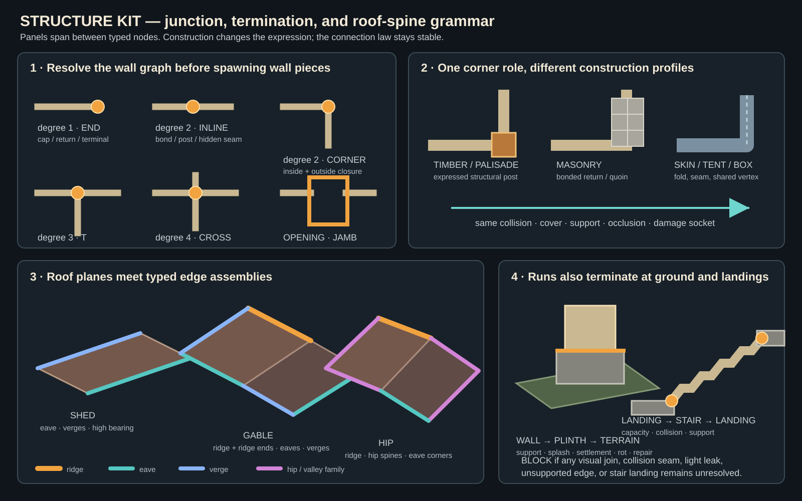

# STRUCTURE KIT — JUNCTIONS, TERMINATIONS, AND ROOF SPINES

## Founder ruling

The ideal-level-art pass exposed a shared structural omission: wall panels, roof planes,
stairs, and terrain transitions currently know how to exist, but do not yet have a
complete grammar for how they finish or meet.

The ruled direction is:

> Every structural run terminates into a declared junction assembly. The construction
> profile decides whether that junction is visibly expressed, subtly bonded, or
> continuous and visually hidden.

The rule is universal. A visible corner post is not.

Timber, palisade, framed galleries, and mine supports normally express the joint.
Masonry may use bonded returns, quoins, piers, or buttresses. Boxes, tents, folded
sheets, monolithic shells, and other continuous skins may resolve the same logical
junction through a shared vertex, seam, fold, bevel, tension member, or hidden
connection.

An undeclared gap is never a valid cultural expression.

## Plain-English promise

Walls should look deliberately connected instead of like flat panels pushed near one
another. Roofs should have real ridges and finished edges instead of two planes barely
touching. Stairs should arrive somewhere. Buildings should meet the ground through a
believable base.

This shared system makes simple geometry read as finished architecture at the fixed
tactical camera. It should remove light leaks, shadow seams, collision gaps, and the
unfinished corners visible in the current wall kit without requiring bespoke
whole-building models.

## Scope

This specification owns:

- wall-run endpoints and intersections;
- material-specific corner and junction expression;
- opening jambs and portal terminations;
- wall thickness, returns, and top-edge treatment;
- roof ridges, hips, valleys, verges, eaves, flashing, and cutaway caps;
- foundation, plinth, retaining, and terrain transitions;
- stair upper/lower landings and edge transitions;
- condition and repair states for the same joins; and
- continuous visual, collision, cover, support, and light facts.

It does not own door leaves, furnishing, complete site topology, or surface materials.

## Required laws

1. **No raw structural endpoints.** A wall, parapet, roof edge, stair, beam, rail, or
   retaining run must end in a typed termination.
2. **No accidental open seams.** Joined pieces meet within the governed visual and
   collision tolerance.
3. **Construction owns expression.** The same logical corner can become a timber post,
   masonry quoin, adobe return, palisade pile, rock transition, sewn seam, or continuous
   fold.
4. **Junctions inherit mechanics.** Collision, cover, support, sight, light occlusion,
   access, damage, and repair continue through the joint.
5. **Junctions inherit chronology.** Weathering, impact, repair, and replacement belong
   to the joint's real material, exposure, load, and history.
6. **Caps are world facts.** Wall tops, exposed cutaway sections, roof ends, and
   foundations receive the piece that makes their construction and weather behavior
   believable.
7. **Simple silhouettes win.** Corner, ridge, eave, landing, and foundation lines must
   contribute more at gameplay zoom than fine surface noise.

## Wall graph

The generator treats walls as runs between junction nodes. It resolves the graph before
selecting material-specific geometry.

| graph condition | role | ordinary result |
|---|---|---|
| degree 1 | `wall-end` | end post, return, pier, cap, bonded stop, or declared skin edge |
| degree 2, straight | `wall-inline` | hidden bond, batten/post, seam, or continuous run |
| degree 2, turning | `wall-corner` | inner/outer corner assembly for the actual angle |
| degree 3 | `wall-t` | T-post, pier, bonded block, or continuous shell node |
| degree 4 | `wall-cross` | cross-post, core, pier, or continuous shell node |
| opening boundary | `wall-jamb` | door/window/gate jamb, reveal, and lintel support |
| wall meets terrain | `wall-foundation` | footing, plinth, retaining return, embedded rock, or skirt |
| wall meets roof | `wall-roof-bearing` | plate, bond beam, bearing cap, or flashing |
| wall exposed by cutaway | `wall-cut-cap` | clean section cap preserving thickness and construction |

The first implementation may support rectilinear 90-degree graphs only.
Non-orthogonal, curved, and irregular joins promote later through the same roles.

### Corner continuity

Every resolved corner must provide:

- visually closed inside and outside faces;
- continuous collision without a snagging wedge or phantom opening;
- coherent cover and sight behavior;
- a support path where the construction requires one;
- stable material, AO, contact, and shadow behavior; and
- a condition socket for damage, growth, repair, or replacement.

## Construction profiles

The junction role stays stable while the construction profile changes its expression.

| construction | likely corner expression | likely inline/end expression |
|---|---|---|
| dressed masonry | bonded return, quoin, square pier | bonded course, dressed end, coping return |
| rubble masonry | fitted interlock, larger corner stones | tooth/bond, rough return, capped stop |
| timber frame | structural corner post with beams tenoned in | stud/post/batten; framed opening |
| plank/palisade | heavy terminal or corner pile | repeated post; braced end |
| log/roundwood | crossed or notched log corner | saddle/notch, upright stop |
| adobe/earth | thickened rounded return or buttress | monolithic continuation, repaired end |
| mine support | post-and-cap frame or crib intersection | repeated timber set |
| natural rock | transition cluster or continuous mass | geological broken/eroded boundary |
| tent/fabric | sewn seam, tension pole, rope node, or continuous cloth | hem, lashing, sleeve, or uninterrupted skin |
| box/monolithic shell | shared vertex, fold, bevel, or invisible weld | continuous face with declared edge |

A profile may hide a join. It may not omit its collision, support, light, or weather
consequences.

## Wall thickness, tops, and bases

The tactical camera exposes wall tops and side returns. A production wall is not an
infinitely thin plane unless its construction explicitly is a sheet.

Each wall family declares:

- structural thickness;
- inside and outside faces;
- top role: coping, parapet, roof bearing, exposed ruin, or cutaway cap;
- base role: footing, plinth, retaining relation, skirt, or continuous shell;
- end/junction compatibility; and
- openings whose reveals respect the same thickness.

Top caps and side returns are geometry because they own silhouette, water shedding,
occlusion, contact, and sometimes standable or cover facts.

## Roof-edge graph

Roof planes do not touch one another directly. Their shared and exposed edges receive
typed roof-edge assemblies.

| relationship | role | required resolution |
|---|---|---|
| low outer edge | `roof-eave` | overhang/fascia/drip edge and roof-to-wall relation |
| sloped outer edge | `roof-verge` | gable rake, barge, folded edge, or cap |
| two rising planes meet | `roof-ridge` | ridge segment joining both planes |
| ridge stops | `roof-ridge-end` | end cap, terminal tile, timber cap, or licensed finial |
| two falling planes meet | `roof-valley` | valley trough/flashing with drainage direction |
| sloping outside intersection | `roof-hip` | hip spine with corner/eave termination |
| roof meets taller wall | `roof-flashing` | weathered wall junction and drainage rule |
| roof omitted by cutaway | `roof-cut-cap` | section boundary preserving support and shell facts |

### Family minimums

- **Shed:** plane, eave, side verges, high bearing junction, and end treatment.
- **Gable:** two planes, ridge segments, ridge ends, gable verges, eaves, and gable-end
  wall relation.
- **Hip:** planes, main ridge where present, hip spines, hip/eave terminations, and
  drainage.
- **Intersecting roofs:** owning families plus valleys, flashing, and drainage.
- **Flat/parapet:** surface, coping/parapet, drains/scuppers, access, and cutaway.

A ridge is an assembly member, not decorative trim pasted over an unresolved seam.

## Foundation and terrain transitions

A wall-to-ground join selects a level or stepped footing, plinth, retaining return,
embedded rock transition, raised timber sill/post shoe, fabric skirt/stake margin,
monolithic continuation, or licensed open underside.

The transition follows the terrain datum, water behavior, support, and construction
card. It also owns settlement cracks, splash staining, rot, undermining, braces, and
repairs.

## Stair endpoints

Every stair run declares:

- lower landing or terrain transition;
- upper landing and support;
- width and route capacity;
- cheek wall, rail, open edge, rock side, or continuous mass on each side;
- collision and standee fit at both landings;
- relation to the destination surface; and
- cutaway and shadow behavior.

A stair that visually reaches a deck but leaves a collision gap, half-cell snag, or
unsupported top tread fails.

## Condition and repair

Junction damage and repair remain causal:

- settlement cracks begin at foundations;
- retaining pressure displaces the loaded corner or wall section;
- rot begins at wet timber feet, trapped joints, or failed caps;
- roof leaks begin at ridges, valleys, flashing, penetrations, or failed field pieces;
- impact damage respects struck height and direction;
- growth collects in protected, damp, low-traffic seams; and
- replacement stones, sister posts, braces, caps, patches, and flashing have a later age.

Each junction family may eventually support:

`intact → worn → chipped/cracked → displaced → failed`

with repair branches:

`braced · patched · capped · sistered · reset · replaced`

Proof only needs intact, one failed/damaged state, and one repaired state.

## Generator order

1. Generate site terrain, routes, rooms, decks, and required openings.
2. Construct abstract wall, roof, stair, and terrain-edge graphs.
3. Resolve node and edge roles before spawning fine pieces.
4. Select construction profiles from site, culture, realm, and condition facts.
5. Spawn run pieces between resolved junctions.
6. Spawn junctions, caps, ridges, eaves, foundations, landings, and cutaway sections.
7. Apply material bands and chronological condition/repair.
8. Validate geometry, collision, cover, support, access, occlusion, and camera.
9. Reject or fall back before furnishing if a structural seam remains unresolved.

## Rejection checks

Reject when:

- a visible hole or daylight leak exists at a committed join;
- visual pieces touch but collision or cover has a gap;
- collision overlap creates an impassable inner-corner snag;
- a wall ends without an end, jamb, terrain, or cutaway treatment;
- roof planes meet without a ridge, hip, valley, or declared continuous-skin treatment;
- ridge, hip, or valley ends float or fail to meet eave/wall geometry;
- a wall or post visually floats above terrain;
- a stair fails either landing or route-capacity test;
- cutaway exposes uncapped paper-thin geometry;
- damage floats independently of load, water, impact, or source geometry; or
- a material profile changes appearance but loses the shared mechanics.

## First clay proof — `SK-J01 Junction House`

Build one deliberately tiny neutral fixture containing:

1. wall end;
2. straight inline join;
3. inner and outer 90-degree corner;
4. T-junction;
5. door jamb and lintel;
6. level and stepped foundation transitions;
7. stair with both landings;
8. shed roof;
9. gable roof with full ridge and ridge-end cap;
10. wall/roof cutaway;
11. damaged corner; and
12. repaired corner.

Run the same logical fixture through dressed masonry, timber frame, plank/palisade, and
one continuous-skin exception such as a box shell or fabric shelter.

### Required demonstrations

- clay-neutral close view of every join;
- fixed tactical camera;
- daylight and practical-light leak tests;
- silhouette shadows plus AO/contact on and off;
- collision and standee fit at inner corners and stair landings;
- cover/sight continuity around corners;
- cutaway cap behavior;
- damaged and repaired chronology; and
- changed seed or mirrored orientation.

## MVP piece demand

- wall end/cap;
- inline join treatment;
- 90-degree inner/outer corner;
- T-junction;
- opening jamb/reveal;
- foundation/plinth transition;
- wall top/cutaway cap;
- structural corner post/pier;
- shed eave/verge/bearing pieces;
- gable ridge segment and ridge-end cap;
- stair lower and upper landing transitions; and
- damaged plus repaired corner variants.

Cross junctions, non-orthogonal corners, hip spines, valleys, complex flashing, curved
walls, and broad irregular joins may promote after `SK-J01`.

## Site impact

- **Guard Post:** wall/gate/deck corners and shoulder/foundation joins.
- **Camp:** only poles, seams, frames, or rooted service walls actually owned by shelter
  construction; fabric does not inherit masonry posts.
- **Monastery:** arcade corners, wrapped ranges, processional stairs, ridges, eaves, and
  cutaway roofs.
- **Mine:** support-frame intersections, landings, rock/build transitions, and platform
  edges.
- **Natural Lair:** continuous rock mass or transition clusters except where an adopted
  built structure owns posts.
- **Urban:** repeated party-wall ends, frontage corners, galleries, roof streets, stair
  landings, and fire/repair chronology.
