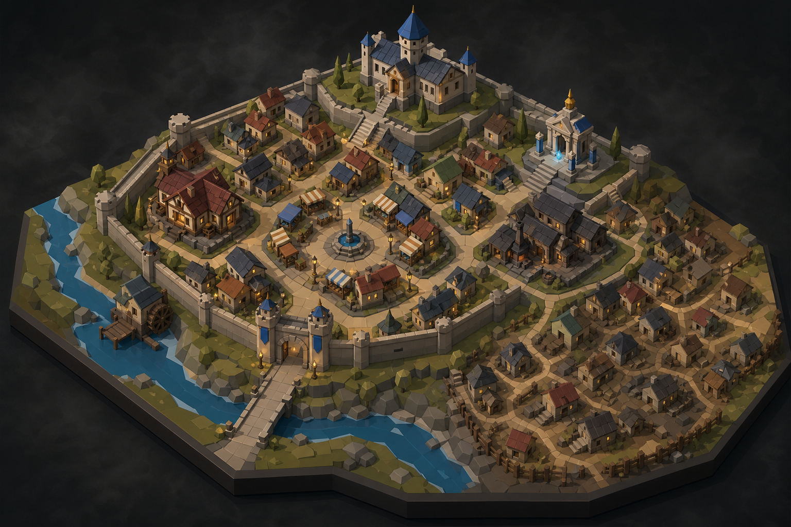
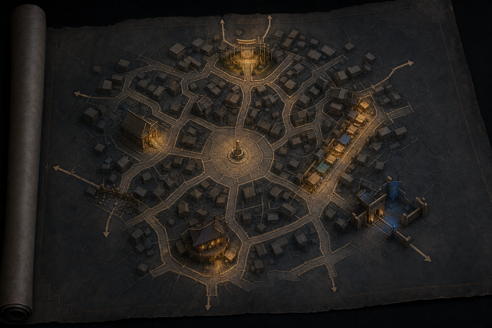
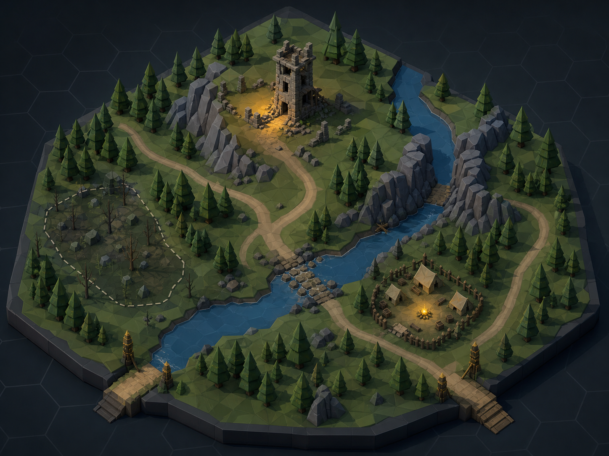
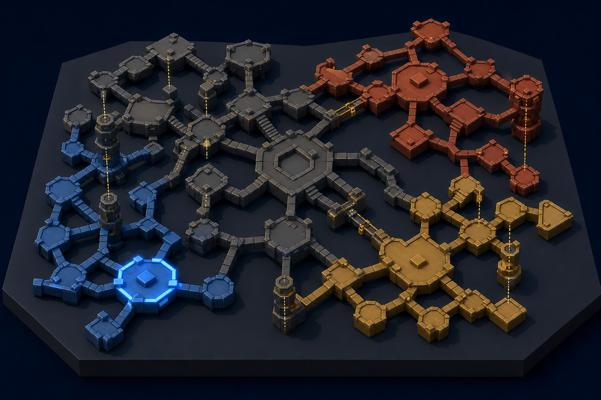
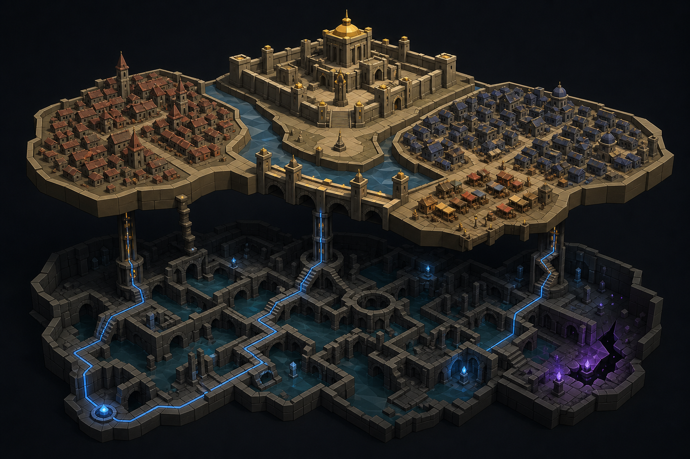

# Genesis Map Vision Quests — Implementation Guide

## Status

Exploration brief for Claude. This stays outside the repository while the current worktree/CI repair is in progress. The generated images are visual targets, not production textures or literal meshes.

## Reference images










## Feasibility verdict

The images are feasible as visual direction after reduction:

- Keep the orthographic/isometric silhouette, raised platforms, limited palette, simple landmarks, and highlighted routes.
- Replace dense unique architecture with a small registry of low-poly kits and `THREE.InstancedMesh` batches.
- Use `LineSegments`, thin ribbons, and simple boxes for routes, roads, borders, bridges, and vertical connectors.
- Use procedural materials and sparse texture variation; never depend on baked labels or painted map art.
- Use a few emissive materials and lights for selection, portals, routes, and mythic fray; avoid a light per building.
- Treat the before/after reference as two states of one deterministic map, never two independently rerolled maps.

The city, town, and layered-city images need the strongest simplification: overview architecture becomes repeated silhouettes; only the active location expands into the existing interior renderer.

## Existing architecture to use

### World and region

Build on `src/engine/hexmap.js` and `docs/SPATIAL-MODEL.md`:

- `terrainAt(w, q, r)` derives a deterministic biome from seed and axial coordinate.
- `axialToWorld`, `worldToAxial`, `hexDist`, `nodeXY`, `setNodeXY`, and `placeTravelNode` provide the coordinate and node seams.
- The node graph remains the AI/canon layer; the lazy hex plane remains a render/terrain input.

Add a pure projection adapter rather than replacing this model:

```text
src/engine/map-projection.js
```

```js
mapProjection(world, {
  scale: "world" | "region",
  focusNodeId, radius, seed
}) => ({
  hexes: [{ q, r, biome, visible, spiceBand }],
  nodes: [{ id, x, y, role, visibility, pressure }],
  edges: [{ from, to, bearing, travel, visible }],
  overlays: []
})
```

Keep this pure, serializable, deterministic, and Three.js-free.

### Walks and local maps

`src/engine/walk.js`, `src/engine/dungeon-walk.js`, and `src/engine/wild-walk.js` already produce environment-specific nodes, exits, encounters, and dimensions. `src/engine/place-spatialize.js` is the key reusable pattern:

- `spatializePlan(segments, topologyName, opts)` consumes a graph.
- topology selects a layout family;
- room placement, separation, corridor rasterization, and reachability verification are deterministic;
- `opts.walkId` provides stable identity.

Do not create independent city, district, wilderness, and dungeon layout engines. Generalize the pattern behind a compatibility wrapper:

```js
spatializeGraph(nodes, edges, {
  topology: "radial" | "grid" | "organic" | "riverbank" | "layered",
  scale: "settlement" | "district" | "site" | "macro-dungeon",
  seed, nodeSize, edgeWidth
})
```

Keep the current dungeon result byte-stable; add an adapter or wrapper before refactoring internals.

### Urban structure

`docs/URBAN-FABRIC.md` already defines the persistence rules:

- districts mint lazily on settlement entry;
- buildings mint soft on approach and lock on contact;
- cities grow across visits;
- tier determines district count.

Use `src/world/urban.js`, `data/building-kits.js`, and the existing urban tables as semantic sources. A proposed settlement map record is:

```js
settlement.map = {
  seed, topology, anchorId,
  districts: [{ id, type, x, y, visibility, pressure }],
  edges: [{ from, to, kind, access, travel }],
  landmarks: [{ id, type, x, y, soft: true }]
}
```

This is a design proposal, not a request to mutate the current repair branch now.

### Three.js seam

Use the existing theater boundary:

- `src/ui/theater-boot.js` owns scene assembly, objects, disposal, and the renderer seam.
- `src/ui/theater-interior.js` owns interior constants and realm material semantics.
- `src/ui/theater-room-mesh.js` compiles pure room-shell data before Three.js assembly.
- `src/ui/theater-materials.js` creates deterministic procedural canvas textures.
- `src/ui/theater-shot.js` owns camera/shot helpers.
- `src/ui/theater-figures.js` and `data/sprite-registry.js` show the existing registry pattern.

The map pipeline should be:

1. Engine produces a plain map plan.
2. UI converts plan nodes/edges to low-poly display objects.
3. Theater owns camera, lighting, selection, animation, and cleanup.

Do not import Three.js into `src/engine`.

## Shared map plan

Add one generic data contract at the engine/UI seam:

```js
{
  id: "settlement:abc",
  scale: "world" | "region" | "settlement" | "district" | "site" | "interior",
  seed: "world-seed:node-id:scale",
  bounds: { minX, maxX, minY, maxY },
  nodes: [{
    id, kind, role, x, y, z,
    visibility: "hidden" | "rumored" | "seen" | "known",
    expansion: "soft" | "locked" | "expanded",
    visualKit, paletteKey, pressureKey
  }],
  edges: [{ id, from, to, kind, travel, elevation, access, visibility, routeState }],
  features: [{ id, kind, x, y, footprint, hidden, visualKit }],
  overlays: [{ id, kind, targetId, colorKey, intensity }]
}
```

Canon remains in world/settlement/walk state. The renderer can discard and rebuild from this plan.

## Deriving forms and graphics

### World atlas and region

- Hex cells come from `hexmap.js` axial coordinates.
- Biome selects a small kit: plain tile, forest cluster, hill wedge, mountain wedge, marsh patch, water plane, or waste slab.
- Known nodes become simple landmarks based on existing place role.
- Routes become lines, thin raised ribbons, or repeated markers.
- The fraying edge is a spice/distance overlay of sparse fragments and emissive accents, not a new terrain system.

### Town and city

- Tier determines node count.
- A seeded topology places districts around an anchor.
- District type selects a visual kit: civic, market, temple, industrial, fortified, residential, or old quarter.
- Ordinary buildings are instanced box/roof/tower silhouettes.
- Only the focal landmark needs a unique mesh.
- Roads, gates, bridges, stairs, canals, and blocked connectors are edge visuals.

### District

- Urban walk segments become street/scene nodes.
- Reuse `URBAN_TOPOLOGIES` in `src/engine/walk.js` where its grammar fits.
- Existing typed buildings remain soft until approach.
- The active segment can expand into the current walk/interior flow.

### Wilderness site

- Biome comes from `terrainAt`.
- Site nodes come from wilderness encounter/tactical-terrain results.
- `Map Footprint` and `feature.dims` determine occupancy and scale.
- Large obstacles use low-poly masses; dressing uses instanced trees/rocks; paths/rivers use simple ribbons.
- Hidden hazards stay in data but are omitted from player render until revealed.

### Dungeon macro-map

- Consume existing `segments` and `exits`.
- Macro rooms are extruded plates; corridors are bridges; levels are stacked groups.
- On entry, use `spatializePlan` and the existing room-shell/interior renderer.
- Faction territories are material/overlay changes, not unique geometry per cell.

### Vertical places

Keep verticality in edge semantics: elevation, travel, access, and kind. Render layers as groups with fixed Y offsets; shafts/stairs/bridges/portals use boxes, cylinders, or lines. Use clipping or a lifted layer for overview; do not model full architectural cutaways.

## Deriving textures

Reuse the existing material pipeline:

- `src/ui/theater-interior.js` owns realm/surface semantics.
- `src/ui/theater-materials.js` derives deterministic canvas textures from material family, base color, seed, resolution, and grain.

Use shared surface families: stone, plank, metal, earth, water, and void/unknown. Prefer solid `MeshStandardMaterial` or `MeshLambertMaterial` color variants for overview geometry. Use small procedural textures only for focal plates, active rooms, landmarks, or terrain variation. Share textures by realm/surface/seed family. Never bake labels or unique painted city maps.

## Deriving lighting

`walkRollLight(env, seedKey, textPool)` in `src/engine/walk.js` is the existing lighting seam; `theater-data.js` owns its table contract. Translate the rolled fact into a small preset:

```js
clear:    { key: warm,  fill: cool, fog: low }
overcast: { key: soft,  fill: cool, fog: medium }
torchlit: { key: warm,  fill: void, emissive: gold }
moonlit:  { key: blue,  fill: void, emissive: low }
breach:   { key: violet, fill: blue, fog: high }
```

Use one key light, one fill/ambient contribution, restrained fog, and a few emissive materials. Do not add a light per building. Preserve selection and visibility through value/color for reduced-effects users.

## Mechanical ideas

Map generation should be:

1. Context selects scale.
2. Existing tier, topology, walk length, dungeon topology, footprint, or biome determines node count.
3. A seeded topology places nodes.
4. Only rolled/canon-supported edges are connected.
5. Nodes receive hidden/rumored/seen/known state.
6. Deeper structure mints only on approach.

Edges should carry travel time, elevation cost, access condition, danger/pressure, faction ownership, and knowledge state. Route choice must feed existing travel, walk, encounter, and pressure systems rather than becoming a separate mini-game.

State changes modify the original plan rather than rerolling it: gates open/close, bridges collapse, districts change control, shortcuts reveal, nodes are destroyed/occupied, and undercity links open. This is the intended implementation of `map-state-deltas.png`.

Combat remains governed by `docs/BATTLEMAP.md`: the rolled room is the map, dimensions derive the 4×3 zone ceiling, and footprints/elevation/hidden hazards hand off to the existing battlemap logic. Overview maps do not create a second tactical grid.

## Suggested modules and changes

New pure modules:

```text
src/engine/map-plan.js
src/engine/map-topology.js
src/engine/map-projection.js
```

New UI module:

```text
src/ui/theater-map.js
```

Optional only if existing material reuse is insufficient:

```text
src/ui/theater-map-kits.js
src/ui/theater-map-materials.js
```

Responsibilities:

- `map-plan.js`: shared serializable shape and validation.
- `map-topology.js`: seeded layout helpers with no world mutation.
- `map-projection.js`: world/region/settlement/district/site/macro-dungeon adapters.
- `theater-map.js`: assemble/dispose Three.js groups from a plan.
- `theater-map-kits.js`: shared geometries, instancing, palette metadata.

Extend carefully: `hexmap.js` for visible substrate batches; `urban.js` for settlement map state; `world/render.js` for map/fog selection if it is the established DOM seam; `theater-boot.js` for scene ownership; `theater-shot.js` for map camera presets. Preserve existing dungeon spatialization until compatibility tests pass.

## Performance rules

- Use `InstancedMesh` for repeated buildings, trees, rocks, markers, and tiles.
- Share geometries and materials by kit/palette.
- Batch or merge visible hex surfaces; do not create one object per large-region hex.
- Keep overview maps coarse and expand detail only on selection/contact.
- Dispose old map groups and textures before replacement.
- Keep dynamic lights in the single digits.
- Prefer lines/ribbons to beveled roads or unique spline meshes.
- Avoid transparent overlays unless necessary; depth sorting is not worth making everything translucent.

## Verification plan

Before visual polish, test:

1. Same seed and source state produce equivalent map plans.
2. Topology changes produce different layouts.
3. Re-entry does not duplicate districts, buildings, or edges.
4. Hidden features stay absent until revealed.
5. State deltas do not reroll unrelated positions.
6. World projections do not mutate world state.
7. Dungeon projections preserve `spatializePlan` output.
8. Urban walks preserve existing segments/encounters.
9. Map replacement disposes meshes, textures, and lights.
10. Combat handoff preserves dimensions, footprints, elevation, and hidden hazards.

Suggested future harnesses:

```text
dev/verify-map-plan.mjs
dev/verify-map-render.mjs
dev/verify-map-seam.mjs
```

## Build order for Claude

1. Define and validate the pure `MapPlan` shape.
2. Build world/region projection from `hexmap.js` and the node graph.
3. Build settlement projection from the existing urban-fabric district records.
4. Reuse `place-spatialize.js` patterns for district and macro-dungeon layouts.
5. Add a minimal `theater-map.js`: plates, lines, markers, and instanced kit meshes.
6. Wire selection to lazy expansion.
7. Reuse procedural materials and rolled-light presets.
8. Add wilderness-site projection and combat handoff.
9. Add state deltas and before/after verification.
10. Add visual kits only after the data/render seam is stable.

## Decision rule

If a feature requires a unique hand-modeled asset, a new bespoke table family, an AI-maintained geography fact, or a rendering technique outside the current Three.js stack, reduce it first to a graph node, graph edge, kit, material variant, or state overlay. If it still cannot be reduced, defer it.
