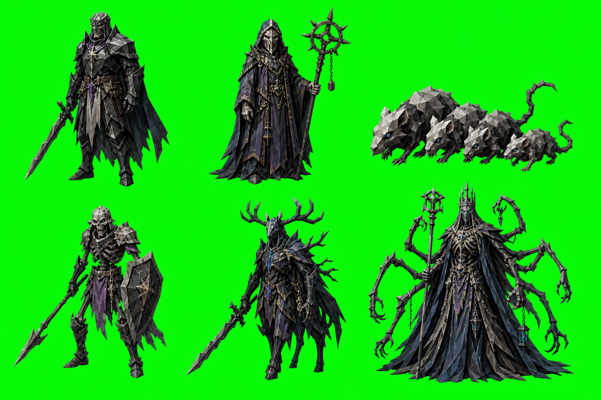
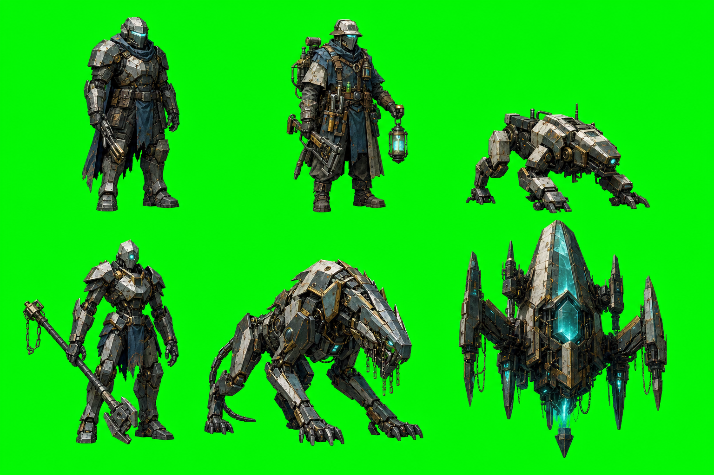

# Vision Quest — Realm Sprite Matrix

## Scope

Reference-only sprite exploration. No runtime wiring, sprite registry edits, slicing, manifest changes, or production asset promotion are part of this quest.

> **Format superseded 2026-07-24:** Fixed 1×4 is evidence from this comparison, not live
> production law. New pixel batches use
> `dev/model-qa/sprite-sheets/PRODUCTION-FORMAT.md`, with grid and cell aspect declared separately
> and aspect selected for the subject.

## Sample sheets






The six-role matrix was useful for comparing realm coverage, but it is not the preferred production presentation. The six-up layout compressed the figures and encouraged a more character-lineup/cartoon read.

Historical comparison winner: **1 × 4 horizontal strips** with one figure per generous cell. The
breathing-room finding survives; the fixed layout does not. New packets may use separate sheets for
PC/NPC and CR/body-plan bands rather than force every role into one crowded sheet.

The original six-role matrix was:

1. adult PC;
2. adult NPC;
3. CR 0–1 low threat;
4. CR 2–4 standard/elite threat;
5. CR 5–10 high threat;
6. CR 11+ boss-scale threat.

The CR bands are visual sampling bands only. The actual CR remains sourced from the bestiary and existing archetype resolution.

## Realm styling matrix

| Realm | Surface language | PC/NPC language | Monster progression |
|---|---|---|---|
| Fantasy | weathered cloth, brass, iron, leather, earth | practical adult travelers, worn civic/f​​rontier equipment | natural bodies, scars, armor, horns, drake/stone/wood motifs |
| Gloom | charcoal, iron, bone, severe cloth, muted violet | ritual, funerary, masked, compressed silhouettes | skeletal, blind, antlered, wraithlike, multi-limbed silhouettes |
| Chrome | true reflective/bright chrome, oxidized steel, ceramic, brass, cyan relic light, acid green, magenta | salvage, utility, plated field gear, lamps and tools | crawler, construct, reactor guardian, relic machine, levitating engine |

## Shared invariants

Across all three sheets:

- mature adult proportions;
- discreet faceted low-poly planes;
- restrained palette rather than mascot saturation;
- full-body opaque cutouts;
- readable silhouettes at small billboard scale;
- front three-quarter default presentation;
- no chibi heads, toy plastic, cartoon eyes, or comic outlines;
- same CR hierarchy: small threats stay compact, bosses become imposing;
- green chroma key is temporary reference convention only;
- no text, labels, or mechanics baked into the image.

## Presentation correction

The historical 1×4 sheets produced stronger silhouettes and fit the game’s narrow figurine bases
better. Treat the **breathing-room and silhouette findings** as invariants, not the 1×4 layout:

- one subject per declared cell;
- generous lateral padding for weapons, tails, wings, horns, and cloaks;
- shared narrow ground line;
- consistent feet-to-canvas scale;
- no crowding between bodies;
- silhouette must remain readable at the base-disc width used by the theater;
- avoid arranging figures shoulder-to-shoulder as a poster lineup;
- front three-quarter remains the default, with front/back pairs generated separately when needed.

The compact six-up layout should remain a mood-board format only. It should not be used as the main prompt shape for production sprite generation.

## Chrome correction

Chrome should not collapse into generic blue-gray robots. Preserve the existing Chrome realm direction:

- bright reflective chrome as the primary material;
- cyan acid-green and magenta as active realm accents;
- hard specular color breaks and luminous edge seams;
- dark void contrast around the silhouette;
- worn steel and ceramic secondary materials;
- magenta/cyan breach effects used sparingly but decisively;
- no cute robot faces, mascot eyes, or rounded toy bodies.

The Chrome family can remain mature by making the forms industrial, severe, and functional while allowing the realm’s cyan/acid-green/magenta energy to be vivid. Saturated color is acceptable here when it reads as material/energy identity rather than cheerful cartoon decoration.

## Mechanical interpretation

Realm styling changes visual identity and material history, not creature statistics. The same mechanical creature identity can carry realm variants:

```text
creatureKey + activeRealm + breachIntensity → sprite/style variant
```

The existing breach system remains responsible for actual physics, persistence, and realm state. A Gloom skeleton is still the same bestiary/archetype identity unless a separate mechanical roll says otherwise.

## Future production question

When this vision is promoted, decide whether the realm family is stored as:

- a generated sprite-registry variant;
- a realm-grade/material treatment over one base sprite;
- or a hybrid, with dedicated variants only for important creatures and realm grade for the rest.

The hybrid is the likely lowest-cost path: realm-specific PC/NPC/flagship art, realm grading and materials for the long tail, and the existing fallback chain for missing assets.
