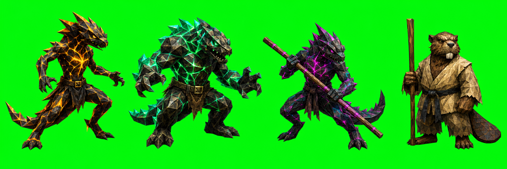
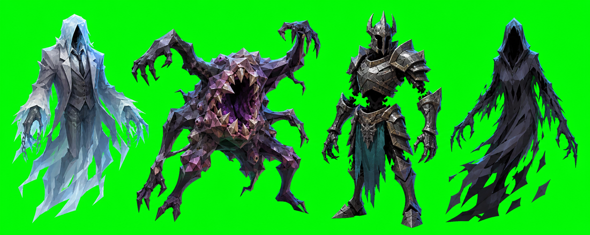

# Sprite Spread — Bestiary Notes

## Status

Reference-only generation. No registry, slicing, or runtime wiring.

## New references

## Source discipline

- The salamander sheet is based on actual bestiary entries: `Salamander Fire Snake`, `Salamander`, and `Salamander Inferno Master` in `data/bestiary.js`.
- The corrected Salamander Brothers sheet uses the original sprite family recovered from `quarantine-pack/pre-unification/originals.zip` as its visual anchor, plus the roster direction in `docs/REALM-KEY-EXPANSION-ROSTER.md`: neon-bright mutant salamander brothers and `The Beaver in the Gi` as mentor.
- The horror sheet uses actual bestiary concepts including `Ghost`, `Mimic`, `Helmed Horror`, `Hook Horror`, `Night Hag`, `Nightmare`, `Vampire`, `Werewolf`, and `Wraith`, but the displayed designs are original fantasy archetypes rather than adaptations of film characters.
- The child sheet is a bestiary-adjacent NPC exploration based on the project’s existing child-name/NPC and roster concepts. It is intentionally non-graphic and does not depict a protected character or a specific existing child villain.

## Style lock for this spread

- Keep visible triangular low-poly planes; do not smooth them away.
- Use mature proportions and severe/readable silhouettes.
- Use the 1×4 horizontal layout for future sprite prompts.
- Keep one subject per generous cell with narrow-base readability.
- Use green chroma key for ordinary matte/cloth/stone subjects.
- Do not use green chroma key for Chrome subjects with cyan/acid-green reflective surfaces; use a magenta key or another validated key color instead.
- For Chrome, preserve mirror-like chrome plus cyan, acid-green, and magenta energy accents.
- Keep horror references archetypal and original: no recognizable masks, costumes, weapons, faces, or silhouettes from protected film characters.
